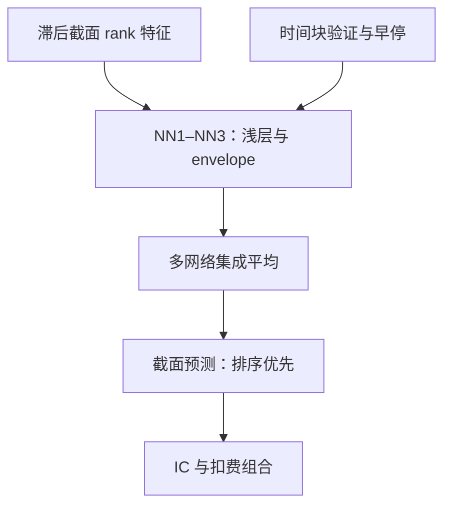
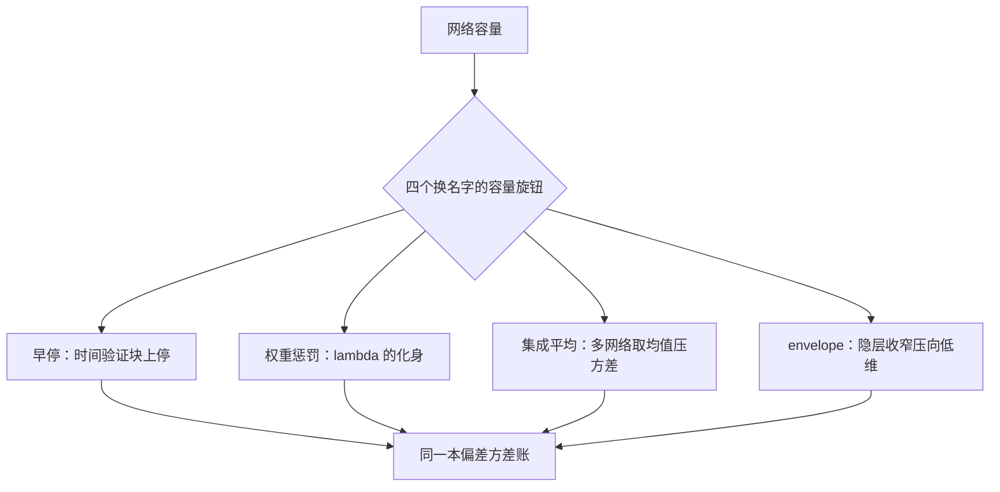

# 神经网络的截面应用

深度学习在市场上不是军备竞赛，是配给制：容量按信噪比配给，层数按样本配给。

<footer>—— 据 Gu, Kelly and Xiu, *Review of Financial Studies*, 2020；Avramov, Cheng and Metzker, *Management Science*, 2023 整理</footer>

[上一课](/quant/slm-trees-boosting)把交互交给树，但树是分段常数，特征仍要事先排好列。想让模型从特征里学连续的非线性与状态依赖，是神经网络进场的地方——而市场是监督学习里最不欢迎深度的场景之一：样本按时间计、非平稳、信噪比千分位。本课写怎么让浅网络在这个场景里立住，以及它为什么常常赢不了多少。

## 问题

把图像或语言的深度配方直接搬来，参数量轻易超过有效样本几个量级，样本内拟合毫无意义；更隐蔽的是评估：随机折加全样本标准化，网络分数向样本内收敛，看起来「学到了」的只是泄漏。缺口不是更好的架构，而是一套把网络容量约束在截面排序任务上的最小协议——架构、正则与时间切分要作为一个整体提出。

术语翻译：数据泄漏就是「评估时偷看了考卷」。全样本标准化把测试年份的均值方差也算进归一化参数，随机折把未来的行情混进训练集——网络于是「预测」出它已经见过的答案，样本外分数全靠漏出来。

## 方法

以 Gu-Kelly-Xiu 的协议为骨架。输入是个股特征的滞后截面 rank 向量，输出对下一期收益的预测，损失是截面 MSE，评估用 IC 与多空组合（排序评估的理由见第一课）。网络取一到三层的浅结构，ReLU、批归一化、多网络集成取平均；隐层宽度逐层收窄的 envelope 架构把表示压向低维。早停放在时间验证块上——它与上一课的早停是同一个角色，也是 $\lambda$ 的化身。训练按时间块滚动，测试年只碰一次；这些纪律全部来自后面的第 5、6 课，网络不是豁免对象。表征方向的连续近亲是[Autoencoder 条件因子模型](/quant/autoencoder-factor-model)把「特征到因子载荷」学成一个映射；微观结构高频信号的网络另有领地（[深度微观结构信号](/quant/dp-deep-micro-signals)、[DeepLOB](/quant/deeplob-cnn-lstm)），本课不进入。

数字实例：输入 50 个特征、隐层 32 个单元的单隐层网络，仅第一层就有 $50\times32+32=1632$ 个参数；而月度截面数据一年只有 12 个时间块。参数比独立的时间样本多两个数量级——这就是「层数按样本配给」的字面含义。

## 机制

为什么浅层常赢：样本效率与归纳偏置。GKX 的月度样本外 $R^2$ 从线性正则化的约千分之一涨到三层网络的约千分之四，增量主要来自特征交互的非线性形态——动量与波动率的状态依赖、规模与流动性的条件化——而不是来自深度本身。容量控制手段换了名字：早停、权重惩罚、集成平均、envelope，账还是第一课那本偏差方差账。网络学的是条件期望的排序，把它读成「理解了市场」是范畴错误；换一年数据重训，隐层学到的方向可能整体换人，预测排序却大体稳定——稳定的是排序，不是内部表示。

常见误区：初学者容易把「千分之四比千分之一大」读成「深度赢了」。四倍仍在千分位，扣掉交易成本后可交易增益还要再缩。Avramov-Cheng-Metzker 的结论正是协议内外的差距大于模型族之间的差距——先问协议，再比模型。

Leippold, Wang and Zhou, *JFE*, 2022 在中国市场的复制表明：涨跌停与 T+1 约束必须写进损失与可交易性判断，机器学习的截面增益在不同制度下不可直接平移——协议里的「市场制度」一格不是脚注。

## 边界

网络不自动战胜 GBDT：Avramov-Cheng-Metzker（2023）加上成本与经济约束后，机器学习的可交易增益明显缩水，模型族之间的差距小于协议内外的差距。深度不是免费的正则，协议守不住时更深的网络只会更快记住历史。与树的分工：特征已排好、样本有限、要稳定基线，树常更省；特征原始、状态依赖复杂、有算力预算，网络才值得进场。最后，本课的浅网络与本书深度学习定价各课的界线在对象：那里学定价函数与对冲策略，这里只学截面排序，评估口径不同，不可互借分数。

## 小结

- 市场上的网络是配给制：浅层、集成、早停，容量按信噪比配给。
- GKX 骨架：rank 特征进、截面 MSE 训、IC 与组合评估，测试年只碰一次。
- 月度 $R^2$ 从千分之一到千分之四，增量在交互形态不在深度；稳定的是排序不是表示。
- 成本与制度约束削平可交易增益；网络不是树的自动升级。
- 出处：Gu, Kelly and Xiu, *RFS*, 2020；Leippold, Wang and Zhou, *JFE*, 2022；Avramov, Cheng and Metzker, *Management Science*, 2023。
