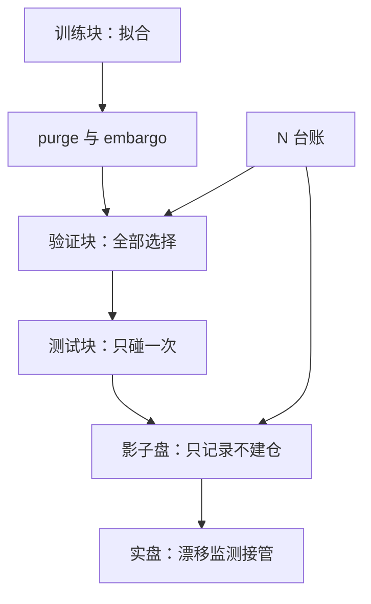
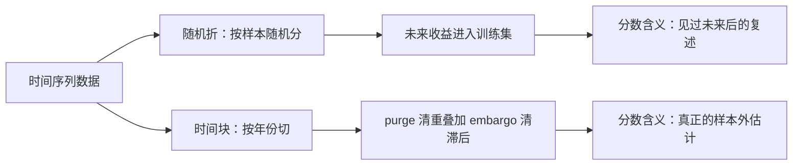

# 样本外协议

「样本外」不是一个数据片段，是一个承诺：这段数据在你做完所有决定之前，谁都不许看。

<footer>—— 据 Cawley and Talbot, *JMLR*, 2010；López de Prado, *Advances in Financial Machine Learning*, Wiley, 2018 整理</footer>

[上一课](/quant/slm-overfitting-market)把过拟合分成泄漏、选择、环境三类，并指出修复只能来自协议。本课把协议写成可执行的时间表：数据怎么切、选择发生在哪、测试块何时动用、上线后谁接管。切分四参数（块、清洗、路径、聚合）的机械细节在[时序交叉验证的深化](/quant/fml-tscv-deep)已收；本课管协议的政治学——每一个自由度归谁，何时关闭。

## 问题

「留一部分数据做样本外」一句话里藏着至少四个自由度：怎么切、谁参与选择、切几次、什么时候算结束。每个自由度都可以被有意或无意地用来把测试块变成训练的一部分：在滚动结果上挑最好的窗口、看到测试段不行就回去换特征、影子盘不佳就改判据再跑一次。每一步局部都「合理」，合起来样本外就不存在了。缺口是把协议写成事先冻结的合同，让「样本外」这个词保持定义。

直觉类比：样本外协议像考前把试卷封存——不是不信任谁，而是试卷一旦开封，「第一次考」就再也立不住。看一眼测试块、不行再回去改特征，等于考砸后偷改答案重考，成绩单上每个数都跟着作废。

## 方法

五步合同。第一步切分：按时间切训练、验证、测试三段，接缝处 purge 清标签重叠、embargo 清特征最长滞后——机械沿[时序交叉验证的深化](/quant/fml-tscv-deep)。第二步隔离：所有选择——模型族、$\lambda$、深度、特征列、标签参数、评估口径——只许看训练与验证块，内外分工即[嵌套交叉验证](/quant/nested-cv)的合同。第三步一次性：测试块只动用一次，第二次动用它就是新的样本内。第四步影子盘：上线前先只记录不建仓，对照[实盘漂移监测](/quant/live-drift-monitor)预指定的统计量。第五步台账：每次尝试与每次协议修订都计入 $N$（[模型选择协议](/quant/fml-model-selection-protocol)的五要素）。滚动重训下的同型合同是 walk-forward（[样本外与滚动检验](/quant/walk-forward)），注意在其结果上挑窗口等于把检验段作废。

术语翻译：purge 是在切缝处删掉标签与另一侧重叠的样本——标签是未来 21 天收益，最后 21 天的行就得挪走；embargo 是再空出一段等于特征最长滞后的缓冲，防止信息从训练侧渗过去。两者都在修误差项，不是仪式。

## 机制

为什么必须是时间外：截面相关与非平稳下，随机折把未来收益放进训练集，分数度量的是「见过的未来」；purge 对齐上一课的 $T/H$ 账，embargo 对齐特征最长滞后，两者都不是仪式而是误差项的修正。为什么测试块只能用一次：每多用一次，报告的就是候选最大值而不是期望绩效，统计上回到选择类过拟合——Cawley-Talbot 指出用同一测试折反复评估的方差本身就是过拟合的指纹。协议不是道德要求，是让数字保持自称的含义：同一个 $0.4\%$ 的 $R^2$，在协议内是技能的量级，在协议外什么都不是。

数字实例：对毫无技能的策略把测试块动用 20 次，报告的是 20 个纯噪声结果里的最大值——它几乎必然「看起来不错」，正如抛 20 次硬币出现一次连赢四五个的机会接近一半。报最大值而不报期望，数字就退回选择类过拟合。

Gu-Kelly-Xiu（2020）的统一样本外设计：训练从样本起点起步、窗口逐年向前扩展、末段留作统一测试。统一协议的价值一半在诚实，一半在可比：各报各的最高分没有排名可言，同一时间背上同一检验才有。

## 边界

协议本身可被过拟合：试了三种切分挑最好的一种，选择只是换了个位置，台账照记；预注册的窄网格可以豁免嵌套，豁免的理由必须先写（[嵌套交叉验证](/quant/nested-cv)的口径）。协议通过不证明因果也不保证未来，它只保证一件事：这个数字是它自称的那个估计量。环境类风险不归协议管——上线之后的衰减与漂移由监测接管，协议与监测的交接点就是影子盘。

## 小结

- 协议四自由度：怎么切、谁选择、切几次、何时结束；每个都要事先冻结。
- 时间块加 purge/embargo 是误差修正，不是仪式；随机折在市场数据上度量未来泄漏。
- 测试块一次性；影子盘只记录不建仓；每次尝试与修订都进 $N$ 台账。
- 协议可被过拟合：挑切分、挑窗口都算试验；预注册例外要事先写明。
- 出处：Cawley and Talbot, *JMLR*, 2010；López de Prado, *Advances in Financial Machine Learning*, Wiley, 2018；Gu, Kelly and Xiu, *RFS*, 2020。
