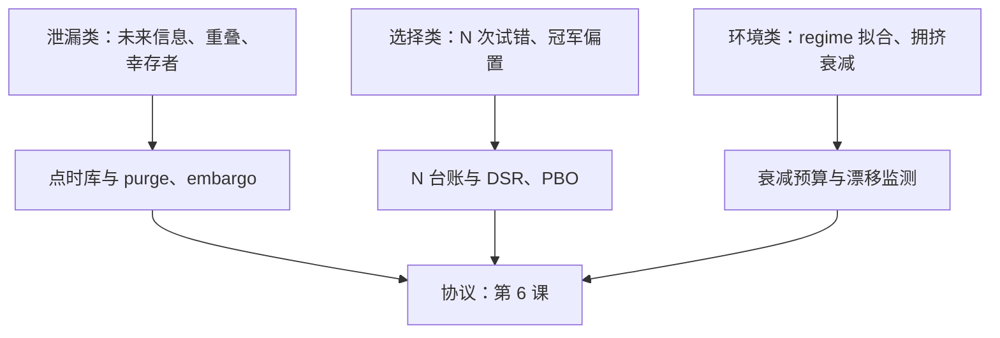

# 过拟合的市场特有形态

市场上的过拟合大多不来自模型太复杂，而来自同一份历史被太多次使用；容量只是共犯，数据复用才是主犯。

<footer>—— 据 Bailey, Borwein, López de Prado and Zhu, *Notices of the AMS*, 2014；McLean and Pontiff, *Journal of Finance*, 2016 整理</footer>

[上一课](/quant/slm-nn-cross-section)把网络容量压到浅层仍有富余——因为真正的敌人不在模型内，在评估外。方法单元的三族模型任何一族都适用，也任何一族都能被同样的手法美化。本课进入纪律单元，先把「过拟合在市场上长什么样」分类；度量的数学（DSR、PBO、Reality Check）在[过拟合次数与试错](/quant/backtest-overfitting)与[过拟合作为风险](/quant/overfit-as-risk)已收，本课管形态与对位预防。

## 问题

教科书把过拟合绑定在模型容量上；市场的过拟合大多不来自容量，来自数据使用方式。于是会出现容量极小的模型「样本外」照样崩塌——因为它的样本外早已被无数次先前的尝试污染，而账本上一行都没记。不分类就预防不了：把选择类死法当成泄漏去修管道，修完了 $N$ 还是被低估，极值门槛照样失守。缺口是一张形态学清单，每个形态配一个检测器。

## 方法

三类形态，各配检测。泄漏类：特征用了未来信息、标签 horizon 重叠未清洗、幸存者与回填混进样本——检测靠点时数据（[时点基本面](/quant/point-in-time)、[前视偏差](/quant/look-ahead-bias)、[幸存者偏差](/quant/survivorship-bias)）与 purge/embargo（[时序交叉验证的深化](/quant/fml-tscv-deep)）。选择类：试验次数 $N$ 不可见、冠军偏置、在滚动结果上再挑窗口——检测靠 $N$ 台账与 DSR/PBO（[Deflated Sharpe 原文](/quant/bailey-dsr)、[Probability of Backtest Overfitting](/quant/pbo)）。环境类：对特定 regime 的过拟合与发表后衰减——McLean-Pontiff 的衰减是应写进原假设的预算，检测归[实盘漂移监测](/quant/live-drift-monitor)。

## 机制

为什么市场比图像容易过拟合：有效样本是时间长度，截面相关让「股票数乘以天数」的名义样本虚胖；标签重叠让同一笔收益重复计数；信噪比千分位让任何拟合的方差项巨大。三个放大器相乘的结果是：不清洗的 $K$ 折显著性可以虚高数倍，桌下几十次尝试就能把无技能簇推出一个「显著」冠军。过拟合也不是大模型的专利——重复使用同一份历史本身就是过拟合来源（Bailey 等 2014）：第 2 课的 $\lambda$、第 3 课的深度、第 4 课的层数，每次尝试都是同一种行为，账必须记在同一本台账上。

标签 horizon 为 $H$ 的逐日滚动持有，相邻 $H$ 条标签共享同一笔收益，独立样本数近似从 $T$ 缩到 $T/H$；不 purge 的交叉验证把标准误按约 $\sqrt{H}$ 倍低估，$H=20$ 时 $t$ 统计量虚高约四倍半——泄漏类死法里最便宜的一种，一行切分代码就能犯。

## 边界

三类的边界不总清晰：拥挤衰减会被误诊为泄漏，regime 拟合会被误诊为概念漂移，分流次序按「先管道、再协变量、后概念」（[漂移管理](/quant/fml-drift-management)）。过拟合不能靠更好的模型修复，只能靠协议修复——虚假 alpha 通过仓位变成真实亏损（[过拟合作为风险](/quant/overfit-as-risk)的杠杆账）。本课只给形态与检测器；把检测器排成时间表、规定「选择发生在哪、测试块何时动用」，是下一课样本外协议的事。

## 小结

- 市场过拟合三形态：泄漏、选择、环境；修复必须对位，错诊比不诊更贵。
- 泄漏靠点时数据与 purge/embargo；选择靠 $N$ 台账与 DSR/PBO；环境靠衰减预算与漂移监测。
- 标签重叠使有效样本近似 $T/H$，不清洗的显著性按 $\sqrt{H}$ 虚高。
- 数据复用与容量同罪：每次调参都是一次试验，记进同一本台账。
- 出处：Bailey, Borwein, López de Prado and Zhu, *Notices of the AMS*, 2014；McLean and Pontiff, *JF*, 2016；López de Prado, *Advances in Financial Machine Learning*, Wiley, 2018。
