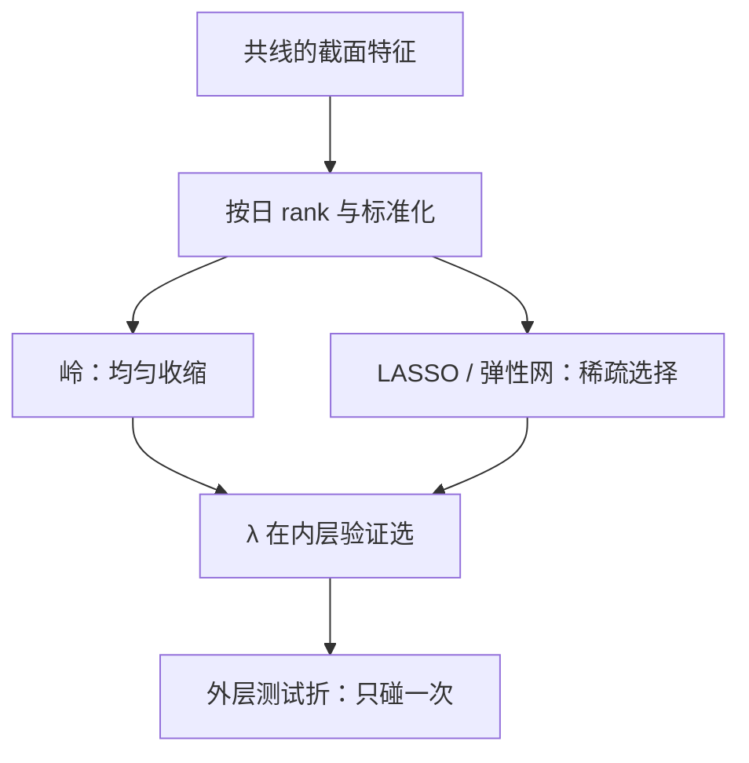
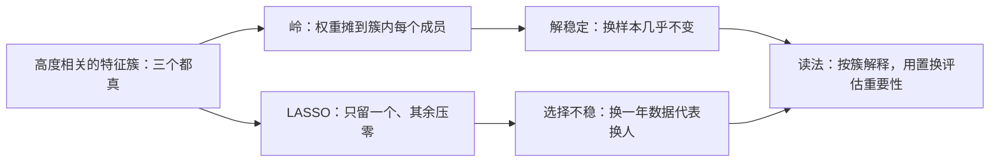

# 正则化与市场数据

在共线的高维截面里，「无偏」是一个没有意义的词；先收缩，才轮得到谈解释。

<footer>—— 据 Hoerl and Kennard, *Technometrics*, 1970；Tibshirani, *JRSS-B*, 1996 整理</footer>

[上一课](/quant/slm-supervised-landscape)把版图钉在信噪比千分位与截面排序评估上，容量于是成为稀缺品。本课从容量最低的一端写起：线性模型配上正则化。它不是入门玩具，而是后面树与网络都必须在协议内打败的基线，也是理解一切「收缩」手段——早停、权重衰减、SDF 正则——的原型。

## 问题

市场截面的设计矩阵病态：动量族、规模族、流动性族内部高度共线，特征动辄上百个，与有效样本同量级。OLS 在病态设计下方差爆炸——$X^\top X$ 接近奇异时，$\hat\beta$ 的方向由噪声主导，样本内拟合漂亮、样本外翻车。不这么做会错在哪：把上百个原始特征直接塞进回归，得到一份每个系数都「显著」的样本内报告，实盘第一周就开始付方差的钱。缺口是把上一课「省容量」的口号落成可估计的模型：用一份可控的偏差，换掉一大块方差。

## 方法

三条主线。岭回归解 $(X^\top X+\lambda I)\beta=X^\top y$，对所有系数均匀收缩，共线下方向稳定。LASSO 解 $\min_\beta\lVert y-X\beta\rVert_2^2+\lambda\lVert\beta\rVert_1$，把弱系数直接压到零，输出稀疏解；elastic net 在两者之间插值，兼顾共线下的稳定与稀疏的选择。三条使用纪律：特征先按日截面 rank、惩罚前标准化（rank 的理由见[特征：滞后、截面 rank](/quant/cs-rank-features)）；$\lambda$ 只能在嵌套验证的内层选，外层折不参与网格（[嵌套交叉验证](/quant/nested-cv)）；LASSO 选中的变量集合在共线下不稳定，读作「一个等价代表」，不读作「经济学答案」。定价侧的同型思想是对随机贴现因子做正则（Kozak-Nagel-Santosh），组合侧对协方差与精度矩阵收缩（[图形 Lasso 精度矩阵](/quant/glasso)）。

## 机制

正则化的统计本质是控制有效自由度：$\lambda$ 连续地扣掉模型的容量，偏差方差交易在低信噪比下几乎总是划算，因为压掉的方差远大于引入的偏差。岭在共线下把权重摊到相关簇上，稳定但单系数不可解释；LASSO 在强共线下的选择近乎随机——同一个真实关系，换一年数据，被选中的代表就换了人。这解释了为什么第 7 课的重要性能读法必须换成置换框架而不是看系数。稀疏本身也不是目的：Chinco-Clark-Joseph 用 LASSO 在一分钟收益里只保留少数滞后项，稀疏的价值在于样本外稳定与可维护，不在于「找到了真信号」。

Chinco, Clark-Joseph and Ye, *Sparse Signals in the Cross-Section of Returns*, *Journal of Finance*, 2019：高频截面用 LASSO 从数百个滞后收益里挑出极少数，样本外仍显著——稀疏在高维共线下的第一个用途是筛掉噪声，第二个才是选变量。

惩罚前必须标准化，否则 λ 的惩罚力度被量纲扭曲：若「市值」以 $10^{11}$ 元计而「换手率」以 $0.01$ 计，同一个 $\lambda$ 对市值的惩罚近似为零、对换手率近乎清零。按日截面 rank 或 z-score 之后，$\lambda$ 才对所有系数一视同仁。

岭回归可以想象成给每个系数系一根橡皮筋：数据把系数拉向最小二乘解，$\lambda$ 的橡皮筋往零拉。数据信号越弱（市场数据几乎总是如此），平衡点离零越近——这是「用一点偏差换掉一大块方差」的物理图像。

## 边界

正则化不修非平稳：对十年数据最优的 $\lambda$ 对下一年未必；每条 $\lambda$ 路径上的尝试都计入 $N$ 台账（[模型选择协议](/quant/fml-model-selection-protocol)），「调参不算试验」是台账最常见的漏记。收缩后的系数不能直接读作弹性或溢价，截面联立下的解释另有计量口径，本课程不承担。

初学者容易以为 LASSO 选中的变量就是「最重要的那个」；在一簇高度相关的变量里，它近似随机挑了一个代表——被压到零的同伴不是没信息，只是和代表说了同样的话。删掉变量集合要按簇看，不要按名字看。 最后立一条基线规则：后面任何非线性模型，必须在同一协议、同一特征、同一评估下赢过本课的正则化线性，才有升级的理由——GKX 的协议里这个差距常常只有千分位，赢不了它的复杂模型先怀疑自己。

## 小结

- 共线加高维使 OLS 方差爆炸；正则化用可控偏差换掉不可控方差。
- 岭稳方向、LASSO 给稀疏、弹性网居中；共线下的变量选择是随机代表，不是因果。
- $\lambda$ 只在内层选，外层折不参与；每次调参计入 $N$ 台账。
- 同型思想延伸到 SDF 正则与协方差收缩，本课是后两课一切模型的必败基线。
- 出处：Hoerl and Kennard, *Technometrics*, 1970；Tibshirani, *JRSS-B*, 1996；Kozak, Nagel and Santosh, *Shrinking the Cross-Section*, *JF*, 2020；Gu, Kelly and Xiu, *RFS*, 2020。
