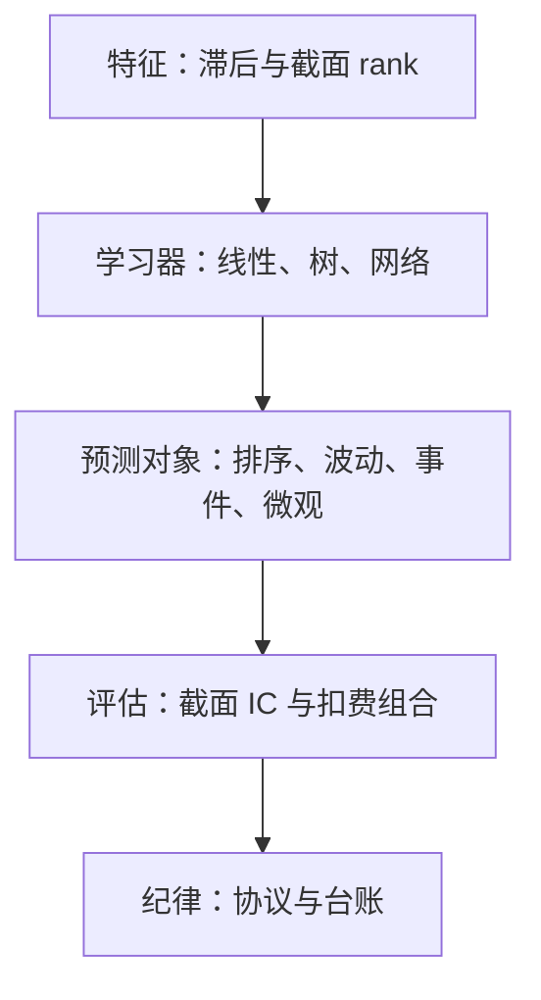
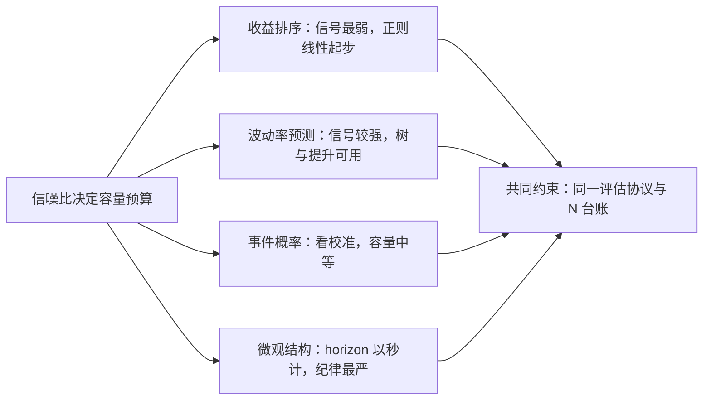

# 监督学习的市场应用版图

市场不缺能拟合的函数，缺信噪比；统计学习在别处赢在容量，在这里先要赢在纪律。

<footer>—— 据 Gu, Kelly and Xiu, *Review of Financial Studies*, 2020；López de Prado, *Advances in Financial Machine Learning*, Wiley, 2018 整理</footer>

[上一课](/quant/ot-case-map)把场外结构化产品收成三条方法论：条款即价格、发行即账本、法律与信用决定谁付账。场外的判据立完，换一条战线：缺的从来不是数据，是把特征变成预测的学习器。本课程写统计学习搬进市场时的方法与纪律：本课先画版图，随后按容量递增过正则化线性、树与梯度提升、神经网络三族模型，再用四课钉纪律——过拟合形态、样本外协议、特征重要性、不确定性。本课程第一课的任务是从零铺垫这个领域的共同设定：特征、标签、损失各是什么，市场数据与教科书表格数据的差别在哪里。后课默认已经读完本课。

## 问题

监督学习的教科书设定是独立同分布、样本远多于参数、信噪比高。市场数据三条都不满足：收益预测的样本外 $R^2$ 量级在千分位；截面彼此相关，有效样本数按时间长度计，而不是按「股票数乘以天数」计；分布随制度漂移，昨天拟合的关系今天打折。直接照搬默认用法，错的不是某个超参，而是整个评估口径：把千分之几的 $R^2$ 误读成零，或者把泄漏进未来的分数误读成技能。缺口因此不是模型，而是先钉下两件事——在市场上监督学习到底预测什么、用什么口径评价——模型族反而排在后面。

### 版图按预测对象划分

按预测对象分四块。截面收益排序：给定滞后的个股特征，预测下一期收益的相对顺序，Gu-Kelly-Xiu 的统一样本外协议是这条线的基准。波动率与风险预测：预测二阶矩，信号比一阶矩强得多，养得起更复杂的模型。事件概率：成交、触价、违约、退市，标签是二值的，评估看校准。微观结构信号：短 horizon 的订单流与簿形预测，特征与标签都以秒计。四块共享同一套特征与时间纪律，差别在标签与损失。

Gu-Kelly-Xiu（2020）的月度样本外 $R^2$ 在千分位，大约从线性模型的 $0.1\%$ 到浅网络的 $0.4\%$；这么小的 $R^2$ 在多空组合上仍对应可观的改进。市场监督学习的信噪比基线就钉在这里——谁报出高得多的数字，先检查泄漏再谈模型。

IC（信息系数）就是预测值与真实结果的相关系数；「截面」指同一天跨股票来算——衡量的是「今天我的打分有没有把涨得多的排在涨得少的前面」。IC 稳定为正哪怕只有百分之几，在几百只股票的分组多空里就够用了。

## 方法

把任务写成三元组：特征矩阵 $X$、标签 $y$、评估口径 $\ell$。特征沿用[特征：滞后、截面 rank](/quant/cs-rank-features)的口径——按列滞后对齐信息集，按日截面 rank 统一量纲；标签沿用[标签工程的深化](/quant/fml-label-engineering-deep)的四元组——事件、触达规则、权重、评估口径。评估口径在低信噪比下应选排序相关（截面 IC、秩相关）而不是水平误差：学习器只需要把好的排在坏的前面，不必还原收益水平。模型族的选型由容量决定，本课程随后三课按容量从低到高展开；本课只钉三元组本身。

## 机制

为什么排序比水平容易：学习目标只要求单调，损失对量纲不敏感，同样的数据能支撑的模型容量高一档。为什么容量必须省着用：偏差方差分解里，市场数据的噪声方差 $\sigma_\varepsilon^2$ 压倒性大，多加一分容量先涨的是方差项；统计学习的经典权衡在市场上被推到极端，简单模型配严格协议常常胜过大模型配松协议。这也解释了版图四块的容量分配：收益排序用最省的容量，波动率与事件概率因为信号强，可以喂更复杂的模型而不立刻被噪声淹没。

偏差方差可以用射箭类比：偏差是箭整体偏向一侧（模型太简单，没学够），方差是箭散落一片（模型太敏感，跟着噪声跑）。市场数据像在雾里射箭——箭本来就看不清靶心，再换一把更灵活的弓只会散得更开。

## 边界

本课不回答定价理论问题——因子为什么有溢价不是本课程的对象；不进入高频统计的估计量谱系；也不重复工程流水线，[金融 ML 工程](/quant/fml-map)已经收过工程账。微观结构信号一格与订单簿各课相邻，特征滞后以秒计，泄漏窗口随之变窄，纪律只会更严不会更松。

初学者容易以为样本外 $R^2=0.3\%$ 等于「模型没用」；在截面排序的任务里，哪怕每期只比随机排序多对一点点，长期按分位组合持有也能积累成可观的差异。反过来，见到月度 $R^2$ 高达百分之几的汇报，第一反应是查泄漏，第二反应还是查泄漏。

最后，版图不承诺任何模型族的优势：GKX 的协议里，线性正则化、树与浅网络的差距远小于「协议之内」与「协议之外」的差距，这正是纪律单元存在的理由。

## 小结

- 市场监督学习违反教科书三设定：信噪比千分位、截面相关压有效样本、分布漂移。
- 版图按预测对象分四块：收益排序、波动率、事件概率、微观结构，共享特征与时间纪律。
- 任务写成特征、标签、评估三元组；低信噪比下评估选排序相关而非水平误差。
- 容量是稀缺品：噪声方差主导，模型族按容量递增排在后三课。
- 出处：Gu, Kelly and Xiu, *Empirical Asset Pricing via Machine Learning*, *RFS*, 2020；López de Prado, *Advances in Financial Machine Learning*, Wiley, 2018。
