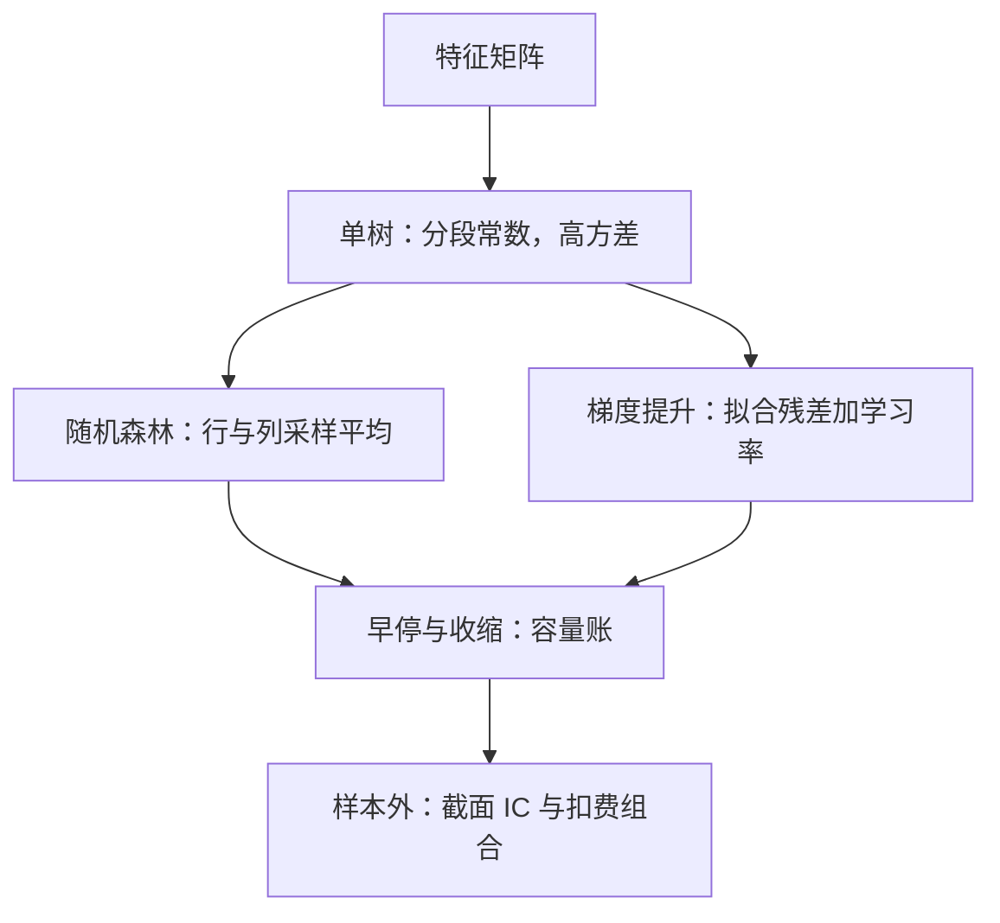
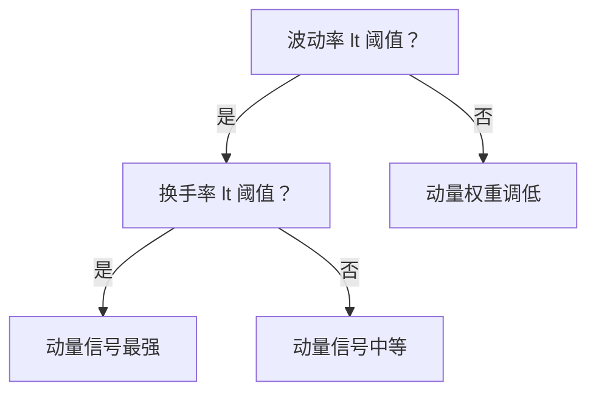

# 树模型与梯度提升

交互不必手工穷举，容量不必一次付清：树用分裂买形状，提升用残差分期付款。

<footer>—— 据 Breiman, *Machine Learning*, 1996/2001；Friedman, *Annals of Statistics*, 2001 整理</footer>

[上一课](/quant/slm-regularization-market-data)用惩罚把线性模型的方差压进可用区间，代价是形状必须预先写死为线性加手工交互。市场关系里交互到处都是——动量在低波动市里强、高波动市里衰减；规模效应取决于流动性状态——而 $p$ 个特征的二阶交互有 $p(p-1)/2$ 项，全塞进回归只是把方差问题放大。本课写让模型自己买形状的两族方法：树与它们的集成，这也是表格型截面数据上至今最常用的非线性工作马。

## 问题

线性模型的容量瓶颈不是精度而是形状：它只能给「每个特征一个系数」，交互与非线性都要人来猜。猜错了是偏差，全猜是方差。缺口是一族自动选择交互、对单调变换不敏感、容量旋钮清晰的模型，并且它的每个旋钮都能接进上一课与后文的纪律框架。

## 方法

单棵 CART 递归分裂，输出分段常数；单树方差极大，两个稳定器各有谱系。Bagging（Breiman 1996）自助采样取平均，随机森林（Breiman 2001）再加列采样，成员去相关后平均把方差压下来。梯度提升（Friedman 2001）走另一条路：前向分步加法 $F_m(x)=F_{m-1}(x)+\nu\, h_m(x)$，每棵新树拟合当前损失的负梯度——平方损失下就是残差——学习率 $\nu$ 把每次修正打折。XGBoost 与 LightGBM 的工程改进不改变统计结构。容量旋钮从粗到细是：树深、学习率、树的棵数配早停；早停就是上一课 $\lambda$ 在 boosting 里的化身，同样只能由验证块决定。操作细节与泄漏防控沿[树模型：GBDT](/quant/gbdt-alpha)与[时序交叉验证的深化](/quant/fml-tscv-deep)的口径，本课不重复。

梯度提升像改作业：第一棵树先给一个粗略答案，第二棵只修正第一棵错得最多的地方，第三棵再改剩余的……学习率 $0.1$ 意味着每轮只采纳一成修正——小步慢改不易把噪声当错题，这也是它必须配合几百上千轮的原因。

早停就是「验证集上的成绩不再变好就收手」：树的棵数不由人拍脑袋定，而由数据自己决定预算。它和岭回归的 $\lambda$ 干的是同一件事——给容量上锁，只是锁的旋钮从惩罚强度换成了轮数。

## 机制

树对特征的单调变换不变，所以截面 rank 特征天然契合；一次分裂就是一个条件交互，沿路径读下来就是「在高波动低换手的年份里动量如何」。Boosting 的统计本质是加性模型的前向分步拟合：浅树（深度三到六）之和足以表达常见截面形态，深树反而方差失控——容量要花在树的棵数（平均掉）而不是深度（方差不掉）上。集成的方差下限由成员间误差相关性决定，这与[模型集成](/quant/fml-ensembles)的预算表是同一笔账：成员越不同越便宜，堆数量不去相关是白花钱。

常见起点：深度 3–6、学习率 0.01–0.1、数百到数千棵树配早停。深度每加一层，可用分裂交互的阶数加一，方差也随之翻倍——在信噪比千分位的收益预测里，「矮而多」几乎总是胜过「高而少」。

上图就是「一次分裂 = 一个条件交互」的最小样本：模型自己发现「动量在高波动市里衰减」这条规则，不需要人事先写下交互项。沿根到叶的一条路径读下来，就是一条完整的「在什么状态下、什么因子多有效」的口头报告。

## 边界

树不外推：预测值落在训练标签的范围之内，对截断分布显得「安全」，对新 regime 则系统性天真——涨跌停与政策切换之外的形状它学不到，也不会警告。

初学者容易以为树也能像线性模型那样外推到没见过的区间；实际上任何输入只要超出训练时的取值，树都只会输出训练期里最接近的旧答案——新 regime 下来了个历史极值，它平静地给一个「历史平均式」的预测，而且不会发出任何警告。这就是「系统性天真」的含义。

特征重要性的读法集中到第 7 课，此处先钉一条：gain 排序是训练会计，不是经济学（[MDA 特征重要性](/quant/mda-importance)）。Boosting 挖出的交互要在分年份、分状态的 IC 上复核才算数（[树模型：GBDT](/quant/gbdt-alpha)的口径），否则只是对特定样本期的记忆。最后，树的容量旋钮全部计入 $N$ 台账——「调了下深度」与「试了个新因子」在统计上是同一种行为。

## 小结

- 树自动买交互、对单调变换不敏感；单树高方差，集成是必需品不是优化。
- 森林用去相关平均压方差，提升用学习率分期买容量，早停是 $\lambda$ 的化身。
- 容量花在「矮而多」：深度 3–6 配数百棵树是表格截面的常见起点。
- 树不外推、gain 不读经济学、交互要分年份复核，旋钮全部记账。
- 出处：Breiman, *Bagging Predictors* / *Random Forests*, *Machine Learning*, 1996/2001；Friedman, *Annals of Statistics*, 2001；Chen and Guestrin, *KDD*, 2016；Gu, Kelly and Xiu, *RFS*, 2020。
