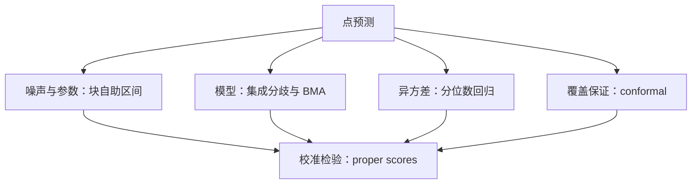
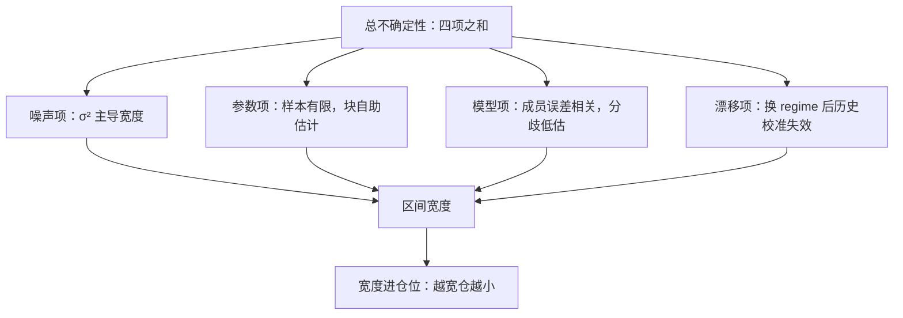

# 不确定性量化

点预测支撑不了仓位：仓位是分布的函数。市场数据先教你一件事——区间几乎总是比你以为的宽。

<footer>—— 据 Vovk, Gammerman and Shafer, *Algorithmic Learning in a Random World*, Springer, 2005；Gneiting and Raftery, *JASA*, 2007 整理</footer>

[上一课](/quant/slm-feature-importance-pitfalls)处理完「哪些特征在起作用」，纪律单元还剩最后一格：承认预测本身有误差结构。回归输出的点估计 $\hat y$ 隐含「误差同方差、模型正确」两条市场从不满足的假设；仓位、风控与止损全是分布的函数，不是期望的函数。本课写不确定性从哪来、用什么工具量化、怎么检验校准。这是纪律单元的收口，也是下一课全课程收束前最后一块拼图。

## 问题

默认置信区间假设残差独立同分布且模型设定正确；市场上异方差、厚尾、regime 切换三条全违反，区间系统性过窄。不这么做会错在哪：按过窄区间定的杠杆，在波动放大时同时遭遇更差的预测与更大的暴露，尾部亏损集中在最没有准备的时点。缺口是把「这个预测有多大把握」变成被检验的对象，而不是模型顺手输出的一个数。

## 方法

按不确定性来源选工具。噪声与参数的不确定性：自助法区间（Efron 1979），时序数据用块自助保持相关结构（Künsch 1989）。模型的不确定性：集成成员间的分歧，相关性预算沿用[模型集成](/quant/fml-ensembles)的口径；深度场景的多网络集成同理；候选模型都合理时用贝叶斯模型平均（Hoeting 等 1999）。条件异方差：分位数回归直接按分位损失训练，不给方差建模而直接给分位。分布无关的覆盖保证：split conformal prediction（Vovk 等 2005；Papadopoulos 等 2002）——在校准集上取残差分位，构造新区间使其覆盖率不低于 $1-\alpha$。评准一律用 proper scoring rules：Brier 分数与 Gneiting-Raftery 的对数与 CRPS 口径，不看区间顺不顺眼。

conformal prediction 可翻译成「保覆盖率的区间构造法」：先拿一批校准数据看模型错得有多离谱，取残差的 $95\%$ 分位，此后每个新预测都配上这么宽的区间——不管模型是什么形状，覆盖率至少九成五。它的成本只是一个 held-out 校准集，这是它近年流行的原因。

块自助的「块」来自时序相关：相邻日的收益互相不独立，逐点重采样会人为把样本「打散」、低估波动。若自相关大约持续一周，就按 5 天整块整块地重抽——块内保持相关结构，块间近似独立，才更接近真实的抽样不确定性。

## 机制

为什么区间普遍过窄：总不确定性是噪声、参数、模型、漂移四项之和，前三项历史数据尚可估计，第四项让历史校准在制度转换后失效——所以覆盖率必须分年份、分波动状态报告，全样本平均覆盖率合格掩盖不了危机月份的失效。为什么集成分歧会低估模型不确定性：成员共享同一份训练数据，误差相关（第 3 课的预算表），分歧只度量了训练随机性那一小块。Conformal 的交换性假设在时序上破缺，直接套用给出的是名义覆盖；加权版本或块版本是必要的修正，不是可选的精细化。最后把宽度接回决策：不确定性大不等于不可交易，而是仓位小——宽度直接进入仓位公式，这正是这一格挂在纪律单元末尾的原因。

第一课的千分位 $R^2$ 意味着区间宽度的主导项是噪声方差 $\sigma_\varepsilon^2$：噪声底没有测准之前，把模型不确定性精修到第三位小数是伪工程。正确的次序是先估噪声底，再看工具能否在它之上加出真实的参数项与模型项。

## 边界

校准不是盈利：区间很准仍然可能没有超额收益，覆盖保证只保证覆盖。

初学者容易把「区间很准」当成「模型很好、能赚钱」；校准只保证「说九成把握的事确实九成会发生」。如果信号本身没有超额收益，一个校准完美的模型只是一位诚实的旁观者——它精确地告诉你它不知道方向。

Conformal 的保证在分布漂移下打折扣，加权补救用旧样本低权重近似「最近窗口的覆盖」，不是未来覆盖；漂移本身归[实盘漂移监测](/quant/live-drift-monitor)管。贝叶斯模型平均在候选集漏掉真模型时退化为加权平均的普通集成，先验当不得保险。本课只量化「预测有多不准」；「不准的预测怎么定价、怎么下仓」是组合课程的领地，本课程到此只把接口留干净。

## 小结

- 仓位是分布的函数：点预测撑不起任何风控与杠杆决策。
- 按来源选工具：块自助、集成分歧与 BMA、分位数回归、conformal；评准用 proper scores。
- 区间过窄的根是漂移项：覆盖率要分年份分状态报告，全样本平均会掩盖失效。
- 噪声底主导宽度：先测 $\sigma_\varepsilon^2$ 再精修模型项；校准不等于盈利。
- 出处：Vovk, Gammerman and Shafer, *Algorithmic Learning in a Random World*, 2005；Gneiting and Raftery, *JASA*, 2007；Efron, *Annals of Statistics*, 1979；Künsch, *Annals of Statistics*, 1989。
