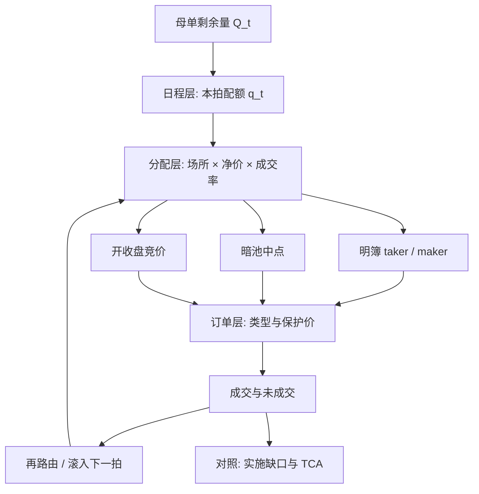

# 智能订单路由 SOR

    
碎片化市场里，一笔母单必须被拆成发往不同场所、不同订单类型的子单；路由要回答的是「此刻把哪一块量交给哪张簿」，而不是在竞速里抢几微秒。

<footer>—— 据 Harris, Trading and Exchanges 对多市场执行的论述；O'Hara, High Frequency Market Microstructure 对碎片化与最佳执行的讨论整理</footer>

智能订单路由（Smart Order Routing, SOR）是执行层把母单映射到场所集合的策略：看各交易所、暗池、竞价与内部化渠道当时的报价、费用、深度与历史成交率，再决定子单的去向、订单类型与改价规则。它处在 [TWAP / VWAP / POV](/quant/twap-vwap-pov) 所规定的**流量日程**之下、单笔 [订单类型](/quant/order-types) 之上：日程说这一秒该完成多少，SOR 说这些量去哪张簿、用限价还是可立即成交限价。Perold 的 [实施缺口](/quant/implementation-shortfall) 是评价尺子；本篇写架构，不写延迟竞赛、插队或利用撮合细节的路径。

## 问题

股权与期货一旦在多个交易场所并行上市，同一证券在同一时刻有多张限价簿、多套费用表、多套匹配规则。母单数量 $Q$ 不能被当成「对一张全国最优买卖价（NBBO 一类合成报价）的一次性市价」。合成报价告诉你**可见的最好价格**，不告诉你：该价位上的量是否还在、吃完之后下一档在哪个场所、暗处有没有中点流动性、以及 taker 费是否把看似更优的一档变成更差的净价。

路由问题因此是带约束的分配：在信息集 $\mathcal{I}_t$（各场所报价、深度、近期成交、费用、拒绝与超时统计）下，把剩余量 $Q_t$ 切成子单 $\{q_{k,t}\}$，发往场所 $k$，使期望执行质量最优。目标通常是到达价或决策价上的缺口，而不是「打到过 NBBO」。约束包括：监管上的最佳执行义务、场内价格保护、自我交易限制、以及母单的紧急程度。碎片化把「选哪张簿」变成一等决策；没有 SOR，日程算法只是在默认通道上匀速浪费或匀速冲击。

### 合成报价不是可执行对象

把各场所买一卖一拼成一张虚拟簿，是路由的**输入可视化**，不是一张真的撮合引擎。你不能对虚拟簿下一张市价单。真正可执行的是：向场所 $k$ 发送带价格与数量的指令，该指令只与 $k$ 的本地簿交互。跨场所的「同时吃两档」需要两张子单，到达时间不同、中间可能被别人先取。因此 SOR 必须把「看起来同时可成交的深度」写成带迟到与占用概率的期望，而不是确定性库存。O'Hara 强调碎片化改变的是价格发现与流动性的分配，不是消灭深度；路由要在分配里找可成交的一块，而不是假设存在一张统一的中央簿。

费用与返佣会翻转名义价格的排序。卖一 10.01、taker 费 0.3 bp 的场所，净价可能差于卖一 10.02、taker 费为负（返佣）的场所。比较必须在净价空间做，否则路由会系统性偏向「报价好看、费用更贵」的明簿。

## 方法

把 SOR 收成三层，层与层之间只通过数量与约束说话。

**日程层。** 母单的剩余量与剩余时间由 TWAP、VWAP、POV 或到达价算法给出目标速率 $v_t$。SOR 不重写 $v_t$，只在这一拍的配额 $q_t\approx v_t\Delta t$ 上做场所分配。紧急度上升时，配额变大，路由应从被动为主切到允许更多 taker，而不是偷偷把日程改成「全市场扫一遍」。

**分配层。** 对每个场所估计：立即成交的期望均价（吃可见深度）、被动挂单的期望成交概率与等待成本、暗池中点交叉的期望成交量。一个可审计的规则是把 $q_t$ 按「净价调整后的可立即成交深度」优先填满保护价以内的明簿，剩余部分按历史中点成交率分配给暗处，再把仍未分配的量以限价挂在费用调整后最深的一侧。保护价来自合成最优或母单限价，防止为了填量去打穿不可接受的档。

**订单层。** 每个 $q_{k,t}$ 还要选 [限价 / 市价 / 冰山](/quant/order-types)，以及是否允许改价、取消重挂。分配层给出的是场所与数量，订单层决定你是 taker 还是 maker。[成交概率](/quant/fill-probability) 进入这里：同样的量，挂在队列尾与吃对方一档，期望缺口不同。暗池通常没有公开队列，成交是匹配事件，路由只能用近期成交率与拒单率当状态，不能假装看见了深度。

$$
\min_{\{q_k\}} \mathbb{E}\bigl[\mathrm{cost}(\{q_k\})\mid\mathcal{I}_t\bigr]
\quad\text{s.t.}\quad \sum_k q_k \le q_t,\ \ q_k\ge 0.
$$

成本应包含净价、未成交滚入下一拍的时机风险、以及跨场所同时成交失败时的腿风险。后一项对配对与篮子尤其硬：一腿在 A 所成交、对冲腿在 B 所被占，瞬时变成单边。

### 费用、保护价与再路由

费用表是路由的一等状态，不是结算后才出现的会计项。Maker–taker 与 inverted 场所会改变「同样的挂单价谁更优」。保护价（price cap / limit）把 SOR 锁在母单允许的最差净价之内；没有保护价，扫档会在薄市场上把缺口打穿。再路由（reroute）发生在：子单超时、部分成交后剩余量、或报价已经离开。再路由必须有冷却与次数上限，否则会在抖动的报价上反复取消重挂，把自己变成取消流，同时提高费用、暴露意图。

竞价时段是另一类场所：开盘、收盘拍卖有独立的数量发现，SOR 应把「是否参加拍卖」当成显式开关，而不是把拍卖量混进连续竞价的深度估计。连续竞价的深度在集合竞价阶段为零或不可用，用连续模型去路由会得到空分配。

内部化与零售批发通道若对机构母单不可用，就不应出现在场所集合里。把回测里的「全国最优价」当成机构可执行集，是在用别人的通道评价自己的路由。

## 机制

SOR 能降低缺口，是因为它把碎片化从「随机选一个默认场所」变成「按条件期望分配」。可见深度集中在少数明簿时，把 taker 量送去深度最大、净价最好的场所，减少打穿；被动量送去排队较短或返佣更高的场所，提高 maker 成交份额。暗处在信息泄露成本高、母单对冲击敏感时提供中点流动性，但成交不确定，必须用未成交的机会成本来平衡——这正是实施缺口第二项。

机制上的第二句话是**信息集滞后**。你用来分配的报价，在子单到达时已经旧了。架构能做的是：缩短决策到发送的内部路径、对每个场所维护迟到分布、以及在保护价内允许一次有限的再定价。架构不能做的是：保证你比别人先到。把 SOR 的优势写成「我们总是先到」，已经离开本篇的对象，进入延迟军备；那条路既不是最佳执行文档该写的内容，也不能被母单层的缺口会计验证。

碎片化还有外部性。路由若系统性把 taker 送去某一所、把 maker 送去另一所，会强化费用驱动的流量分层：报价在 inverted 场所更激进，发现却可能仍在传统所。Harris 把这看成市场结构设计问题；对单个执行者，它表现为「合成报价跳动快、本地簿深度浅」，分配必须对这种分层做稳健，而不是假设各所同质。

### 多腿与同步约束

统计套利与期现、ETF 申赎的母单是多腿的。SOR 若对每条腿独立优化净价，组合层面会出现腿间时间差：一条已成交、对冲腿还在暗池里等中点。正确的架构是带同步约束的路由：或同时送可立即成交的一对、或双方都挂、任一方超时则两边撤。这会牺牲单腿的「最优场所」，换组合的中性。评价必须用组合缺口，不能用两条腿各自跑赢 VWAP 来宣布成功。

把 SOR 当成「总能拿到 NBBO」是范畴错误。NBBO 是监管与展示用的合成，不是成交引擎。最佳执行问的是过程是否合理：是否考虑了价格、速度、场所质量与费用，而不是每一笔都印在合成最优价上。

## 边界与工程取舍

A 股在连续竞价阶段主要是单一场所、价格优先时间优先，SOR 的场所维退化，决策维变成订单类型、保护价与是否参加开收盘竞价；「跨所路由」几乎没有对象。港股、美股、欧洲才有真正的多场所集合。回测若用单一交易所的逐笔去模拟多场所 SOR，场所选择的边际贡献无法识别。

不要把历史成交里「去过哪些场所」当成最优路由的标签去监督学习——那是当时那套规则的结果，含有当时的拥挤与费用，不是反事实最优。不要在保护价外为了完成 POV 而扫档，那是日程层与路由层职责被打通后的典型事故。暗池分配必须有成交率下限与毒性监控：持续不成交就要把量撤回明簿，而不是让母单在暗处过期。

治理上，SOR 参数（场所名单、费用表、超时、暗池比例上限）应版本化，并与 [成交后分析](/quant/tca) 的分层报告对齐：按场所、订单类型、紧急度看缺口。没有事后分层，路由只是一个改不了的黑箱。容量方面，自己的量一旦占某所某档的可观比例，历史成交率失效，分配应退回更保守的可见深度，见 [容量与参与率](/quant/capacity-participation)。

## 小结

- SOR 把母单配额分配到场所与订单类型，目标是条件期望下的执行质量，不是延迟竞赛。
- 合成最优报价是输入，不是可执行对象；比较必须用含费用的净价，并处理到达滞后。
- 架构分日程、分配、订单三层；再路由要有保护价、超时与次数上限。
- 多腿母单需要同步约束，单腿最优场所可以伤害组合中性。
- 场所集合、费用表与暗池上限必须可审计，并用成交后分析按层归因。
- 出处：Harris, *Trading and Exchanges*；O'Hara 对碎片化与最佳执行的论述；评价尺子见 Perold, *Journal of Portfolio Management*, 1988。
