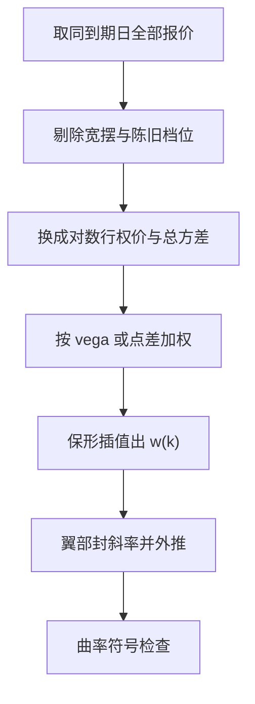
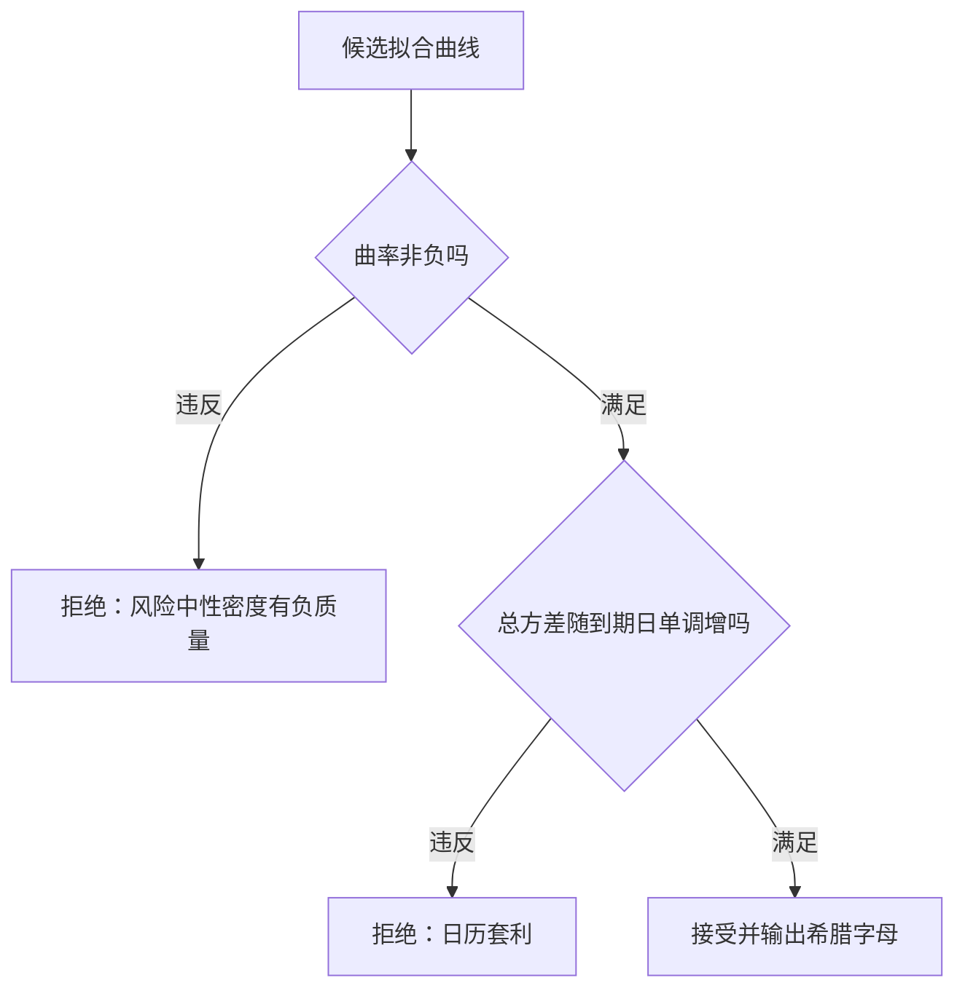

# 波动率微笑插值

交易所只在挂牌行权价上报价，组合与对冲要的是整条曲线——插值不是发明数据，是在两个已知点之间画一条「贵得最合理」的桥。

<footer>—— 据 Gatheral, The Volatility Surface, 2006；Breeden and Litzenberger, 1978</footer>

[上一课](/quant/yang-zhang)把已实现波动的测量做完，本课转到隐含一侧：同一到期日的期权只在十几个挂牌行权价上有盘口，而给奇异期权定价、按 vega 分桶、算边际希腊字母都需要一条连续的 smile。缺口是插值方式本身——随手线性插值会造出负曲率的曲线，而曲率是风险中性密度的符号，负了就是套利。本课写流程与判废标准，不展开 SVI 全套校准与曲面动力学（[波动率曲面](/quant/vol-surface)）。

## 问题

两个缺口。其一，行权价离散：报价之间与翼部之外都是空档，临近到期时挂牌 strikes 变稀，外推段的占比反而更大。其二，插值变量选错：直接对隐含波动率 $\sigma(K)$ 做三次样条，二阶导不受约束，曲率符号失控。本课不写时间维度的曲面拼接，也不写贴现与红利的预处理，只管单一到期日、清洗报价之后的 strike 方向插值。

术语翻译：微笑（smile）是同一到期日下隐含波动率对行权价的 U 形截面；偏斜（skew）指左翼抬高的不对称；翼部（wing）是深价内与深价外两端。业界的「vol 曲线」多指这条一维截面，不是整张曲面。

## 方法

标准流程五步：清洗（剔除宽摆与陈旧报价）、变量转换（$\sigma(K)$ 换成总方差 $w(k)=\sigma^2(k)T$，$k=\ln(K/F)$ 是对数远期行权价）、加权（按 vega 或买卖点差）、插值（保形分段三次 Hermite 优于自然样条）、翼部处理（用幂律或线性斜率封顶，不许样条自由飞）。数字实例：某股指 3 个月期权的挂牌 strikes 从 $k=-0.25$ 到 $0.15$ 共 13 档，实盘组合却压着 $k=-0.40$ 的深度价外看跌——外推段贡献的 vega 占组合三成，翼部怎么封顶直接改变对冲手数。

## 机制

Breeden–Litzenberger 给出判废标准：看涨期权对行权价的二阶导是风险中性密度，$\rho(K)=e^{rT}\,\partial^2 C/\partial K^2$，而 $\partial^2 C/\partial K^2\gt 0$ 等价于 smile 的凸性——所以「曲线向下弯」不是审美问题，是 $\rho$ 出现负质量，衍生品定价从此可以被套利。保形插值的价值在于把二阶导约束写进算法：Hermite 分段在节点间保持形状，自然样条为最小化曲率能量常在翼部反翘。验收前置总比事后修补便宜。直觉类比：插值像在两个已探明的桥墩之间架桥——两端标高是行情给的，桥型（直梁还是拱）由荷载检验（无套利）说了算，不是画得越顺眼越好。

常见误区：直接对 $\sigma(K)$ 样条然后喂进定价公式。错在哪一步？曲率检查本应做在价格或总方差上；对波动率本身插值再复合进 Black 公式，二阶导约束被指数复合破坏，负密度从后门溜进来。

## 边界

插值只管一维截面，跨到期日的日历约束要放到曲面上一起管。翼部本质是观点不是数据：流动性到 $k=-0.25$ 为止，再往外的一切斜率都来自外推假设，压尾还是抬尾会显著改变尾部 vega。与 SVI 校准的分工：参数化把无套利写进参数空间，插值把无套利当验收条件——strike 密度够、曲面稳定时插值够用，跨期限联动复杂时上参数化。校准翻车时先分清是插值段出了负曲率还是报价坏档，别急着全盘重估。曲率一侧连着 [波动率曲面](/quant/vol-surface) 的日历一致性，一侧连着 [风险预算](/quant/risk-budgeting) 里对尾部 vega 的限额。

数字实例：同一组报价，线性插值与保形样条给出的 25-delta 风险逆转可差 0.3 个波动率点；对持有上万张期权的做市商，一个波动率点约等于数十万美元的逐日盯市差异——插值器是隐形的头寸。

## 小结

- 插值五步：清洗、换总方差、加权、保形插值、翼部封斜率。
- 判废标准是 Breeden–Litzenberger 密度非负，等价于 smile 凸性。
- 对 $\sigma$ 直接样条是经典翻车点：二阶导约束被复合破坏。
- 翼部是外推假设，责任在建模者不在数据。
- 出处：Breeden and Litzenberger, *Journal of Business*, 1978；Gatheral, *The Volatility Surface*, 2006；SVI 参数化见 Gatheral and Jacquier, 2014。
