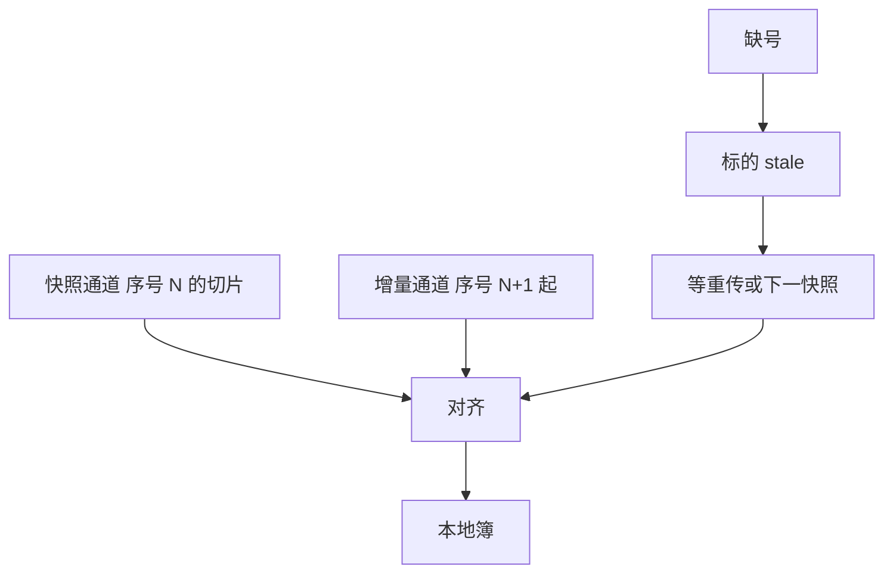

# 快照与增量行情

行情契约是两种互补的投影：快照给出某一引擎序号上的全簿切片，增量给出切片之间的差分。只有增量而无校准，丢包后状态不可恢复；只有快照而无事件，微观结构的时钟是假的。

<footer>—— 对照 Hasbrouck 对市场数据与时间戳的讨论；CME MDP 3.0 快照/增量通道设计；沪深交易所行情规格中的快照与逐笔</footer>

[上一课](/quant/binary-protocols-ouch-sbe)把帧格式停在二进制。[L2/L3](/quant/l2-l3-data)已区分层次。[重建](/quant/orderbook-reconstruction)要求序号与冷启动。本课的缺口是**馈送如何同时提供两条通道**：增量是主路径，快照是校准与晚加入者的入口。[SIP 与直连](/quant/sip-vs-direct)问源；本课问同一源内部的两种编码。后课托管与微波假设你已经声明用的是哪条通道。

## 问题

增量通道带宽小、事件完整，但对迟到者与丢包者不友好：必须从序号 0 或上一校准点重放。快照通道周期性广播「当前各档价量 + 引擎序号」，让新订阅者不必重放全天。问题是两通道的**序号对齐**：快照声称自己是序号 $N$ 的投影，增量必须从 $N+1$ 接着应用。错一位，就会出现「快照里已经没有的订单又被增量撤销」或负数量。Hasbrouck 强调时间戳来源；这里再加一条：快照与增量的时间戳必须同属引擎时钟，不能一个用发送墙钟、一个用核内事件。

A 股常见「定时快照 + 逐笔成交/委托」。快照间隔内的增撤被净掉，用快照序列估队列动力学会系统性低估报撤。逐笔是增量的近亲，但若不同时给订单号生命周期，仍可能只是成交打印而不是 L3。美股直连 ITCH 以增量为权威，快照（或 refresh）用于恢复。CME 把增量与快照放在不同组播组，加入增量前必须先吃快照到已知序号。

### 合并与节流是第三种投影

高峰时馈送可能合并同一档的多次更新，或丢掉中间态只发最新 BBO。这对展示有用，对重建有害：你看见的「一次变档」可能是十次增撤的净结果。研究必须在数据说明书里找到是否合并。SIP 在压力日更常显出节流；直连也可能在微突发里排队。把平静日估的「事件率」外推到 2010-05-06 一类压力日，通道契约已经变了。

晚启动的回放：先定位快照序号 $N$，再放增量。若增量日志从开盘开始而你只想回放下午，仍要一张 $N$ 时刻的快照，不能从第一笔下午成交「猜」当时深度。

## 方法

存储上两条流都留：增量事件表（序号主键）、快照表（序号 + 档位）。回放 API：`book_at(seq)` 若有快照则加载，否则从最近快照 + 增量重建。对账作业：每个快照到达时，用本地重建的聚合深度比较，差异写入 `desync` 指标。差异的容差必须是 0（整数手数），不要用「中间价差一个 tick 就算了」——中间价对、深度错，正是名次策略会爆的地方。

订阅顺序：先快照通道至获得完整切片，再打开增量并丢弃序号 $\le N$ 的消息。组播下重复包用序号去重。缺号则请求重传或等下一张快照；在缺口期间把该标的标为 stale，策略不得在 stale 簿上发依赖名次的单。这与[迟到对账](/quant/late-data-recon)同一纪律。

### 统计帧不是簿

许多馈送夹带成交量、VWAP、开高低收、涨跌停价、停牌标志。它们是派生或制度状态，更新频率与簿增量不同。涨跌停价、停牌必须进状态机（A 股尤其），但不要把 OHLCV 快照当成 L2。IOPV、参考价、虚拟匹配量属于拍卖揭示，见[集合竞价](/quant/cn-limit-auction)，通道可能独立。

## 机制

增量保持事件时间；快照保持可恢复性。两者合在一起，才使[撮合核](/quant/matching-engine-arch)的全序在客户侧可复制。只有快照时，你做的是离散观测的滤波，不是重放。只有增量时，你做的是开环积分，初值与缺口会漂移。组播的「先快照后增量」是把闭环校准写进协议。

发布端常把行情移出撮合核关键路径：核写环形缓冲，发布线程组播。于是行情序号相对成交回报可能晚几个事件。私有成交已发生、公共增量未到，客户会看到自己的成交打在「尚未更新」的簿上。这不是套利信号，是发布延迟。处理：用私有回报更新自己的订单，公共簿标延迟，而不是用自己的成交去改对手深度（除非规格允许）。

## 边界

本课不写如何利用快照–增量时差跨客户抢跑。制度研究应把发布延迟当市场设计参数，见后课托管。压缩行情、TCP 补洞、行情商二次聚合会再加一跳，血缘必须标注。没有公开规格的「Level-2 网页行情」不能用于重建。

## 小结

- 增量给事件，快照给校准；对齐主键是引擎序号，容差为零手。
- 缺口期间标 stale；晚启动必须先加载快照再放增量。
- 节流与合并改变契约；压力日与平静日可能不是同一馈送。
- 出处：Hasbrouck 市场微观结构数据论述；CME MDP 3.0；沪深交易所行情规格。
