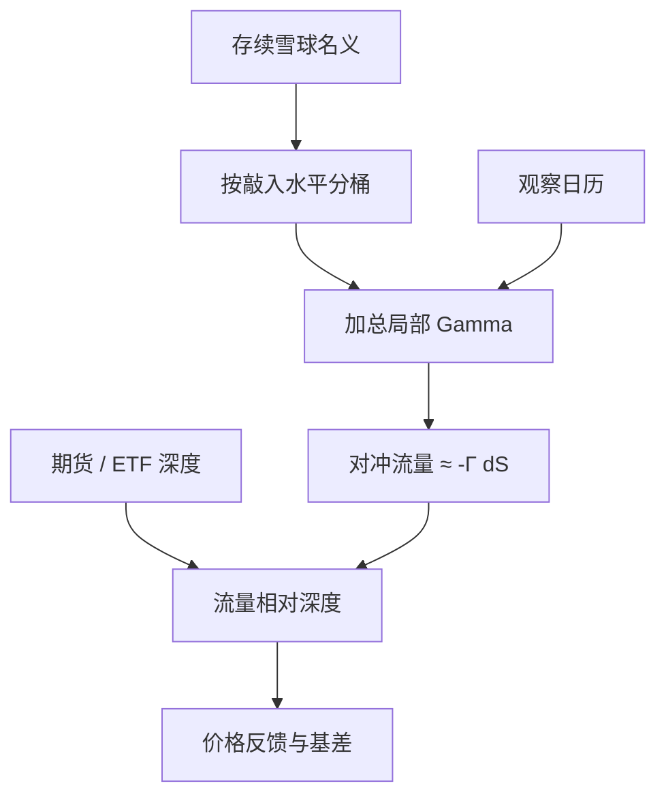

# 对冲商的障碍期权堆积与 gamma

期权做市商为保持 Delta 中性而交易标的时，会把执行价附近的 Gamma 写成现货上的流量；当许多合约挤在同一水平，这条流量不再互相抵消。

<footer>—— 据 Ni, Pearson and Poteshman, Journal of Financial Economics, 2005；障碍合约的局部 Gamma 见标准障碍公式与 Broadie–Glasserman–Kou 的监控讨论</footer>

雪球（自动赎回结构）把敲出、敲入两道障碍写进同一张票据。发行人对投资者的负债，在障碍附近对标的价格高度弯曲：Gamma 局部爆炸，Charm 与 Color 把弯曲的位置随日历推移。单张合约的对冲是[离散 Delta](/quant/delta-hedge-freq)问题；市场上同时存续的许多张合约若在相近的敲入带上堆积，对冲商的净 Gamma 会变成指数期货与相关 ETF 上可观测的同步流量。Ni、Pearson 与 Poteshman 记录过到期执行价附近的现货钉住；障碍产品把类似机制从到期日扩展到存续期内每一次观察。本篇写**堆积如何把局部 Gamma 加总成市场供给**，衔接[障碍监控频率](/quant/barrier-monitoring)与[库存偏度](/quant/inventory-skew)，不讨论如何把价格推过障碍。

## 问题

记对冲商对投资者的负债为 $V(S,t;\mathbf{H})$，其中 $\mathbf{H}$ 是敲入、敲出水平的集合。Delta 对冲要求持有 $\Delta=-\partial V/\partial S$ 的标的或期货。现货变动 $\mathrm{d}S$ 之后，要再交易的数量约为 $-\Gamma\,\mathrm{d}S$，其中 $\Gamma=\partial^2 V/\partial S^2$。香草组合的 Gamma 通常分散在许多执行价上；障碍组合的 Gamma 集中在 $S\approx H$ 的狭带，监控日附近更尖，见[高阶希腊](/quant/higher-greeks)与[Pin risk](/quant/pin-risk)。

雪球在中国权益衍生品零售与财富端大规模发行后，敲入水平往往落在发行时点现货的固定折扣（常见叙述是七到八成一带），敲出落在平值附近。发行若在指数的一段窄幅行情里放量，许多合约的 $H_{\mathrm{KI}}$ 会挤进同一指数区间。问题不是单张票的闭式好不好算，而是：**净 Gamma 作为 $S$ 的函数是否出现尖峰，以及尖峰是否与期货深度、涨跌停和观察时钟重合。**

### 敲入带上的短 Gamma 不是「方向观点」

对投资者，雪球在敲入前像高票息的自动赎回，敲入后经济上接近裸露的下跌风险。对发行人，符号相反：敲入附近负债对 $S$ 的弯曲使对冲账户在局部做空 Gamma——价格下跌时需要再卖标的（或空头期货）以追平 Delta，价格上涨时再买回来。这与做市商在执行价堆积处的短 Gamma 库存是同一几何，只是障碍把峰从 $K$ 挪到了 $H_{\mathrm{KI}}$。把它说成「发行人看空」，是把对冲规则误读成观点；规则在观察日与障碍距离的坐标系里是确定的。

连续监控与日终监控给出不同的 Gamma 峰位置。条款若是日终观察，盘中穿越再返回可以不触发，但 Delta 对冲仍按模型概率交易。模型若用连续公式去对日终合约，会在错误的 $S$ 上堆流量，见障碍监控篇的 Broadie–Glasserman–Kou 平移。

## 方法

把存续合约按标的、观察日历与敲入水平分桶。每一桶估计名义 $N_b$ 与该桶在当前 $S$ 上的模型 Gamma $\Gamma_b(S)$（可用障碍闭式、树或带指示函数的模拟；离散观察必须落在网格上）。加总

$$
\Gamma_{\mathrm{agg}}(S)=\sum_b N_b\,\Gamma_b(S)
$$

给出对冲商部门的局部弯曲。再把 $-\Gamma_{\mathrm{agg}}(S)\,\Delta S$ 与对应股指期货、ETF 的深度 $D$ 比较：若 $|\Gamma_{\mathrm{agg}}\Delta S|/D$ 在观察日前若干日内反复可观，则对冲流量足以进入现货价格的状态方程，而不是残差噪声。

发行数据不会以「精确敲入地图」公开。可观测代理包括：产品募集与存续规模的公开披露、券商衍生品业务报告、期货持仓与基差异常、以及指数在历史发行密集区附近的已实现波动是否出现「靠近则放大、远离则消退」。这些代理测的是**拥挤的对冲规则**，不是单户损益。与[拥挤螺旋](/quant/crowding-spiral)相同：危险的是可同步的减仓量，不是名义存量本身。长期套保与结构性产品的存续名义要分开，前者不一定在同一条触发器上。

### 观察日、缺口与对冲带

雪球的票息与敲出、敲入判断落在离散观察点。观察日前，模型概率对 $S$ 最敏感，Gamma 峰升高；观察日过后未触发，剩余期限的峰形状改变。对冲若按连续 Delta 每时重算，会在观察日前把期货流量打满；若按 Leland / 无交易带只在 Delta 走出带宽才调，流量较钝，但缺口风险留给观察日开盘。正确的工程是把[对冲频率](/quant/delta-hedge-freq)与观察网格对齐：带宽在观察日前收紧，在障碍远离时放松，而不是把时钟一律加密。

隔夜跳空使 $S$ 直接越过峰而不经过连续对冲路径，见[隔夜跳空](/quant/overnight-gap-hedge)。此时账面 Delta 在开盘已经错位，第一笔对冲面对的是浅深度与可能的涨跌停，见[涨跌停与集合竞价](/quant/cn-limit-auction)。风控情景应包含「跳过 $H$」与「停在 $H$ 上反复扫描」两种，而不是只扫局部正态冲击。

## 机制

短 Gamma 对冲是正反馈：跌则卖、涨则买，把已实现波动抬高。障碍把反馈的空间支持限制在 $H$ 附近；堆积把许多账户的支持区间重叠。于是指数在敲入密集带里会表现出局部的高波动、偏斜的成交方向与期货升贴水压力。这与 Brunnermeier–Pedersen 的亏损螺旋不同：这里的触发器不是保证金线，而是**模型 Delta 对 $S$ 的二阶**；但一旦期货保证金随波动上调，两条环路可以耦合，见[资金流动性](/quant/funding-liquidity)与[杠杆强平](/quant/leverage-liquidation)。

敲入一旦发生，该合约的障碍 Gamma 消失，经济暴露变成近似线性的下跌（对投资者）或相应的反向（对发行人）。对冲商需要把为障碍准备的凸性库存拆掉：原先为追 Delta 而建立的期货仓要反向交易。若许多合约在同一周敲入，拆仓本身是另一股同步流量，方向与敲入前的追卖不必相同。公开市场在 2024 年前后的雪球讨论里，常把「敲入」与「对冲踩踏」连在一起；机制上应拆成两段：敲入前的短 Gamma 放大，敲入后的 Gamma 消失与库存再平衡。把两段合成一句「雪球砸盘」，无法对应到应该加宽的限额是 Gamma 还是名义。

### 与香草空头、引伸波的关系

发行人若用香草或场内期权去对冲雪球的 Vega，仍会在障碍附近剩下无法用单张香草消掉的弯曲。Vanna / Volga 在微笑移动时改变 Delta，见高阶希腊篇。引伸波动若在敲入带被买贵，对冲成本上升，发行人可能减少动态对冲频率，把风险改留给隔夜——流量变稀，但缺口变大。风险报告应同时给「按当前频率对冲的期货流量」与「若暂停对冲、观察日缺口」两列，避免只优化其中一列。

加总 Gamma 用的是发行人自己的模型。换一套局部波动或改监控修正，峰的位置会平移。对外沟通若只报一个「危险指数点位」，应声明模型与观察约定；否则那是叙事，不是可重复的风险地图。

## 边界与工程取舍

不要把公开的产品规模直接当成期货上的可交易 Gamma：有的仓已经内对冲、有的标的是个股或混合篮子、有的观察日错开。不要用连续障碍公式给日终合约做流量预测。不要把对冲流量研究写成「如何在障碍前反向收割」——那是把风险管理对象当成操纵手册，本篇明确排除。

容量上，股指期货与相关 ETF 的深度随小时变化；$\Gamma_{\mathrm{agg}}$ 的尖峰若落在开盘或收盘集合竞价，同样的名义冲击更大。限额应以「峰处流量 / 当时深度」为单位，而不是以合约张数为单位。与[参与率封顶](/quant/participation-cap)相同：规则同步时，各自合规的参与率加总仍可打穿深度。

真实出处：Ni, Pearson and Poteshman, *JFE*, 2005（期权对冲与现货）；Broadie, Glasserman and Kou, *Mathematical Finance*, 1997（离散障碍）；Leland, *JF*, 1985（有成本的对冲频率）；Brunnermeier and Pedersen, *RFS*, 2009（流动性螺旋）。雪球是障碍自动赎回在国内的产品名，希腊值几何与香草障碍相同，不另造一套定价公理。

## 小结

- 对冲商为雪球维持 Delta 中性时，局部 Gamma 决定现货与期货上的增量交易；障碍把 Gamma 集中在敲入、敲出水平。
- 发行时点相近会使敲入带堆积，$\Gamma_{\mathrm{agg}}(S)$ 出现尖峰；尖峰相对深度足够大时，对冲从库存问题变成价格反馈。
- 短 Gamma 在敲入前放大波动；敲入后凸性消失，拆仓是另一段同步流量，应分开计量。
- 观察网格、缺口与对冲带必须对齐；连续公式套日终条款会把流量堆错位置。
- 出处：Ni–Pearson–Poteshman, *JFE*, 2005；Broadie–Glasserman–Kou, 1997；Leland, *JF*, 1985；Brunnermeier–Pedersen, *RFS*, 2009。
