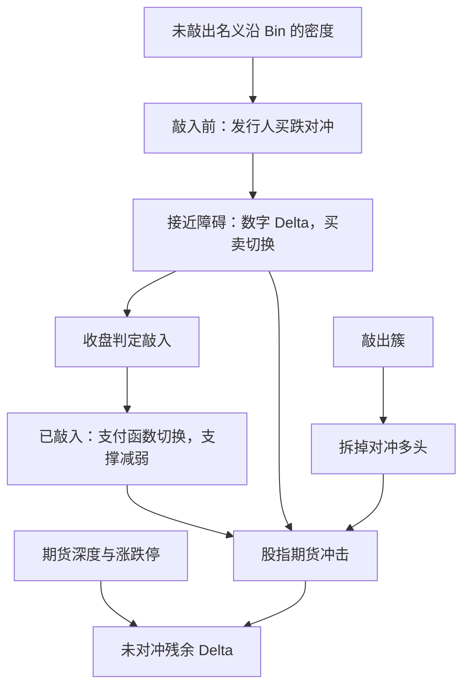

# 敲入事件与对冲踩踏

障碍附近希腊值不再光滑：敲入一旦从或有变成既成，发行人的复制需求会跳一截；若大量合约的敲入水平堆在同一指数点位，跳的方向会叠成对期货的同步冲击。

<footer>—— 障碍期权数字风险与对冲见 Taleb、Wilmott 等实务叙述；需求与存货外溢见 Ni, Pearson, Poteshman 及做市商 Gamma 文献</footer>

[雪球定价](/quant/snowball-pricing)给出单张合约的支付与 Delta。市场风险来自许多张合约共用挂钩标的、共用相近的 $B_{\mathrm{in}}$。中证 500、中证 1000 上曾出现发行点位接近、敲入比例接近的存量堆积。指数跌向那一簇水平时，发行人的对冲从「越跌越买的支撑」进入「障碍数字风险」，敲入发生后又从敲入期权变成近似远期空头（对发行人）或投资者开始承担现货。买卖方向在短窗口里可能翻转，期货深度有限，于是出现**对冲踩踏**：不是有人约定一起砸盘，而是复制规则在同一点同时改写订单。本篇写敲入前后的希腊值会计与集中度，对象是风险管理，不是如何在敲入前抢跑。境内场外存量受适当性与柜台规则约束；程序化对冲仍受[程序化规定](/quant/cn-program-trading-rules)约束。

## 问题

敲入前，发行人持有向下敲入看跌，Delta $\Delta_{\mathrm{pre}}\in(-1,0)$，且 $|\Delta|$ 随 $S\downarrow B_{\mathrm{in}}$ 上升。对冲是买入期货。这一段对指数有缓冲：下跌引发买盘。敲入后，若条款使投资者到期支付变为 $S_T$，发行人相当于对客户做空指数（须支付 $S_T$），Delta 跳向 $-1$ 附近，对冲仍是多头期货，但数量与敲入前不必连续。更危险的是障碍本身的数字部分：收盘是否 $\le B_{\mathrm{in}}$ 是二元事件，其 Delta 在观察日像针。盘中 $S$ 在 $B_{\mathrm{in}}$ 上下摆，对冲单可以在买与卖之间剧烈切换。问题是估计：（1）单笔合约敲入时 Delta 的跳；（2）存量名义在 $B_{\mathrm{in}}$ 上的密度；（3）期货流动性能否吸收同步再平衡。缺任何一项，都会把「雪球会托市」或「雪球会砸盘」写成与状态无关的口号。

Ni、Pearson、Poteshman 对上市期权的教训是：做市商再平衡可以改变标的波动与到期钉住。雪球的障碍不是上市执行价，但会计相同——存货的 Gamma 与数字风险进入期货订单流。差别是场外仓位不透明，密度要用发行与到期的公开信息、券商披露与指数点位去估，误差大。

### 敲入不是亏损本身，是状态切换

条款上，敲入当日投资者未必立刻实现亏损；亏损在「已敲入且最终未敲出」时按期末价兑现。对冲却不能等期末。状态从「或有看跌」变成「几乎确定的下跌参与」，希腊值立刻按新支付函数计算。若此后指数反弹并敲出，合约仍可能终止于票息——对冲又要按敲出概率往回调。因此敲入后的路径仍有敲出期权，Delta 不是简单的 $-1$，而是「已敲入雪球」的 Delta，通常更接近空头远期再叠加剩余敲出。风控若在敲入瞬间把仓位当普通空头期货一次性对满，可能在反弹敲出时反向超调。

观察若以收盘指数为准，盘中击穿再收回不切换状态，但盘中对冲仍会按条件概率交易。收盘附近的订单更密，这是数字风险的时钟，不是「把指数打到障碍以下」的操作建议。故意冲击收盘以触发或避免敲入，落入操纵与异常交易监管。

## 方法

风险账按挂钩标的聚合，而不是按产品名。对每个指数、每个交易日，列出未敲出名义、未敲入名义、已敲入名义，以及 $B_{\mathrm{in}}$、$B_{\mathrm{out}}$ 的直方图。把名义映射到发行人总 Delta、总 Gamma：未敲入部分用障碍期权数值希腊值，已敲入部分用相应支付的希腊值。压力测试至少三条路径：缓跌穿过障碍簇、一日跳空越过障碍簇、跌到障碍附近震荡多日。缓跌给出持续买入的托市段；跳空给出无法在连续 Delta 上调整、缺口后一次性补对冲；震荡给出数字风险的来回交易，消耗期货深度并抬高已实现波动。

对冲执行受期货涨跌停、保证金、[程序化报撤](/quant/cn-fee-cancel-ratio)与会员通道约束。假设可以在障碍上无限量市价成交，会低估缺口。应把期货簿的可成交量当成对冲上限，超出部分记为未对冲 Delta，进入资本与止损，而不是记为已经复制成功。

### 集中度比单笔票息更重要

单笔 75% 敲入、名义很小，跳的期货张数可忽略。若数百亿名义的 $B_{\mathrm{in}}$ 落在指数同一 2% 区间，则该区间的 Gamma 密度可以高过上市期权的执行价墙。发行时点集中（同一波营销、同一点位建仓）会制造这堵墙。分散挂钩、错开障碍、错开观察日，是降低踩踏的结构手段；它们改变的是发行簿，不是某一投资者「如何躲过自己的敲入」。内部风险应拒绝使公司簿在单一指数单一障碍上过度堆积，即使单笔销售仍有票息空间。

## 机制

踩踏可以拆成三段。第一段，远离障碍：正的缓冲，发行人买跌，与[需求压力](/quant/ni-option-demand-pressure)里做市商正 Gamma 类似（此处因发行人多看跌而买现货）。第二段，贴近障碍的观察窗：数字 Delta 使小幅波动对应大额期货，买卖切换快，期货已实现波动上升，可能把更多合约推进敲入。第三段，簇内大量敲入完成：未敲入名义消失，第一段的买盘来源减弱；已敲入名义按新 Delta 可能仍要持有或调整空头对冲，但「越跌越买」的边际支撑下降。若同时有投资者赎回、券商减发新雪球，买盘更少。指数在障碍簇下方的流动性，因此差于障碍簇上方——不是因为条款惩罚下方，而是对冲规则改了供给。

敲出簇同样能制造同步减仓：指数升到一批 $B_{\mathrm{out}}$，提前终止使发行人拆掉多头期货，形成上涨时的卖压。踩踏一词常被只用于下跌敲入；对称地，敲出日也是期货的集中再平衡日。风险日历应同时标敲入墙与敲出墙。

### 与上市期权 Gamma、0DTE、清算螺旋的差别

上市期权的 Gamma 墙在执行价上每日可见；雪球墙在场外，透明度低。0DTE 把墙压缩到一天，见[0DTE 与波动](/quant/amaya-0dte-volatility)；雪球墙可以在指数上悬挂数月。清算螺旋是保证金触发的被迫卖出，见[杠杆与强平](/quant/leverage-liquidation)；雪球踩踏是复制规则触发的再平衡，发行人未必穿仓，但期货市场仍收到订单冲击。三者可叠加：指数快跌时，期货保证金、雪球敲入、期权负 Gamma 同时要交易。风险加总须在同一标的、同一时钟上，而不是分产品各报各的限额。

## 边界与工程取舍

场外名义与障碍分布不是交易所公开全市场数据。券商只能看到自己的簿与部分同行传闻；监管统计若未公开，模型应把密度当成区间估计，并在上限情景上留资本。挂钩指数若停用或编制调整，观察以合约指定的继任规则为准。每日敲入与连续敲入的差别，在跳空日最大：跳空越过 $B_{\mathrm{in}}$ 时，离散合同仍按收盘判定，但中间没有给对冲的连续路径，缺口风险属于跳跃，Delta 对冲不能消去，见[对冲频率](/quant/delta-hedge-freq)。

不要把本篇写成「在敲入墙前布局期货」的交易手册。利用对冲流去冲击收盘、制造触发，属于市场操纵与异常交易讨论范围之外的禁止项。不要向投资者暗示「发行人一定会托市所以不会敲入」——托市是未敲入段的或有结果，且在墙附近会失效。公开规则下，销售须揭示敲入后可能损失全部本金；内部只应用希腊值与集中度管理自身复制风险。

已敲入产品若允许在后续观察日敲出，投资者仍可能拿回本金加票息。把敲入当日当产品死亡，会高估投资者损失、也会误导对冲：剩余敲出权仍有价值，须继续定价。

## 小结

- 敲入把雪球从或有看跌切换到下跌参与，希腊值在观察日不连续。
- 障碍簇上的名义密度决定期货同步冲击的规模；单笔票息不能代表系统风险。
- 未敲入段的买跌支撑在敲入后减弱；敲出簇会在上涨时带来减仓卖压。
- 对冲受期货流动性、停板与程序化规则限制，不能假设障碍上无限成交。
- 管理对象是自身簿的集中度与数字风险，不是利用墙去冲击指数。
- 出处：障碍期权对冲实务；Ni–Pearson–Poteshman 对冲外溢；雪球条款与场外衍生品适当性公开规范。
