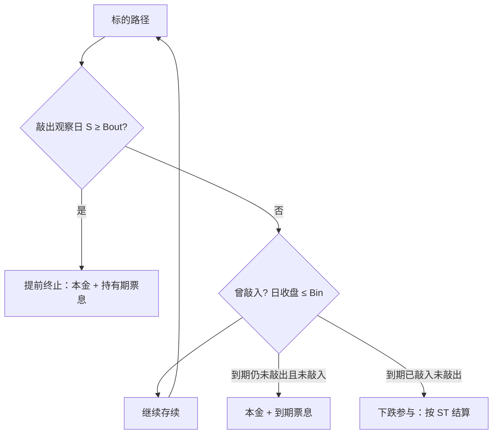

# 雪球结构与定价

雪球是自动赎回的双障碍结构：向上敲出则提前终止并支付票息，向下敲入则激活投资者的下跌参与；价格来自风险中性下对离散观察路径的期望，而不是把票息当无风险利率。

<footer>—— 障碍期权定价见 Rubinstein–Reiner；离散观察修正见 Broadie, Glasserman and Kou；自动赎回结构的行业分解见结构票据实务</footer>

境内「雪球」通常以证券公司收益凭证或场外期权出现，挂钩中证 500、中证 1000 等指数。投资者在存续期内收取年化票息，代价是卖出一条路径依赖的下跌风险。观察时钟必须写进合约：敲出多为每月（或每隔数个交易日）离散观察，敲入多为每个交易日收盘（近似美式敲入）。若某次敲出观察日收盘价不低于敲出障碍 $B_{\mathrm{out}}$（常见为期初的 100%–105%），产品提前结束，返还本金并按持有期支付票息。若存续期内曾触及敲入障碍 $B_{\mathrm{in}}$（常见为期初的 70%–85%）且从未敲出，到期结算变为与期末价格挂钩的下跌参与，本金不再完整。若既未敲入也未敲出，到期仍支付本金与票息。本篇写支付分解、数值定价与发行人对冲的希腊值，衔接[障碍监控频率](/quant/barrier-monitoring)和[蒙特卡洛](/quant/mc-pricing)。适当性、不得宣传保本、柜台衍生品业务规范是约束；不讨论如何把结构改写成规避适当性的包装。

## 问题

把雪球当成「高票息理财」，漏掉的是嵌入期权的卖方身份。投资者的经济头寸近似：持有零息债券，同时卖出向下敲入看跌，并卖出一串向上敲出的自动赎回权（发行人有权在敲出日终止并支付既定票息）。票息是期权费的分期形式，其高低必须用障碍距离、波动、期限、敲出频率与分红融资来解释。同一 15% 年化，在 $B_{\mathrm{in}}=75\%$、挂钩 500 指数、波动 25% 与在 $B_{\mathrm{in}}=85\%$、波动 18% 上，对应的风险完全不同。问题是在给定条款下计算风险中性价值 $V$，再与票息反推：发行人卖出凭证的价值应覆盖对冲成本、资本与保证金，而不是把票息与存款利率比。

支付对路径的依赖使 Black–Scholes 闭式不够用。敲出离散、敲入几乎每日，两种时钟不能都用连续障碍公式。连续监控会高估敲入概率、低估敲出漏检，票息会定错。必须在合约网格上定义触发，再用模拟或带障碍的偏微分数值解。

### 三条终局，不是「涨了拿息、跌了亏本」一句

记期初 $S_0=1$（标准化），期末 $S_T$，敲出停时 $\tau_{\mathrm{out}}$，敲入示性 $K_{\mathrm{in}}$。名义本金为 1 时，投资者支付（现金结算、忽略中间票息的精细日算）可写成：

- 若 $\tau_{\mathrm{out}}\le T$：获得 $1+$ 持有期票息，合约终止；
- 若未敲出且 $K_{\mathrm{in}}=0$：到期获得 $1+$ 到期票息；
- 若未敲出且 $K_{\mathrm{in}}=1$：到期获得 $S_T$（或 $S_T/B_{\mathrm{in}}$ 等合同约定的参与公式），票息可能部分保留或全无，以条款为准。

第三支使投资者在敲入后近似做多标的（从 0 到 $S_T$），也就是把已经卖出的看跌变成了兑现。第一支是自动赎回，切断了剩余期权。定价要把三支的概率与贴现支付加总，不能只用期末分布。

「未敲入未敲出拿全息」看起来像债券，其实是两条障碍都没碰到的路径集合，概率随波动上升而下降。用历史未敲入频率当未来票息兑现率，忽略了条款是在高波动期卖出的：卖出时隐含波动已经把第三支的概率卖贵了。

## 方法

风险中性定价：

$$
V=\mathbb{E}^{\mathbb{Q}}\Big[\sum_{i} e^{-r t_i} C_i\,\mathbf{1}_{\{\tau_{\mathrm{out}}=t_i\}} + e^{-rT} \Pi_T\,\mathbf{1}_{\{\tau_{\mathrm{out}}>T\}}\Big],
$$

其中 $C_i$ 为敲出日现金流，$\Pi_T$ 为未敲出时的到期本金与票息或下跌参与。模拟须在每个敲出日检查 $S_{t_i}\ge B_{\mathrm{out}}$，在每个敲入日检查 $S_{t_j}\le B_{\mathrm{in}}$。步长粗于观察网格会漏敲入；只在敲出日抽样会把每日敲入变成离散敲入，价格偏贵（对发行人）或偏便宜（对投资者）取决于哪一侧。Broadie–Glasserman–Kou 修正可用于把每日观察近似成连续障碍平移，但雪球同时有两种频率，实务上以按交易日网格的蒙特卡洛为主，方差缩减用对偶路径与控制变量。

波动率不能只用一个 $\sigma$。障碍产品对微笑的翼部和期限结构敏感：敲入区域吃的是下跌翼，敲出区域吃的是近点。局部波动可匹配香草切片，但对对冲仍缺随机波动；[局部随机波动](/quant/local-stoch-vol)常用于此类路径依赖。校准必须声明：用哪几个到期的香草、是否含分红预测、是否用期货曲线。挂钩指数的定价通常在期货上做对冲，现货指数本身不可交易，基差进入对冲误差。

### 票息是方程的未知数，不是输入的收益率

发行人在 $t=0$ 的目标是 $V_{\mathrm{issuer}}\ge 1-\mathrm{margin}$（或对投资者 $V_{\mathrm{investor}}\le 1$）。给定障碍与期限，解出年化票息 $c$ 使等式成立。$c$ 随 $B_{\mathrm{in}}$ 上移、随 $\sigma$ 上升、随期限变长而上升——因为第三支更贵。市场票息高于模型 $c$，要么发行人加了波动与跳的溢价，要么条款里还有保证金、提前赎回权、或观察日对交易日的精细差别未写入模型。把募集说明书上的「预期年化」当成折现率去算现值，是把卖方期权费当成了无风险收益。

## 机制

发行人（券商）是投资者的对手方：投资者空头敲入看跌，发行人多头该看跌，Delta 为负，须买入标的或股指期货才能中性，见[希腊值对冲](/quant/greeks-hedge)。标的下跌、尚未敲入时，敲入期权更接近生效，发行人 Delta 更负，对冲须加买——表现为「低买」。标的上涨接近敲出时，自动赎回概率升，剩余期权缩短，对冲须减买或转卖——表现为「高卖」。震荡市里这套再平衡可以赚到 Gamma；单边快跌或快涨时，障碍附近的数字风险（digital）使 Delta 跳，复制误差变大。这是定价必须加跳与离散对冲成本的原因，也是下一篇[敲入踩踏](/quant/snowball-knockin-cascade)的微观基础。

每日敲入在收盘价上判定时，盘中穿过 $B_{\mathrm{in}}$ 再收回不算敲入。估值若用连续障碍，会高估敲入、高估投资者亏损概率、从而高估应付票息。合同以收盘（或条款指定的官方指数）为准，模型时钟必须一致。

### 与香草、普通障碍、自动赎回票据的差别

普通向下敲入看跌没有向上敲出；凤凰、自动赎回票据可能保本或敲出后不再有下跌参与。雪球的危险区是「已敲入、未敲出」：投资者从票息卖方变成指数空头的反面（承担下跌）。香草看跌的 Delta、Vega 光滑；雪球在两条障碍附近各有一层尖峰，且敲出日只有一天有敲出数字风险。对冲限额不能只用到期日的 BS Delta，要按观察日历切换。

## 边界与工程取舍

境内雪球是场外合约，受证券公司柜台衍生品与收益凭证规则、投资者适当性、风险揭示约束；私募参与还受《私募证券投资基金运作指引》对场外衍生品的规范。不得向不适当投资者销售，不得按保本或「稳赚票息」宣传。估值与销售材料应区分：模型价值、对手方信用、提前终止权、以及敲入后的最大损失（可亏完名义）。挂钩单股的雪球还叠加停牌、涨跌停与股利，观察日定义更脆。

不要用历史回测「从未敲入」去替代风险中性概率。不要在障碍附近用粗糙网格给客户报价。不要把发行人内部的对冲 P&L 当成产品对投资者的保证。公开规则下，本篇止于条款如何定价与如何用期货复制，不提供绕开适当性或把雪球拆成未报备收益互换的结构。

保证金与资本会抬高发行人要求的 $c$，但不改变支付函数。客户看到的票息含中介约束溢价。比较两家券商的票息，须对齐障碍、观察、分红假设与是否可提前Call，否则比较的是不同合约。

## 小结

- 雪球是离散敲出加接近每日敲入的自动赎回结构；投资者卖出敲入看跌以换票息。
- 定价必须在合约观察网格上做风险中性期望，票息由障碍、波动与时钟反解，不是存款利率。
- 发行人 Delta 为负，对冲表现为下跌加买、临近敲出减仓；障碍处有数字风险。
- 模型须处理两种观察频率、微笑翼部与指数期货基差。
- 销售与存续受场外衍生品适当性约束，不得按保本陈述。
- 出处：障碍期权与离散修正文献；交易所与协会柜台衍生品、收益凭证及适当性公开规则；《私募证券投资基金运作指引》场外衍生品相关条款。
