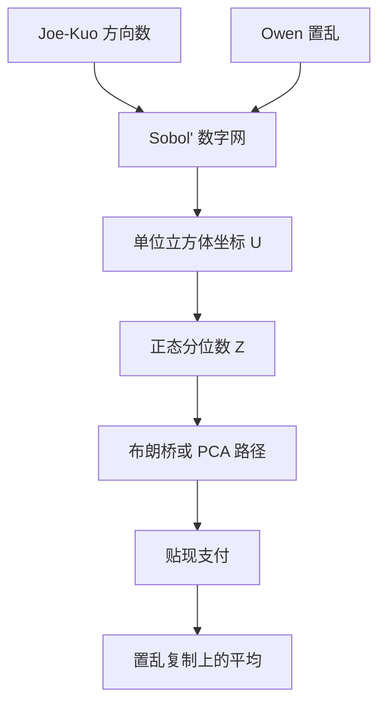

# 拟随机数 Sobol

    
低差异序列用确定性的均匀填充代替独立随机点；当被积函数的 Hardy–Krause 变差有限时，积分误差由差异度支配，而不再只按中心极限定理的平方根速度下降。

    <footer>—— Sobol', On the Distribution of Points in a Cube and the Approximate Evaluation of Integrals, USSR Computational Mathematics and Mathematical Physics, 1967</footer>

[上一课](/quant/is-barrier)把障碍上的稀有事件扭到新测度并乘似然比；随机波动、跳跃、多障碍使常数漂移失效。变测度之后，积分仍在单位立方体上。缺口是拟随机：用 Sobol' 点列去填 $[0,1]^d$，而不是「更好的伪随机」。本课写点列、Owen 置乱与路径映射，不重写 IS 的指数扭曲。与方差缩减叠用时光滑性下降，应先改核再改点列。

## 问题

期权价格是单位立方体上的积分：把独立正态写成分位数 $Z=\Phi^{-1}(U)$，$U\in[0,1]^d$，$d$ 等于资产数乘时间步（再加随机波动与跳跃的额外维）。伪随机把 $U$ 当 i.i.d. 均匀，误差有概率 $N^{-1/2}$ 的渐近。若积分核 $f$ 足够光滑，低差异点列的 Koksma–Hlawka 不等式给出确定性界 $|N^{-1}\sum f(x_i)-\int f|\le V(f)\,D_N^*$，其中 $D_N^*$ 是星号差异。Sobol' 网的 $D_N^*$ 可以到 $(\log N)^{d-1}/N$ 量级，维数固定、 $N$ 大时优于平方根。问题是金融里的 $f$ 常常不光滑：看涨的折点、数字与障碍的间断使 Hardy–Krause 变差无穷，理论上的 $1/N$ 不再担保；维数 $d$ 随步数线性涨，有效维数而不是名义维数才决定 Sobol' 是否真的快。

因此 QMC 在金融中不是「换成更好的随机数生成器」一句话，而是三件套：点列（Sobol' 方向数）、置乱（使估计无偏并可报误差）、路径映射（布朗桥或 PCA 把方差集中到前几维）。缺任何一件，都容易得到比 Mersenne Twister 更差的结果。

### 差异度与有效维数

星号差异度量点集在轴对齐盒子里的均匀程度。Sobol' 是数字网：在二进盒子里点数与体积成比例。Caflisch、Morokoff 与 Owen 强调 ANOVA 分解：若 $f$ 的大部分方差来自前几维的交互，后面的维即使填得较差也无妨——这叫低有效维数。欧式期权的 $S_T$ 只依赖布朗在 $T$ 的值，有效维是 1，Sobol' 极快。把路径按时间顺序把增量塞进连续坐标，有效维接近步数，QMC 优势迅速消失。这不是 Sobol' 的缺陷，是坐标选错了。

把 QMC 的误差当成「一定比 MC 小一个数量级」会误导。不连续支付、高有效维、方向数质量差、以及 $N$ 不是 2 的幂，都可以让拟随机看起来只是一种怪模怪样的伪随机，区间还没法用普通标准差去报。

## 方法

Sobol' 序列第 $j$ 维的第 $n$ 个点由方向数 $v_{j,k}$ 与 $n$ 的二进位做异或得到。方向数来自本原多项式；早期默认多项式在高维投影上会成团。Joe 与 Kuo 提供的搜索方向数把二维投影的均匀性当作设计目标，是现时金融库的常见选择。生成是确定性的：同一 $n$ 永远对应同一点，便于复现，也意味着没有独立样本的中心极限定理。

Owen 置乱（以及 Matoušek 的线性置乱近似）在每个二进数字上做随机置换：点列仍是数字网，边际仍均匀，但整列成为无偏的随机估计，方差可以有意义地谈，区间可用独立置乱复制来报。没有置乱的纯 Sobol' 是有偏的确定性求积，误差可能对 $N$ 振荡，不适合当「带标准误的价格」。实践是：若干独立 Owen 复制，每复制用 $N=2^m$ 个点，组间标准差当误差。

### 布朗桥与 PCA 把方差推到前几维

路径 $W_{t_1},\ldots,W_{t_d}$ 是相关正态，可以由标准正态 $Z\in\mathbb{R}^d$ 线性变换得到。按时间顺序：$Z_1$ 生成第一步增量，$Z_d$ 生成最后一步，每维贡献相近，有效维高。布朗桥：先用 $Z_1$ 生成 $W_T$，再用 $Z_2$ 生成中点，再填四分点——前面几个坐标决定路径的大尺度形状，后面只填高频细节。PCA 对协方差阵取主分量，同样把能量集中到前几维。Moskowitz 与 Caflisch 表明，这种坐标变换是 QMC 对路径依赖期权生效的前提。亚式、回望对整条路径敏感，但大尺度仍由前几主成分支配；障碍对触及时刻敏感，间断落在许多维的复杂区域上，即使做了桥，QMC 也常要配平滑或条件化。

正态反函数必须稳定：极小的 Sobol' 坐标 $2^{-32}$ 量级会把 $\Phi^{-1}$ 推到很远的尾。实现上应对 $U$ 做 $(U+c)/2^b$ 一类移位，避免精确的 0 与 1。维数超过方向表长度时不应静默复用低维，而应换表或退回伪随机。

## 机制

伪随机靠独立性换取 $\sqrt{N}$ 与容易的方差估计；QMC 靠空间填充换取可能的 $N^{-1+\varepsilon}$。Sobol' 在二进结构上最优地填充，因此 $N$ 取 2 的幂时网格对齐，差异度最好。置乱把「碰巧这个函数在这个网格上偏大」平均掉，使估计的期望精确等于积分。路径构造则是在积分核上做一次正交变换：不改变真值，只改变 ANOVA 的维数分布，让 Sobol' 前几维的优质投影打在 $f$ 真正变化的方向上。

与分层抽样的关系：一维等距点就是最简单的 QMC；高维分层的层数爆炸，数字网是高维分层的一种代用品。与重要性采样同时用时，似然比通常不光滑，$V(f)$ 变大，QMC 的理论速度打折；先平滑支付或先条件化，再喂给 Sobol'，比把 IS 权重直接乘上去更符合低差异假设。

### 不连续支付要先平滑

数字期权的支付是指示函数，障碍是路径空间上的曲面。Koksma–Hlawka 的 $V(f)=\infty$，实践中 QMC 仍可能优于 MC，但不稳定，且对点列的相位敏感。平滑手段包括：把数字换成窄跨式、用布朗桥把障碍指示换成条件概率（得到 Lipschitz 或至少更正则的核）、对触及时间做核光滑。这些改写若保持无偏（条件概率）或偏差可控（核宽），QMC 才重新变得可预期。不要指望「Sobol' 自己能处理敲入」。

有效维数可以用 ANOVA 或经验上的「只用前 $k$ 维、后面取中点」来探测。若前 8 维已经解释 95% 的方差，Sobol' 值得用；若方差在上百维里均匀摊开，先降步数、改桥，再谈拟随机。

## 边界

Sobol' 不是随机数检验意义上的「更随机」，高维投影仍可能成条带，尤其是用过时方向数时。美式 LSMC 的回归噪声、重要性采样的重尾权重、带跳的复合泊松计数，都会破坏光滑积分的前提。多资产相关性若用 Cholesky 按资产优先编号，时间维被推到后面，对路径依赖产品是错误的编号习惯——应先按时间做桥，相关在每层因子上处理。

误差报告：未置乱的单列 Sobol' 不能用样本标准差。独立置乱的组数太少则区间本身很吵。监管与对账场景里，确定性点列有利于逐 bit 复现，但必须锁定方向数版本、置乱种子、跳过的前导点（burn-in）以及 $N$。Glasserman 的书把 QMC 放进金融工程工具箱，依据是经验收敛与有效维理论，不是对所有期权的定理。

跳过前 64 或前若干 2 的幂个点，是为了躲开序列起步时某些维的相关性；这是实现惯例，不是 Sobol' 1967 年论文的一部分。换库时这些惯例不一致，价格会对不齐。

## 小结

- Sobol'（1967）给出数字网上的低差异点列；金融定价把它当作单位立方体上的积分节点，而不是「更好的伪随机」。
- Koksma–Hlawka 要求有限变差；看涨折点尚可，数字与障碍必须平滑或条件化，否则理论速度不成立。
- Owen 置乱恢复无偏性与可报告的误差；纯确定性网格不宜单独报标准差。
- 布朗桥或 PCA 降低有效维数，是路径依赖上 QMC 生效的关键；按时间顺序填增量常浪费 Sobol' 的前维质量。
- 与 IS、跳跃、美式回归叠用时光滑性下降，应先改核再改点列。
- 出处：Sobol', *USSR Comput. Math. and Math. Phys.*, 1967；置乱见 Owen；路径映射见 Moskowitz and Caflisch；方向数见 Joe and Kuo；金融叙述见 Glasserman, 2004。
