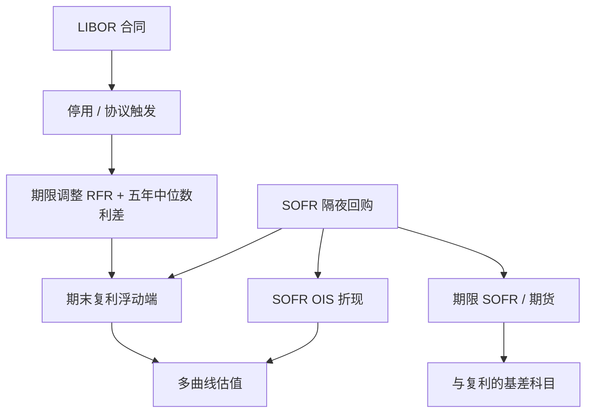

# SOFR 过渡与后备

    
LIBOR 不再是可观察的无担保银行融资市场，而是越来越薄的专家判断；基准必须改接到大量、可验证的交易上。

    <footer>—— Duffie & Stein, Reforming LIBOR and Other Financial Market Benchmarks, Journal of Economic Perspectives, 2015；ARRC 对 SOFR 的选定与 ISDA 后备协议</footer>

LIBOR 操纵丑闻与无担保同业市场的萎缩，使这一曾经的「无风险短端」失去交易基础。Duffie 与 Stein（2015）把改革写成：基准应锚定在广阔的真实交易上，而不是少数银行的报价。英国 FCA 的 Bailey（2017）明确了 LIBOR 的退场时间表。美国替代参考利率委员会（ARRC）在 2017 年选定担保隔夜融资利率 SOFR——由纽约联储根据国债回购交易编制——作为美元衍生品与商务贷款的主要替代。ISDA 2020 年 IBOR Fallbacks Protocol 把遗留合同接到「经期限调整的后备 RFR 加历史利差」。本篇写 SOFR 是什么、复利与期限利率如何不同于 LIBOR、后备公式怎样进入估值，以及多曲线、[LMM](/quant/lmm) 与 [Hull-White](/quant/hull-white) 要改哪一层。它与[基差互换](/quant/basis-swap)、[互换价差](/quant/swap-spread)衔接，不重复交叉货币。

## 问题

旧单曲线把 3M LIBOR 既当折现又当投影。停用之后，合同指数、折现指数与风险因子可能三分裂：抵押衍生品折现走 SOFR OIS；浮动端可能是 SOFR 复利（in arrears）、期限 SOFR、或带利差调整的 LIBOR 后备；国债与 repo 仍是另一条曲线。问题是把法律条文翻译成现金流日历：观察期、回看、锁定期、支付滞后、营业日，全部进入年分数与凸性。把「LIBOR 换成 SOFR」当成改一个曲线名字，会在首次重置就出现无法解释的 PnL。

第二问题是信用消失后留下的空洞。LIBOR 含银行无担保信用，SOFR 是国债回购、近乎无信用。同一张「5Y 互换」从 LIBOR 换成 SOFR，平价利率应下降大约一个信用/流动性利差，而不是保持不变。后备协议用五年中位数把这笔利差冻成常数加在 RFR 上，使转换日附近的转移支付尽量小；它不是对未来银行信用的预测。

### 隔夜担保利率不是 3M 远期

SOFR 每日公布，对应隔夜国债回购。LIBOR 是前瞻期限利率：重置日已知未来三个月的利息。把隔夜序列变成合同利息，有两条主流路。一是期末复利（compounded in arrears）：计息期内把 SOFR 逐日复利，期末才知道支付额，这是衍生品的 ISDA 标准。二是前瞻期限 SOFR（term SOFR）：由期货或掉期隐含一个前瞻 1M/3M 利率，便于贷款。Heitfield 与 Park（2019）讨论如何从 SOFR 期货推断期限利率，以及凸性使期货不等于简单远期。ARRC 的用户指南强调：衍生品与现货的惯例不必相同，跨产品基差会永久存在。

「无风险」只相对于无担保银行信用而言。SOFR 仍含回购市场的微观、季末窗口、以及国债抵押供求。把它写成 Vasicek 里的 $r_t$ 而不加季末确定性跳跃，短端期货日历会系统性偏。

## 方法

**曲线构建。** 折现：用 SOFR OIS（及短端 SOFR 期货，经凸性）自助 $P^D$。投影：对复利 SOFR 互换，投影与折现可以重新靠近，但期限 SOFR、联邦基金、BSBY 一类残余指数仍要单独投影。多曲线纪律不变，见[OIS 与多曲线](/quant/multi-curve-ois)。期货凸性随波动与保证金，应用 [HJM](/quant/hjm) 或短端模型估，不能当固定基点表年年沿用。

**后备公式。** ISDA 对已触发的 IBOR，用

$$
\text{后备利率} = \text{经期限调整的 RFR 复利} + \text{利差调整},
$$

利差调整是该 IBOR tenor 相对 RFR 的五年历史中位数（由指定计算代理公布）。期限调整处理「前瞻 IBOR」与「期末复利 RFR」的计息差。估值上，触发后的浮动端变成 SOFR 复利加常数，投影曲线切换，信用基差的随机部分被杀死，只剩 SOFR 风险加一个固定加点。未触发但即将触发的合同，要按协议日与停用公告建模一个确定的切换，而不是每天用 LIBOR 曲线「再活一天」。

**模型。** 一因子 Hull–White 可以建在 SOFR 短端上，用来给贴现和路径依赖的 SOFR 产品定价；它不再自动给出银行信用。旧的 LIBOR LMM 状态要改写成 SOFR 复利远期或期限 SOFR 远期，漂移与年分数按新 tenor 结构重写，见 Brace–Gątarek–Musiela 骨架在 RFR 下的翻译。Cap/swaption 的报价从 LIBOR Black 转到 SOFR 立方，校准仪器不能混用。CMS、百慕大的共终端仪器也必须是同一指数。

### 利差调整不是信用模型

五年中位数是法律常数，不是 Duffie–Singleton 强度。转换后，持有「LIBOR 资产、SOFR 负债」的机构会留下结构性加点，但加点不随 CDS 波动。若仍用[简化形式强度](/quant/reduced-form-intensity)去拟合已经后备的腿，强度会被校准到接近零，残差进折现，曲线解释颠倒。真正还需要强度的，是未过渡的信用敏感票据、以及对手方 CVA，而不是标准 SOFR 互换。

贷款市场的 term SOFR 与衍生品的 in-arrears 之间的基差，应用[基差互换](/quant/basis-swap)科目管理，而不是折进 Hull–White 的 $\sigma$。企业贷款可能还有信用调整利差（CAS）一层，那是银行对借款人的加点，与 ARRC 后备利差又不是同一个数。

## 机制

改革的机制是把基准从「专家判断的无担保期限利率」换成「交易量加权的担保隔夜」。操纵空间下降，短端与回购设施、准备金利率的连结变紧。代价是：合同失去内生的银行信用溢价，前瞻性下降（除非用期限 SOFR 或期货），季末与担保特殊会直接进入衍生品结算。ARRC 选择 SOFR 而不是有效联邦基金，是因为回购市场规模远大于联邦基金，符合 Duffie–Stein 对「广阔交易」的要求。

对冲上，旧的「3M Eurodollar 期货对 LIBOR 互换」地图换成 SOFR 期货对 SOFR 互换。凸性、序列与 IMM 日期仍在，但信用基差不再被 Eurodollar 自动带上。用 SOFR 期货对冲残余 LIBOR 合同，必须显式加上后备利差与 LIBOR–SOFR 基差的残余；触发之后基差消失，对冲比要跳一次——这是事件，不是连续的 DV01。

Tough legacy：某些债券与结构化票据没有稳健后备、需要立法或持有人表决。模型假设「所有 LIBOR 都在协议日干净切换」，会低估法律与基差尾部。估值应单独标识无协议、无立法覆盖的名义。

### 与短端模型、关键利率的衔接

SOFR 折现曲线的关键期限仍用 OIS 互换与期货来对冲，方法见[关键利率久期](/quant/key-rate-duration) 与[关键期限 DV01](/quant/key-tenor-dv01)。一因子模型只能提供贴现凸性与美式，不能替代 SOFR–Treasury 价差、期限 SOFR 基差或季末跳跃。把 $\theta(t)$ 每天重校准去吸收这些，是在用漂移伪装缺失的因子。正确做法是：SOFR 短端用 Hull–White 或 OIS 树，价差与基差用外部曲线，期权用 SOFR 立方校准的 LMM 或换元局部波动。

## 边界与工程取舍

不要把历史 LIBOR 波动表面改名 SOFR 继续用：smile 的信用成分已消失，短端政策敏感性不同。不要忽略回看与 lockout 对路径依赖产品的影响，障碍与区间计息会变。不要用期限 SOFR 给 in-arrears 互换标价而不做凸性。跨币种后备（€STR、SONIA、TONA）各有日历，美元 SOFR 的经验不能当全球模板。

期货与 OIS 的拼接、SOFR 公布修订、以及纽约联储的计算方法变更，都是运营风险。估值政策应规定：用修订前还是修订后、用哪一版后备屏幕利率。模型风险上，凸性调整对波动敏感，而 SOFR 短端波动本身受政策走廊压缩，历史样本跨过 2020 年与 2022 年加息，参数不稳定。

ARRC 是行业协调与最佳实践，不是定价公式的作者。公式来自 ISDA 定义、计算代理的技术说明和交易所规则。写报告应引用具体定义书，而不是「按 ARRC 精神折现」。

## 小结

- ARRC 选定 SOFR 作为美元主要替代基准；SOFR 来自国债回购交易，近乎无银行无担保信用。
- Duffie–Stein（2015）给出改革逻辑；Bailey（2017）给出退场时间表；ISDA 2020 协议给出后备：期限调整 RFR 加五年中位数利差。
- 折现、复利投影与期限 SOFR 仍可能是多条曲线；一因子短端只覆盖 SOFR 贴现动态。
- 利差调整是法律常数，不是强度模型；触发日对冲比会跳。
- 期货凸性、回看日历与 tough legacy 是过渡后仍要单独管理的残差。
- 出处：Duffie & Stein, *Journal of Economic Perspectives*, 2015；Bailey, FCA, 2017；ARRC 选定 SOFR（2017）及 *User's Guide to SOFR*；ISDA IBOR Fallbacks Protocol, 2020；Heitfield & Park, Federal Reserve Board, 2019。
