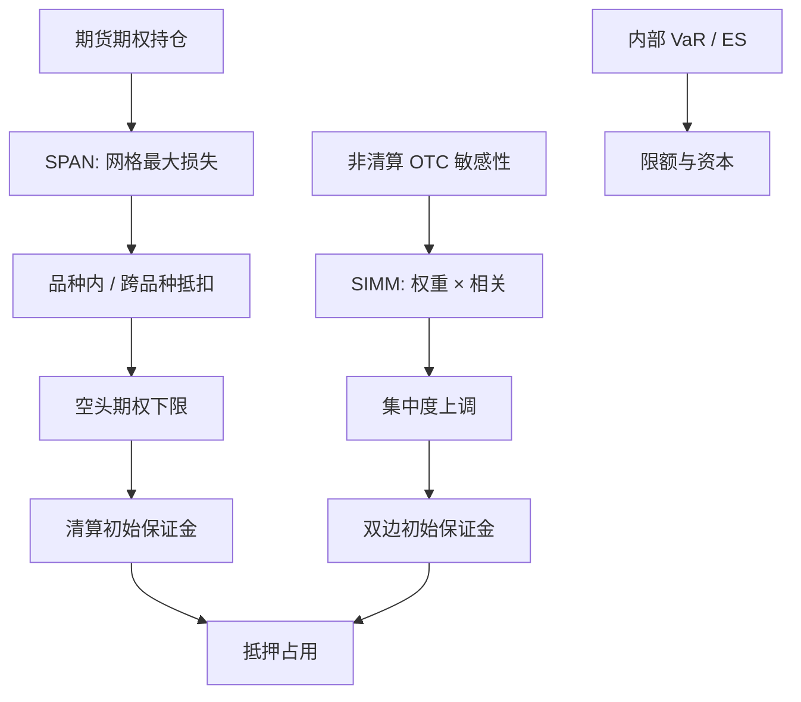

# 保证金模型 SPAN 与 SIMM

保证金要在清算违约之前留住足够的可变现抵押，覆盖「一天或数天内、在规定情景网格上」的潜在损失；它不是经济资本，也不等于银行账簿的 VaR，但和 VaR 共用同一类损失映射。

<footer>—— CME SPAN 公开方法论；ISDA SIMM 公开方法论（非清算衍生品初始保证金）</footer>

[上一课](/quant/component-es)表明正齐次风险度量可按 Euler 公式切成成分之和，ES 的成分是尾巴情景里各腿的条件期望；VaR 的 Euler 切片噪声大且度量不连贯。缺口是保证金不是资本切开。交易所清算与非清算 OTC 要的是须缴纳的初始保证金：地平线是保证金期，模型是网格最大损失或行业标定的敏感性加总，不是你估的 $\Sigma$。本课对照 SPAN 与 ISDA SIMM。不重写条件期望。后课缺口风险默认已经读完：网格外的跳两套标准模型都会漏。

## 问题

VaR/ES 服务限额与监管资本，测度可以是日常或压力年，地平线 1 日或 10 日，置信 99% 或 97.5% ES。保证金服务中央对手方或双边抵押：地平线往往是保证金期（MPOR，如 1–2 个清算日或 10 日非清算），覆盖的是清算违约到平仓完成。SPAN 用网格最大损失，不是概率分位数；SIMM 用监管/行业标定的风险权重，不是你估的 $\Sigma$。把保证金当「另一种 VaR」会在回测上找错对象：SPAN 不会有 Kupiec 违反率，它有的是情景是否覆盖了真实平仓路径。

清算会员还面对变动保证金、额外保证金、清算基金。本篇只写初始保证金的组合模型。融资与 haircut 见 [杠杆与强平](/quant/leverage-liquidation)；市场冲击见 [流动性调整](/quant/liquidity-adjusted-var)。

### SPAN：扫描风险不是蒙特卡洛

CME 公开的 SPAN 结构大致是：对每个合约定义风险数组（risk array）——标的价格上下若干档、波动上下，再加上极端价格移动等固定情景（经典实现里常见十六个扫描点一类，具体档位以当时交易所文件为准）。每个情景下用定价模型重估期权与期货，得到损失。扫描风险取网格上的最大损失。同一商品内不同到期之间给价差抵扣（intra-commodity spread），不同商品之间若交易所承认对冲关系则给跨商品抵扣（inter-commodity spread）。空头期权另有最低保证金（short option minimum），防止网格在极低 Vega 时把保证金收到接近零。

SPAN 的「最大网格损失」对网格外的跳没有概率陈述。缺口若比最极端扫描档还大，保证金可以不够。这是网格模型的边界，要用附加保证金或缺口产品限额补，而不是加密扫描档位假装成连续分布。

## 方法

**SPAN 实务要点。** 输入是净持仓与合约的风险数组参数（由清算所按产品公布，不是会员自己估波动）。输出是初始保证金。会员可在组合层看到扫描风险、抵扣、SOM 的分解，便于解释「为什么加了一笔日历价差保证金反而下降」。对冲若未被列为合法价差（错误到期、错误比例），抵扣为零，保证金接近两腿之和。工程上应把交易所价差表当成数据依赖：表一更新，保证金跳跃与 P&amp;L 无关。

**ISDA SIMM。** 公开方法论按产品收集风险因子敏感性：利率、信用（合格与非合格）、股票、商品、外汇等风险类别，每类内再分 delta、vega、曲率。每项敏感性乘风险权重，类别内用规定相关矩阵加总，类别之间再加总；集中度超过阈值则提高权重。曲率项处理非线性，避免纯 delta 在期权上不够。参数由 ISDA 定期校准并公布，用户不得用内部 $\Sigma$ 替换——这正是「标准」的含义：双边可复现、可对账。

**与 FRTB SA 的相似与不同。** 二者都是敏感性 × 权重 × 相关。FRTB 目标是资本、含 DRC 与 RRAO、有流动性期限；SIMM 目标是 IM、覆盖保证金期、不含银行资本里那些附加模块的全部。不得把 FRTB 资本直接当 SIMM，也不得把 SIMM 当内部模型 ES。对照仍有用：同一套希腊字母应能同时喂 SIMM 与 SA，差异来自权重与相关，而不是来自漏掉的风险因子。

### 保证金期、门槛与对账

非清算 IM 通常有门槛与最低转移金额，SIMM 给出的是门槛之上应有的总 IM。MPOR 越长，权重隐含的波动越大。清算 SPAN 的地平线嵌在风险数组的价格档里，不单独报一个 $\alpha$。双边对账：双方用同一 SIMM 版本、同一敏感性定义（包括曲线分桶、vega 的波动定义），差异应在舍入与快照时间，而不是模型选择。敏感性若用内部模型与对手用供应商模型，对账失败会变成保证金争议，属于运营风险。

## 机制

SPAN 的机制是最坏网格点：离散情景下的 $\max g(\Delta S,\Delta\sigma)$。抵扣的机制是监管承认的分散化，不是估计相关。因此 SPAN 对「网格内的非线性」敏感（期权重定价），对「网格外的跳」与「未被列表的对冲」不敏感。SIMM 的机制是线性（加曲率修正）的加权敏感性：快、可加总、可对账；深度虚值、障碍、复杂路径依赖若不能被 delta/vega/曲率抓住，会漏。这与 FRTB 用 RRAO 抓剩余风险是同一逻辑：标准敏感性法有覆盖缺口。

保证金与 VaR 的顺周期也不同。SPAN 数组由清算所更新，危机中档位与保证金乘数上调，是清算所的政策，不是你窗口里的 $\sigma_t$。SIMM 权重定期校准，不随你昨日收益更新。内部条件 VaR 会在高 $\sigma_t$ 日自动升限额；保证金可能滞后或一步跳。交易台若用 VaR 管仓、用保证金管融资，两套数字的时间差本身是流动性风险。

组合在 SPAN 里因跨商品抵扣看起来便宜，在 SIMM 里可能很贵（OTC 对冲腿不在同一清算池）。清算与非清算的保证金不能净额时，对冲在保证金上可以是正的现金占用。经济对冲不等于保证金对冲。

### 回测与覆盖

清算所会对 SPAN 做覆盖回测：实现损失超过初始保证金的频率是否符合设计。这与 Kupiec 类似，但损失定义是会员组合的清算路径，不是中间价。内部不得用「我们 SPAN 很少被突破」证明经济资本足够：突破少可能是保证金过保守，也可能是样本未含网格外缺口。SIMM 的回测由行业与监管在校准周期里做，单家机构应做的是敏感性完整性：漏一个十档利率点，IM 可以安静地偏少。

## 边界与工程取舍

SPAN 版本、数组、价差表以交易所当前公开文件为准，会随产品上市而变。SIMM 版本号必须与对手一致，升级是双边项目。两套模型都不含你自己的缺口产品在网格外的跳；结构化发行应另做 [缺口风险](/quant/gap-risk) 限额。也不含 CCP 违约基金与评估权。把保证金最小化当成目标函数，会把仓位赶到抵扣表承认的格子里，形成拥挤；那是约束下的最优，不是风险最小。

不要用内部 MC VaR 去「验证」SIMM 高低：测度、地平线、置信都不同。可以验证的是：SIMM 输入的希腊字母是否与内部定价器一致。不要为降低 SPAN 而把期权改到扫描模型定价不准的微笑区域却不调风险数组——数组是清算所的，不是你的校准盘。

保证金是现金与合格抵押的占用，机会成本进入 [扣费后边缘](/quant/net-edge)，不进入 VaR。策略评估若只报夏普不报 IM 占用，会高估需要双边保证金的 OTC 结构。

## 小结

- SPAN 用价格–波动网格的最大损失加官方价差抵扣，服务清算初始保证金，不是概率 VaR。
- ISDA SIMM 用公开参数的敏感性加总，服务非清算 IM，可双边对账，精神近 FRTB SA 而非内部模型。
- 网格外缺口与无法被希腊字母抓住的奇异风险，两套标准模型都会漏，须另设限额。
- 经济对冲在不同清算池、不同模型里可以变成保证金增加。
- 出处：CME SPAN 公开方法论文件；ISDA *SIMM Methodology* 公开版本；非清算保证金规则见 BCBS–IOSCO 保证金框架；资本侧对照 BCBS FRTB 标准法。
