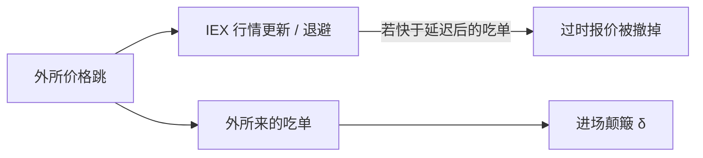

# IEX 速度颠簸

在撮合前对所有进场消息加一段固定的、足够长的延迟，使场所在收到外部价格已经移动的市价单之前，有机会根据新行情更新或退避挂单。颠簸买的是对称的慢，不是更快的线。

<footer>—— 据 IEX 获批成为交易所时的制度设计；机制对照 Budish, Cramton and Shim, Quarterly Journal of Economics, 2015；Baldauf and Mollner, High-Frequency Trading and Market Performance, Review of Financial Studies, 2020</footer>

[peg 与 D-limit](/quant/peg-d-limit-orders)是订单层保护。缺口是场所层：IEX 用约 350 微秒的速度颠簸（coil delay）处理进场订单，同时用更快通道更新其行情与崩溃信号。Baldauf 与 Mollner（2020）分析 HFT 与市场表现；颠簸是连续协议上对相对速度的手术，不是 FBA。本课写延迟不对称如何改变狙击，不讨论品牌叙事。

## 问题

BCS 竞赛的支付是「先到者通吃」。若吃单消息被强制延迟 $\delta$，而本地挂单根据外部行情的更新路径更短，则做市商可能在狙击单到达前完成撤或 D-limit 退避。$\delta$ 需大于典型的跨市场套利延迟、小于即时性不可接受的阈值。问题是：(i) 只延迟入场、不延迟出站行情时，谁相对变慢；(ii) 碎片化下狙击是否转到无颠簸场所；(iii) 颠簸是否伤害需要立刻成交的非知情单。

对称延迟（所有人进出都加 $\delta$）只平移绝对速度，相对竞赛仍在。IEX 的要点是**不对称**：保护更新相对吃单的赛跑。

### 与频繁批量拍卖的差别

FBA 取消批内时间优先，用统一价。颠簸保留连续限价簿与价格–时间，只改变消息的到达时钟。队头租金仍在，只是跨市场过时报价更难被外所来的市价单收割。本地用户之间的速度竞赛可以仍在，若他们的消息经过同一 $\delta$。设计目标是跨市场狙击，不是消灭 FIFO。

其他场所后来试验过不同长度与随机延迟。随机化改变的是方差而不是均值赛跑，博弈不同。本课以固定颠簸为机制。

## 方法

把跨市场套利者的往返时间 $d_{\mathrm{arb}}$ 与 $\delta$ 比较。若 $\delta>d_{\mathrm{arb}}$ 的有效优势，外所狙击期望利润下降，IEX 上做市被捡下降，愿意报更窄。经验：比较 IEX 与对照所在新闻窗的实现价差、HFT 吃单占比、份额变化。用户自选择：怕被捡的做市流、零售与机构被动流可能迁入，毒性结构改变，不可把份额当质量。

Baldauf–Mollner 提醒：限制某些 HFT 策略对总福利的符号取决于信息与竞争。颠簸是限制之一，不是定理上的帕累托改进。

## 机制

颠簸把 Foucault 被捡窗口的一部分从用户速度改成场所时钟。Peg / D-limit 在这段时钟里才有意义：没有 $\delta$，信号再好也跑不过同机房的吃单。三者是一套：信号、自动指令、延迟不对称。

碎片化：Reg NMS 的订单保护可能强制把单送到当时 NBBO 所在场所，包括无颠簸所。套利者在那些所完成价格发现，IEX 上的挂单被保护但也可能更少参与发现——Brogaard 式主动腿被设计削弱。质量要分「IEX 上的被捡」与「全国发现速度」。

## 边界

350 微秒针对当时的光纤套利尺度，硬件与路径变化后最优 $\delta$ 会变。只在一个小份额场所实施，全国竞赛仍在。颠簸不阻止幌骚、填塞（消息仍可发，只是同时变慢）。对必须立即成交的单，颠簸是延迟税，他们会避开——场所客户结构因此偏被动。

把颠簸叫做「反 HFT」过粗。它针对跨市场相对速度，留下的是库存做市与本地 FIFO 博弈。

收盘仍是连续协议解不掉的另一点：合同钉住的价格使截止同步，颠簸改变不了指数基金必须在那一分钟成交的事实。下一课改拍卖。

## 小结

- IEX 式固定进场颠簸用不对称延迟保护挂单更新，目标是跨市场狙击而非取消连续簿。
- 与 FBA 不同：保留价格–时间，只改消息时钟。
- 碎片化下发现可能仍发生在无颠簸场所；质量指标必须分场所与全国。
- 出处：Budish, Cramton and Shim, *QJE*, 2015；Baldauf and Mollner, *RFS*, 2020；Harris 对场所设计的一般讨论。
