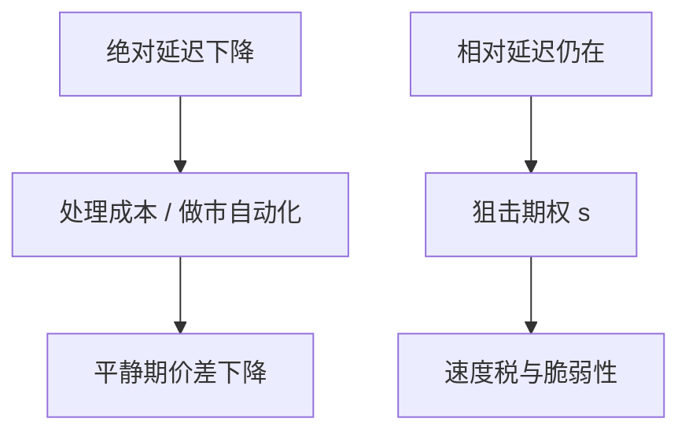

# 交易速度与市场质量

把整个市场变快，不等于把每笔交易的延迟差消灭。质量取决于相对速度如何被协议处理：发现可以加快，价差与深度却可以因竞赛与撤退而变差。

<footer>—— Pagnotta and Philippon, Competing on Speed, American Economic Review, 2018；算法交易与流动性见 Hendershott, Jones and Menkveld, Journal of Finance, 2011</footer>

[不变量](/quant/microstructure-invariance)给出跨品种缩放。缺口是政策变量「速度」本身：交易所升级、托管、取消地板，市场质量如何变。Pagnotta 与 Philippon（2018）把场所之间的速度竞争写成均衡；HJM（2011）提供算法交易改善流动性的证据。本课收束高频单元：质量是多指标，速度不是单调的善。然后交给市场设计续，从订单类型与场所规则动手。

## 问题

市场质量至少包括：价差、深度、实现冲击、价格发现（Hasbrouck 误差、VR）、波动螺旋的脆弱性、以及分配（谁付速度税）。绝对延迟下降（所有人快 10 微秒）若保持相对排序，狙击期权 $s$ 仍在，竞赛投入可能不变甚至因交易更密而增加。相对延迟下降（随机化、批量、颠簸）才砍 $s$。问题是经验里看到的「变快」多是哪一种：托管是相对速度的军备；自动报价更多是处理成本下降。

HJM 的流动性改善，更接近处理成本与做市自动化（Stoll 三项里的第一项），不是 BCS 竞赛被解决。两篇文献必须同时读，才能避免「HFT 提高质量」或「HFT 破坏质量」的单句。

### 场所竞争加速

Pagnotta–Philippon：投资者喜欢快的场所，场所投资速度吸引流，碎片化下可能过度投资速度。这与交易所之间的 make-take、tick 竞争并列。速度成为垂直差异化：对延迟敏感的流去托管场所，不敏感的流留在慢所或暗池。透明与匿名课的场所转移，在此多了延迟维度。

Boehmer、Fong 与 Wu 等跨国证据表明算法交易对流动性的符号随环境变。本课不报一个全球系数，只保留：符号取决于相对速度与供给是否撤退。

## 方法

把质量指标对速度冲击回归：自动报价引入、光纤开通、主机托管、国际链路。必须分开短窗新闻质量与全日平均价差。发现用 Hasbrouck 长期乘数或定价误差；流动性用有效价差与深度；脆弱性用压力窗撤退。若发现改善而压力脆弱性升，政策含义不同于双改善。

理论基准：Biais–Foucault–Moinas 的均衡快速交易；BCS 的竞赛耗散。把「平均延迟」当处理变量会混淆绝对与相对。

## 机制

平静期：自动化做市压低处理与库存成本，Menkveld 画像主导，质量升。新闻期：相对速度主导，Foucault–Hombert–Roşu 的发现腿与被捡同时升。压力期：反馈螺旋，速度加快的是空簿路径而不是补给。同一技术栈三态三色。市场设计续的 peg、颠簸、收盘竞价、熔断，都是在三态上切不同的刀，而不是「把市场再加速一点」。

对执行：平均质量改善不降低你在新闻窗的被捡。算法必须状态依赖，这与限价/市价阈值课一致。

## 边界

「速度」在数据里常是代理（消息率、托管虚拟变量），不是毫秒。跨国制度差（涨跌停、印花税）会淹没速度效应。把质量写成单一指数（再对政策回归）会让发现与流动性互相抵消或双计。本课结束高频理论单元；具体规则从下一课 peg 与 D-limit 开始，不再抽象谈速度。

投资者保护若只看平均有效价差，会批准一切能压低平静期价差的加速，忽视分配与尾部。指标要分状态报告。

市场设计续从订单与场所规则动手：peg、颠簸、收盘拍卖、匹配算法，都是在三态上切一刀，而不是再把全市场的平均延迟削短一点。

## 小结

- 绝对变快主要降处理成本；相对速度决定狙击租金。质量必须分平静、新闻、压力三态。
- 场所之间竞速可能过度投资延迟，碎片化放大。
- HJM 式流动性改善与 BCS 式竞赛可以并存，单句评价 HFT 不够。
- 出处：Pagnotta and Philippon, *American Economic Review*, 2018；Hendershott, Jones and Menkveld, *Journal of Finance*, 2011。
