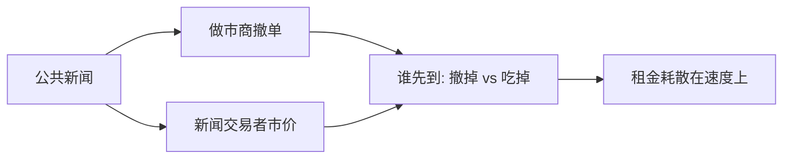

# 速度竞赛与狙击

狙击是在别人来得及撤过时报价之前把它吃掉。速度的私人价值等于这份期权的期望租金；社会价值在竞赛均衡里被耗散在线和机柜上。

<footer>—— Budish, Cramton and Shim, Quarterly Journal of Economics, 2015；新闻交易与速度见 Foucault, Hombert and Roşu, News Trading and Speed, Review of Financial Studies, 2016</footer>

[频繁批量拍卖](/quant/frequent-batch-auction)给出设计回应。缺口是把连续市场上的速度写成可分析的策略：谁在听新闻、谁在挂单、均衡延迟投到哪一步。Foucault、Hombert 与 Roşu（2016）分析新闻交易与速度；Biais、Foucault 与 Moinas（2015）给出均衡快速交易。本课写狙击机制，不重复 FBA 的批长讨论。

## 问题

公共新闻有两个观察者：做市商要撤，套利/新闻交易者要吃。两者都投资速度。若吃的人更快，发生狙击，价差必须预先加宽以补偿期望被捡；若撤的人更快，过时报价消失，狙击利润下降，但挂单寿命更短、有效深度更闪。问题是对称投资速度时，市场质量落在哪一侧，以及速度差异（而不是绝对速度）为何才是租金来源。

Foucault–Hombert–Roşu 强调：更快接收新闻的交易者会选择更激进的订单，价格发现加快，但慢的流动性提供者受损。发现与流动性可以反方向，这与 Bloomfield–O'Hara 对透明的权衡同构，只是不对称从「看见身份」换成「看见新闻的时间」。

### 相关市场是狙击的基础设施

现货挂单相对期货中点过时，是最干净的公共信号。跨市场监控速度因此比单市场线速更重要。碎片化倍增需要监控的场所，军备成本上升。这不是[市场分割](/quant/market-fragmentation)课的 NBBO 会计，而是延迟结构如何创造期权。

Kyle 知情者的优势是 $V$，速度知情者的优势是同一条公共新闻的时钟。把 HFT 都叫做 Kyle 式内幕，会把合法的公开信息处理与私有公司信息混为一谈。执法关心的是后者与操纵，不是所有低延迟。

## 方法

两玩家投资延迟 $d$，成本 $c(d)$ 凸。新闻泊松到达，过时报价价值为 $s$ 量级。先到者赢得 $s$，均衡直到 $c'(d)$ 等于期望赢得的边际。租金耗散：总速度支出约等于期权期望值。价差把 $s$ 预先加进报价，最终由流动性需求者支付军备。

比较：禁止托管、统一随机延迟、批量拍卖、速度颠簸，都是在改变 $d$ 的可行集或改变「先到者通吃」的支付。下一设计单元会逐个看场所规则；本课只保留：任何仍让先到者独赢 $s$ 的连续协议，都会重建竞赛。

## 机制

狙击把 Foucault 的被捡从「下一离散期」压到「下一微秒」。限价期权的时间价值不再由基本波动主导，而由相对延迟主导。于是出现看似悖论的现象：基础波动不大，但价差仍宽、撤单仍频——因为相关市场的一跳就足以创造 $s$。微观结构不变量课会问不同资产上 $s$ 如何随成交量缩放；这里只需承认 $s$ 是内生的制度租金。

对策略噪声：非知情者无法参加竞赛，他们要么付更宽价差，要么把单交给也能竞赛的中介。中介化是速度的分配结果。

## 边界

并非所有 HFT 利润都是狙击。库存做市、合约间对冲、提供深度，可以有正社会价值。实证要把「新闻窗口的吃单」与「无新闻时的双边挂单」分开，这是 Menkveld / Brogaard 的工作。随机延迟若只加在入场、不加在行情，可能只是把竞赛改道。法律上的幌骚与这里的合法新闻交易，分界在是否有真实交易意图与是否虚假挂单。

把「谁快谁赢」当成公平，忽略了过时报价往往是正在提供流动性的慢参与者。公平取决于协议，不是取决于延迟的自然排序。

## 小结

- 狙击是对过时报价的速度竞赛；相对延迟产生租金，绝对速度在对称均衡里被耗散。
- 发现可以加快而流动性受损；相关市场是主要公共信号源。
- 连续先到者通吃的支付一保留，竞赛就会重建。
- 出处：Budish, Cramton and Shim, *QJE*, 2015；Foucault, Hombert and Roşu, *RFS*, 2016；Biais, Foucault and Moinas, *Journal of Financial Economics*, 2015。
