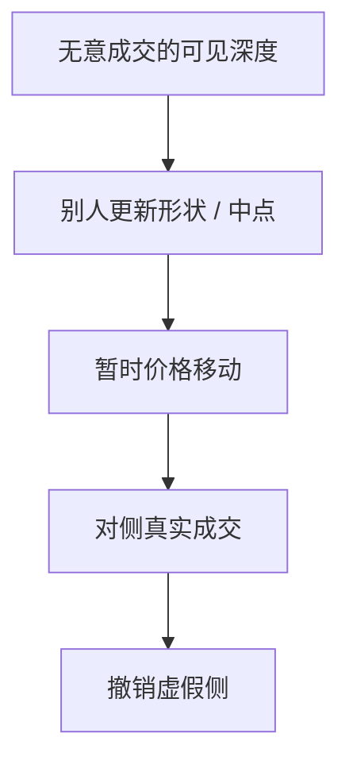

# 幌骚与分层

幌骚是提交无意成交的订单，制造虚假供需，诱使别人改价或吃单，再撤销并在相反方向获利。分层是在多个价位上铺开这些虚假供给。它们与做市闪单的分界，在意图与成交意愿，不在撤单率本身。

<footer>—— Kyle and Viswanathan, How to Define Illegal Price Manipulation, American Economic Review, 2008；概述见 Putniņš, Market Manipulation: A Survey, Journal of Economic Surveys, 2012</footer>

[报价填塞](/quant/quote-stuffing)攻击通道时钟。缺口是攻击**别人对供需的信念**：挂出不想成交的深度，让 Parlour 状态、宏观形状、甚至 Glosten 推断都读错。Kyle 与 Viswanathan（2008）给出操纵的经济学定义：扭曲价格并从自己造成的扭曲中获利。Putniņš（2012）综述操纵类型。本课写幌骚与分层的机制，不提供操作指南，也不把合法做市的偏度叫做操纵。

## 问题

可见簿是信号。若信号可被廉价伪造，理性交易者对深度打折，真实供给的价值下降，市场更依赖成交而不是报价来发现——效率与流动性都受损。幌骚的策略结构是：在一侧展示虚假厚单，诱使算法把中点或微观价格推向对侧，或诱使别人在对侧更积极地挂/吃，然后撤掉虚假单、自己在被推动的价格上成交。分层只是把虚假单铺在多档，让形状看起来「真实」。

问题是识别：与 Ho–Stoll 偏度（真想减库存而移动报价）、与隐藏（真有量不想展示）如何区分。关键是虚假侧在将要成交时是否系统性撤离，以及账户是否在对侧同步获利。

### 法律与经济的接口

商品与证券法规禁止欺诈性的虚假订单。经济学定义强调价格扭曲与自利交易，不一定要求「从未有过成交可能」。极薄市场上一张大单即使短暂真实，也可能以扭曲为目的。本课停在机制，不讨论个案。

冰山是隐藏真实量；幌骚是展示虚假量。方向相反。把冰山叫做操纵是范畴错误。

## 方法

研究常用账户层或标记数据：检测一侧大额新增随后在接近成交时撤销，对侧主动成交获利。分层看多档同时增、同时撤的相关性。市场质量：被操纵窗内价差、短期 VR、随后回复。理论把虚假深度写成对 $\rho$ 的扰动，别人的最优放置与市价阈值被误导，产生可预期的暂时价格，操纵者交易暂时成分——与 Grossman–Miller 的暂时折让同族，但是人为制造的 $z$。

检测的假阳性：正当事前撤单、新闻窗、pro-rata 堆量后撤余。必须结合对侧获利与模式重复。

## 机制

幌骚剥削的是把 L2 当真实供给的算法与人。均场与宏观形状若被当成执行输入，正好成为受害者。对策是把可成交性放到事件流与自身的队列模型上，对突然出现、从不接近成交的远端厚单降权。做市商若无法区分真实需求，只能加宽——操纵的社会成本由所有人付更宽价差。

与狙击对照：狙击吃的是**已经过时的真实报价**；幌骚制造**从未打算成为真实的报价**。前者是连续时间优先的产物，后者是对透明的欺诈。政策工具不同：前者改协议时钟，后者靠监察与处罚。

## 边界

公开数据几乎看不见账户，学术检测受限。把「层层挂单」当成分层，会误伤正常的多档做市。教学案例（如被判决的期货幌骚）说明模式，不是数据课。加密市场操纵类型更多（洗售等），本课不展开。

交易台风控应把「对侧突然变厚却从不成交」当毒性信号，与 PIN 式买卖不平衡并列，而不是当额外流动性。

下一课回到真实供给：做市商在压力期关掉算法，空簿不必来自虚假挂单。操纵与撤退会在同一分钟里一起出现，会计上要分开谁制造了假深度、谁抽走了真深度。

## 小结

- 幌骚与分层通过虚假可见供给扭曲他人信念，再交易由此产生的暂时价格。
- 与理性撤单、库存偏度、冰山隐藏的分界是成交意愿与对侧获利。
- 经济学定义见 Kyle–Viswanathan：扭曲并从扭曲中获利。
- 出处：Kyle and Viswanathan, *American Economic Review*, 2008；Putniņš, *Journal of Economic Surveys*, 2012。
