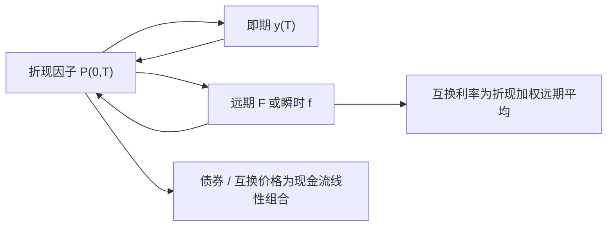

# 即期、远期与折现

    
同一条无套利期限结构可以用折现因子、即期利率或远期利率三种坐标写出；价格是折现因子的线性组合，利率是它的非线性变换。

    <footer>—— 标准固定收益恒等式；教科书表述见 Hull, Options, Futures, and Other Derivatives</footer>

[上一课](/quant/discrete-hedge-error)把连续对冲留在离散世界的残差。缺口是固定收益的计价核：折现因子，而不是再对冲一次期权。固定收益的第一层语言不是久期，而是现金的时间价格。折现因子 $P(t,T)$ 是 $t$ 时刻一单位在 $T$ 确定支付的现值。即期利率是把该折现写成某种复利惯例下的收益率。远期利率是两个折现因子之比所隐含的、起息在未来的借贷利率。三者一一对应（在给定日计数与复利惯例下），但交易与风险系统各有偏好：折现因子线性，适合把现金流加总；即期方便报价与比较；远期是互换、FRA 与曲线构建的自然增量。Hull 把这些恒等式放在远期与互换定价之前；[Bootstrap](/quant/curve-bootstrap) 与 [多曲线](/quant/multi-curve-ois) 都建立在「先能在三种坐标之间无歧义换算」之上。

## 问题

市场不直接报出完整的 $P(0,T)$ 函数。报出的是存款利率、FRA、期货、互换利率、债券收益率，每一种都是折现因子的不同泛函，还夹杂日计数、节假日、起息延迟。若把「利率」当成一个数，不声明即期还是远期、单利还是连续、实际/360 还是实际/实际，两个台子的曲线无法对齐。无套利首先要求：同一支付在同一曲线上只有一个现值，因此 $P(t,T)$ 必须是内部一致的。即期与远期只是该函数的重参数化。

第二层问题是：远期利率是对未来即期的无套利承诺，不是预测。带凸性的期货、带基差的 LIBOR–OIS，会让「简单恒等式」在真实合同上需要调整。本节只把单曲线、无信用的恒等式写清，作为后续自助法与多曲线的代数骨架。

### 三种坐标

取 $t=0$，连续复利即期 $y(T)$ 满足 $P(0,T)=\mathrm{e}^{-y(T)T}$。简单远期（对区间 $[T,T+\delta]$）

$$
F(0;T,T+\delta)=\frac{1}{\delta}\left(\frac{P(0,T)}{P(0,T+\delta)}-1\right).
$$

瞬时远期 $f(0,T)=-\partial_T\ln P(0,T)$，是 $\delta\to 0$ 的极限。互换利率在单曲线下是折现加权的远期平均。债券价格是票息与本金用 $P(0,T_i)$ 线性相加。改用即期去写同一价格，会出现非线性：收益率与价格不同形，这正是 [久期与凸性](/quant/duration-convexity) 要展开的对象。

$P(t,T)$ 永远是「确定一单位现金」的现值。信用风险、抵押与融资会改变你该用哪一条折现曲线，但不改变定义。多曲线里折现用 OIS，投影用 LIBOR 远期，二者不再能用同一 $P$ 互换，见后文。

## 方法

给定惯例，换算是代数。从折现到即期：按市场公式解开 $y$。从即期到折现：再套回去。从折现网格到远期：相邻到期相除。从远期到折现：选定 $P(0,T_0)$（通常短期存款锁定近端），再连乘

$$
P(0,T_{n})=\frac{P(0,T_{n-1})}{1+\delta_{n}F(0;T_{n-1},T_n)}.
$$

这就是自助法的内核：每多一个市场合约，多解一个未知折现或远期。插值发生在你选择的坐标上——对 $P$、对 $\ln P$、对 $f$ 插值，得到的曲线在翼部与凸性上不同，见 Hagan 与 West 对曲线插值的讨论。

外汇与股票的远期由现货、利率（或借券）与折现锁定：$F=S\mathrm{e}^{(r-q)T}$ 是连续股利下的特例。利率不是外生「另一个数」，而是对应货币的折现曲线。跨货币则出现基差：不能用两国存款利率简单算出可交易远期，市场另报交叉货币基差，那已超出单曲线恒等式。

### 日计数与起息

同样的「3M 远期」在实际/360 与 30/360 下对应不同的 $\delta$，因而不同的 $F$。起息 $T+2$、月末规则、IMM 日期决定折现节点落在哪一天。忽略日历把理论网格当成交易网格，Bootstrap 会系统性偏。期货与 FRA 还有凸性调整：期货按日盯市，其利率与简单远期差一项与波动率和时间有关的凸性；把期货报价直接当 $F$ 填进连乘，是常见偏差来源。

## 机制

无套利把三种坐标焊死：若远期过贵，可借短买长合成反向；若折现不一致，可拆包现金流套利（在理想、可空、无摩擦时）。真实债券还含信用与流动性，政府曲线与互换曲线不是同一 $P$。单曲线时代用互换自助出一条 $P$，既折现又投影；2008 年后抵押衍生品的折现应接近 OIS，LIBOR 合同的浮动端仍按 LIBOR 远期投影，恒等式分裂成两条曲线，但每一条内部仍遵守「折现 $\leftrightarrow$ 即期 $\leftrightarrow$ 远期」。

价格对折现因子线性，对收益率非线性。所以风险系统若在收益率坐标做平行移动，再用修正久期线性近似，必须记得凸性与关键利率形状，见 [关键利率久期](/quant/key-rate-duration)。若直接对 $P(0,T)$ 做扰动，线性精确，但交易员不按折现因子报价。两套坐标需要一座桥，而不是选边站。

### 远期不是预测

风险中性下远期是鞅的期望（对适当的计价单位）。真实世界期望还可以有风险溢价，远期可以系统偏离事后即期。把 $F(0;T,T+\delta)$ 写成「市场预测的未来 3M 利率」是叙事；数量上它是两个折现因子的比。期限溢价、凸性、监管与供应都会让事后实现不等于今日远期。这与外汇抛补利率平价类似：可交易远期由利率锁定，不由预测锁定。

连续复利在公式里干净，市场几乎从不用它报价。任何把 $y$ 与 $F$ 并列的表，都应注明惯例，否则 2bp 的「差异」可能只是单利对连续的换算。

## 边界

单曲线恒等式假定同一信用、同一融资、可复制的确定支付。LIBOR 操纵、IBOR 退出、SOFR 与期限 SOFR 的基差，改变的是市场输入，不是 $P$ 的定义。通胀挂钩、浮动利率债、含权债券不是确定现金流，不能只用折现加总。Hull 的入门公式足够用来统一语言；曲线插值、凸性调整、多曲线拆分必须引用专门文献，不要把入门恒等式写成 2010 年后的全部市场结构。

数值上，$P$ 必须单调于 $T$ 才有正的瞬时远期；插值若振荡会产生负远期，破坏无套利。这是实现约束，应在 Bootstrap 后检查，而不是假设自动成立。

「无风险利率」在教科书里是 $r$。多抵押、多币种、有无 CSA 的现实里，折现曲线是融资与抵押的选择，不是自然界的一条线。

## 小结

- 折现因子、即期、远期是同一期限结构的三种坐标；价格对 $P$ 线性，对收益率非线性。
- 简单远期由相邻折现之比定义；自助法用连乘从近端向外解 $P$。
- 日计数、起息、期货凸性是把合同变成 $P$ 时的必要细节，不是装饰。
- 远期是无套利比率，不是对未来即期的统计预测。
- 2008 年后折现与投影可以不是同一条 $P$，但每种坐标换算在单条曲线内部仍然成立。
- 出处：Hull, *Options, Futures, and Other Derivatives*；插值实践见 Hagan and West, *Applied Mathematical Finance*, 2006；多曲线见后文 OIS 专篇。
