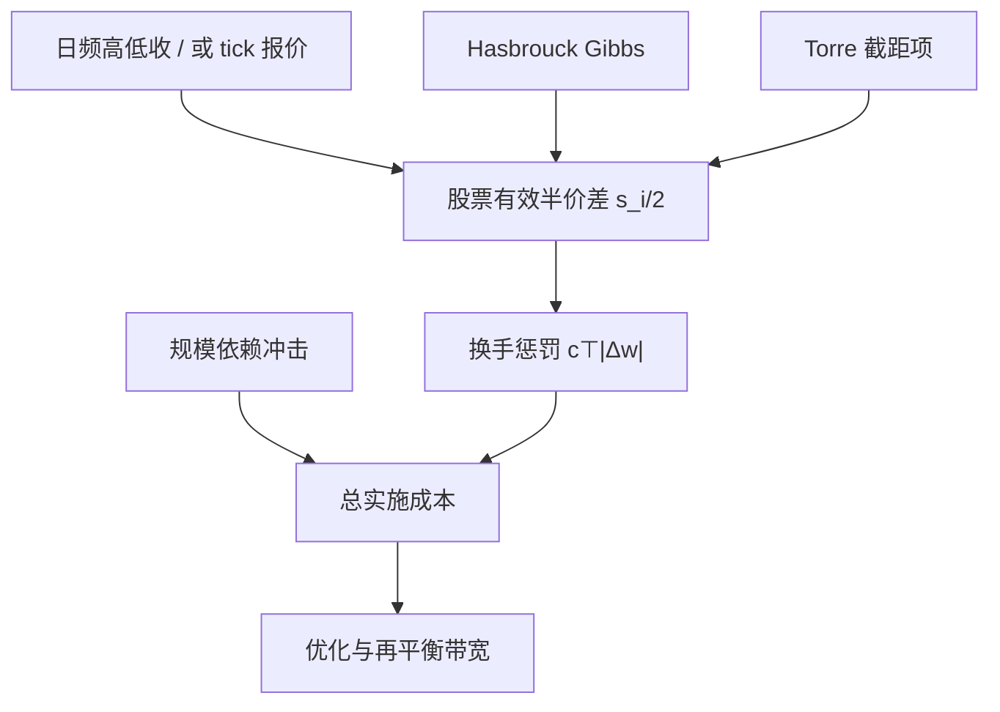

# 买卖价差成本

有效成本可以从每日高低价与收盘价里估计出来，而不必拥有逐笔报价；把这个成本乘上换手，才是组合承担的价差账单。

<footer>—— Hasbrouck, Trading Costs and Returns for U.S. Equities: Estimating Effective Costs from Daily Data, Journal of Finance, 2009</footer>

[上一课](/quant/drawdown-calmar)用路径风险收束组合评价。缺口是实施：组合权重要先付买卖价差才能变成可交易。[有效价差与实现价差](/quant/effective-realized-spread) 回答已经成交的一笔有多贵；[价差分解](/quant/spread-decomposition) 回答宽出来的那一截补偿的是处理、存货还是逆向选择。组合构建还需要第三件事：在没有逐笔、甚至只有日频数据时，给每一只股票一个**事前**的半价差，用来惩罚换手、估算实施缺口。Hasbrouck（2009）用贝叶斯 Gibbs 在 Roll 型结构上从日数据恢复有效成本；Torre 的 BARRA 市场冲击手册则把报价价差写成冲击模型里与数量无关的一项，再叠加随规模上升的冲击。两者都是把「价差」变成优化器里的 $c_i$，而不是微观结构论文里的识别对象。本篇写这张成本怎么进组合，以及它和冲击项如何分工。

## 问题

主动组合的预期换手会把每只股票的往返成本加总成组合层面的期望损耗。最瘦的会计是

$$
\mathbb{E}[\text{spread cost}]\approx\sum_i \frac{s_i}{2}\,|\Delta w_i|\,V,
$$

$s_i$ 是相对价差，$V$ 是组合净值，$|\Delta w_i|$ 是权重变动。没有 $s_i$，[换手约束](/quant/portfolio-constraints) 只能用统一基点，小盘与大盘被同等惩罚，优化器会过度交易薄股票。问题是：$s_i$ 从哪来，频率多高，以及它是否已经包含你还要另算的冲击。

报价价差 $A-B$ 只对立刻吃一档的市价单近似成立，且许多历史样本没有可靠 BBO。有效价差含价格改善，通常小于报价价差。Hasbrouck 的日频有效成本针对的是可在 CRSP 一类数据库上复现的研究与回测；交易台用自己的执行短fall 校准。身份不同，$s_i$ 不同，见 [净边缘](/quant/net-edge) 对机构 / 零售管道的讨论。不存在一个对所有账户通用的「A 股价差表」。

### 价差项与冲击项不要双计也不要漏计

Torre 的市场冲击模型把交易成本拆成：与数量无关（或几乎无关）的价差成分，以及随 $Q/\mathrm{ADV}$ 上升的冲击成分。小单的主导项往往是半价差；大单的主导项是冲击，见 [平方根冲击](/quant/sqrt-impact)。回测若已用主动侧报价成交（买在卖价），再减半价差，就是双计。若用中点成交且不减任何 $s_i$，就是漏计。方法必须与成交假设绑定：中点回测减有效半价差；主动侧回测只加超额改善 / 走阔与冲击。

Hasbrouck（2009）估计的是有效成本，不是报价宽度，也不是 Kyle 的 $\lambda$。把它直接当作冲击函数的截距可以；再在同一笔交易上叠加完整的有效价差，会把同一层摩擦数两遍。成本模块应列一张「成交假设 × 成本项」对照表。

## 方法

**日频 Hasbrouck / Gibbs。** 在 Roll 的成交价 = 有效价值 + 半价差 × 方向 的结构上，用高低价、收盘价等日频信息做贝叶斯估计，得到股票–年度（或更短窗）的有效成本 $c_{i,t}$。优点是覆盖面广、可复现、能接到长期因子回测。缺点是日频识别在信息交易强、方向序列相关时会偏，与 [Roll 模型](/quant/roll-model) 的识别条件同源。应按市值、波动、换手分层检查 $c_{i,t}$ 是否单调合理，并截断极端值以免优化器把某只股票当成「免费」。

**报价与有效价差面板。** 有 tick 时，用成交量加权有效价差的滚动中位数当 $s_i$，比用最新一笔报价更稳。开盘、收盘拍卖应单独一套 $s_i$，或从日历再平衡的成本里剔除拍卖机制不可比的部分。Huang–Stoll 的实现价差更接近做市商事后收入，对主动方事前预算偏短；事前应用有效价差或短fall，事后用实现价差做执行质量评估。

**Torre / BARRA 式成本。** 把预测成本写成 $c(Q)=s/2+\eta\sigma(Q/V)^{\delta}$，小 $Q$ 时第一项主导。组合优化里对 $|\Delta w|$ 用第一项，对大的 $|\Delta w|$ 切换或叠加第二项。参数按流动性分组校准，而不是全市场一个 $s$。换手惩罚 $c^\top|\Delta w|$ 里的 $c$ 应至少随股票变化；更细的做法是分段线性，避免平方根项把 QP 变成非凸——非凸时用局部线性化或把大单从优化里拿出去交给执行算法。

### 把 $s_i$ 接到换手与再平衡

成本进入两处：优化器的线性惩罚，以及[再平衡](/quant/rebalance-rules)的禁交易带宽度。$s_i$ 上升时，带宽应加宽，否则规则会在价差最宽的日子最勤快地交易。日历再平衡若碰巧落在指数调整日，应使用当日的有效价差而不是月均 $s_i$。因子研究里按 Novy-Marx–Velikov 的精神，先按换手分档，再对每档用统一规则乘上该档的平均有效成本，避免只给低换手策略看净收益。

印花税、佣金、交易所规费与价差是不同科目。A 股卖出印花税是确定性比例，应进 $c_i$ 的税费桶，不要混进 Hasbrouck 估计。融券费率是空头特有的流成本，按持有期累积，不是按 $|\Delta w|$ 一次性发生。

## 机制

价差成本的机制是即时流动性的标价：你要在时间 $t$ 改变持仓，就必须与簿上已有的报价成交，或挂单等待并承担不执行风险。半价差是「立刻执行」的标价；挂单把这笔成本换成等待与逆向选择，期望成本可以更低，但不是零，也不能在回测里按中点成交还声称自己走了被动。Hasbrouck 日频估计把许多笔的有效成本压缩成一个慢变量，适合战略换手，不适合日内执行。

Torre 把价差写成冲击公式的截距，是承认：即使数量趋于一笔最小单位，往返仍要付一轮买卖。Kyle 的线性冲击过原点，不含这一截；把 Kyle $\lambda$ 当全部成本，会低估小单、高估或低估大单取决于校准。组合层的换手大多由大量中小单构成，截距项往往主导总账单——这是为什么「只建模冲击、不建模价差」的回测在降低频率后净收益改善得不像冲击模型预测的那么多：降频省下的是冲击，省不下每笔仍在付的半价差。

### 截面差异如何扭曲因子

$s_i$ 与市值、波动、价格水平相关。等权小盘因子的毛溢价里有很大一块是在付价差；价值加权后价差账单下降，溢价也变。用统一 10bp 惩罚，会相对高估小盘因子的净 IR，低估大盘动量的净 IR。Hasbrouck 把有效成本与横截面收益联系起来，正是为了问：交易成本能否解释部分异常。本篇不需要完成那个资产定价命题；工程上只需保证 $c_i$ 的截面排序与真实流动性排序一致，以免优化器的「低成本替代」选错。

## 边界与工程取舍

Gibbs / Roll 型估计在涨跌停、一字板、长期停牌上失效，应标记缺失并用流动性分组的截面预测填补，而不是用 0。暗池与零售内化使有效价差小于可见报价，机构短fall 可能低于 Hasbrouck 日频估计；用偏高的 $c_i$ 做研究偏保守，用它做交易台考核则不公。反过来，用自己一段平静期的短fall 去回测危机月份，会低估账单。

不要把报价价差除以二再乘双边换手，就称为「完整交易成本」——还缺冲击、借券、延误。不要在已经按卖价成交的回测上再减 Hasbrouck 成本。不要用全市场平均价差去惩罚一个只交易沪深 300 的增强产品。成本模型应随制度修订：最小报价单位变化、做市商制度、盘后交易，都会改 $s_i$ 的水平，参数要分段。

$s_i$ 应定期重估。用五年前的 Hasbrouck 截面去惩罚今日的换手，会在价差整体收窄的市场里过度约束，或在结构变差的小盘上约束不足。成本参数与风险模型一样有版本，要写进回测配置。

## 小结

- 组合层的价差成本是 $\sum (s_i/2)|\Delta w_i|$，需要股票层面的事前 $s_i$，而不是微观结构分解本身。
- Hasbrouck（2009）从日数据估计有效成本，便于长期回测；Torre / BARRA 把价差写成冲击模型的截距，与数量项分工。
- 成交假设必须与是否再减半价差一致，避免与主动侧成交或冲击项双计。
- $s_i$ 的截面差异会扭曲等权小盘一类因子的净 IR；统一基点惩罚不够。
- 税费、借券与价差分桶；A 股涨跌停样本上的日频估计应作缺失处理。
- 出处：Hasbrouck, *Trading Costs and Returns for U.S. Equities*, Journal of Finance, 2009；Torre, BARRA *Market Impact Model Handbook*；Roll, *Journal of Finance*, 1984；执行会计见 Huang and Stoll, *Journal of Financial Economics*, 1996。
