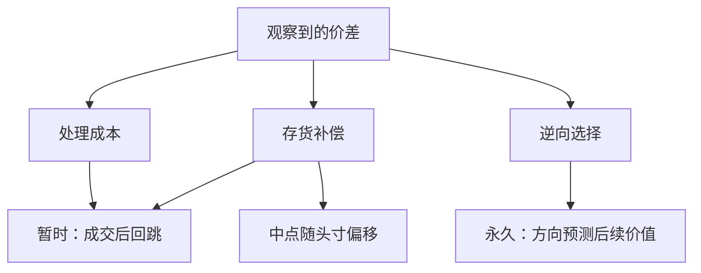

# 买卖价差的分解

买卖价差不是单一成本的标签。它同时补偿处理指令的经营费用、持有不愿持有的存货的风险，以及与可能知情的对手成交的预期损失。

<footer>—— 据 O'Hara, Market Microstructure Theory 与 Harris, Trading and Exchanges 对价差构成的论述整理</footer>

报价价差 $s=a-b$ 是立刻买再立刻卖所付出的往返成本，也是流动性提供者若未被信息伤害时的毛收入。微观结构并不把 $s$ 当成不可再分的摩擦。O'Hara 把价格形成理论分成存货与信息两条主线；Harris 从交易成本的角度列出处理成本、存货与逆向选择。分解的目的是：同样宽的价差，可能来自稀少的成交与昂贵的处理，可能来自做市商必须承担的方向风险，也可能来自知情交易的威胁。后文 [Roll 模型](/quant/roll-model) 用成交回跳去估有效价差，[Glosten-Milgrom](/quant/glosten-milgrom) 说明即使处理成本为零也可以有价差，[Kyle 模型](/quant/kyle-model) 则把信息压进价格冲击而不是固定的买卖报价。本篇先把分解的会计与机制写清楚。

## 问题

若价差只是「交易所收的一点费用」，则更激烈的竞争应把它压到接近处理成本，存货与信息不必出现。事实是：即使电子化把处理成本压得很低，价差仍随公告、随个股信息不对称、随存货是否集中而变。需要解释的不是价差是否存在，而是它为什么随对象与随时间改变，以及改变的是哪一部分。

三个候选部分对应三种不同的状态变量。处理（order processing）与成交笔数、系统费用、固定经营成本有关，近似每笔一块，对方向不敏感。存货（inventory）与做市商已经持有的头寸、风险厌恶、对冲成本有关，价差与报价中点会随存货偏移。逆向选择（adverse selection）与对手知情的概率、价值的不确定性有关，成交之后有效价值朝成交方向跳，流动性提供者的事后收入小于事前报价价差。O'Hara 的书表明，只看其中一条线会把另两条的现象误读成自己的证据。分解问题因此是识别问题：从可观测的报价、成交与后续价格里，如何把这三块分开，而不是另写一个「总摩擦」。

### 报价价差、有效价差与事后收入

报价价差是 BBO 之差，可能没有人在上面成交。有效价差用成交价相对当时中间价的偏离，$s_{\mathrm{e}}=2q(p-m)$，其中 $q$ 为成交方向。它度量实际付出的即时成本。成交之后一段时间（若干笔或若干时钟）中间价变为 $m'$，实现价差 $s_{\mathrm{r}}=2q(p-m')$ 近似流动性提供者的事后收入：若价格已向成交方向跳走，收入被吃掉。有效价差减实现价差，常被当作逆向选择的经验代理——价格向对手有利方向永久移动的那一部分。这套会计不依赖某一个结构模型，但解释必须回到存货与信息：存货调整也会让报价中点移动，不一定是价值发现。

把报价价差除以二当成「半价差成本」只对立刻吃 BBO 的市价单成立。限价单成交在己方报价上，即时有效价差可能为零甚至为负（价格改善），成本改写在等待与被选中的概率上。

## 方法

概念分解写为

$$
s = s_{\mathrm{proc}} + s_{\mathrm{inv}} + s_{\mathrm{as}},
$$

三项都是不可直接观测的。经验上用价格在成交后的行为去拆。若中间价是鞅、买卖随机，成交价在买卖之间回跳，Roll 用负的一阶协方差恢复有效价差，那里面混合了处理与部分存货，原则上不含永久信息——因为信息会破坏「中间价鞅加独立方向」的假设。若成交后中间价出现与方向同号的漂移，则把漂移归因于信息，把回跳归因于暂时成分。Harris 对交易成本的讨论允许这种暂时/永久的切分作为组织数据的方法，而不是作为唯一真实。

存货部分的识别需要头寸或可代理头寸的状态。报价中点随累积净卖出上移、随净买入下移，是存货模型的特征：做市商用中点去诱导能减少存货的成交。信息部分的特征是：成交方向预测后续价值，买卖报价不对称地更新，价差在信息密集时变宽。纯处理成本的特征是：价差与近期方向无关，成交后价格回跳到原中点附近。实际市场三者同时在，方法只能强调哪一种矩被哪一项主导，不能声称点识别了三个非负加总项。

### 暂时成分与永久成分

把一次主动买的冲击拆成：立刻把成交价放到卖价，随后一部分回落（暂时），一部分留在新的中间价里（永久）。暂时成分对应处理加存货的均值回复；永久成分对应信息被写进价格。窗口太短，永久看起来像暂时；窗口太长，无关的公开信息会混进永久。事件时间上「随后 $k$ 笔」通常比「随后五分钟」更贴近机制，但 $k$ 的选择仍是设定。分解表应报告多个窗口，而不是只给一个讨喜的比例。

## 机制

处理成本要求价差至少覆盖每笔的经营费用。没有这一项，即使没有风险与信息，指令匹配也不能免费；有了电子撮合，这一项可以很小，却仍为正。存货机制是风险分担：流动性提供者成为对方的对手方，暂时持有不想要的风险，必须用价差与中点偏移来控制头寸分布。头寸回到目标附近后，这一项对价差的压力下降。信息机制是逆向选择：对手在知情时才成交，不知情时才离开；提供流动性的条件期望损失必须用更宽的价差弥补。Glosten-Milgrom 把这一项写成买卖报价等于条件期望价值，价差是两个条件期望之差；Kyle 把同类问题写成随订单流线性变化的价格，而不是固定的双向报价。

三项对数据的指纹不同。处理成本几乎不随公告跳变。存货使报价中点与累积成交负相关，并产生均值回复。信息使成交方向预测未来中点，并在信息到达前后抬高价差。O'Hara 强调信息模型与存货模型不是修辞差异：前者改变的是信念，后者改变的是风险承担。把所有中点移动都叫「发现价值」，会把存货诱导的报价调整算进 $\alpha$。把所有回跳都叫「无信息」，又会忽略知情交易同样可以伴随短暂的过度反应与补单。

### 竞争如何压哪一项

竞争加剧时，处理成本项最先被压，因为它最像可复制的经营利润。存货项取决于还有多少人愿意在同一时刻承担方向风险，以及他们能否对冲；对冲市场若同时变薄，存货项不必下降。逆向选择项由信息不对称决定，竞争本身消灭不了知情者；更多的非知情流动性反而可能摊薄单位逆向选择，使价差中的信息份额下降。因此「价差变窄」没有唯一叙事：要看变窄的是回跳还是永久冲击。Harris 对竞争与市场结构的讨论，应读成改变了三项的相对权重，而不是只改变了一个 $s$。

费用与回扣会改写会计。收取 taker 费、补贴 maker 时，名义报价价差可以很窄甚至为零，经济价差要把费用加回去。分解若只看 BBO 之差，会把费用结构误当成微观结构成本下降。

## 边界

三加总不是唯一合法的切法。有人把存货并入暂时成分，只谈暂时与永久；有人把处理与存货合并为「非信息」。只要在文中定义清楚，不与 O'Hara 的两条理论主线打架即可。不能识别的是：没有头寸数据时存货与信息都让中点移动；没有事后窗口时只有一个 $s$。Roll 在中间价鞅的假设下把有效价差从回跳里读出，一旦信息主导、协方差变正，该项分解失败，应改读信息模型，而不是强行开平方。

限价单市场里「做市商」是一群不断更换的挂单者，存货是分散的，分解仍有意义，但「单一专家的头寸」不再存在。暗池与中点成交把一部分量移出报价价差的会计。不同时段（开盘拍卖、连续、收盘）三项权重不同，全日平均会抹平。跨资产比较必须用相对价差（除以价格），但相对价差又与价格水平、tick 制度纠缠。分解是解释工具，不是可以在每只股票每个五分钟上无误差输出三色饼图的机器。

本篇不引用未列入的计量分解论文。Roll（1984）、Glosten-Milgrom（1985）、Kyle（1985）给出的是机制极端情形；Harris 与 O'Hara 给出把它们放在同一价差里阅读的语言。具体百分比来自你的样本与窗口。

## 小结

- 价差概念上可分成处理、存货与逆向选择；经验上常用暂时回跳与永久方向漂移去代理后两项。
- 报价价差、有效价差、实现价差分别对应展示成本、即时成交成本与流动性提供者的事后收入。
- 处理几乎与方向无关；存货移动中点并制造回复；信息让方向预测后续价值并加宽价差。
- 竞争主要压可复制的处理利润；信息不对称不因竞争而自动消失。
- Roll 读回跳，Glosten-Milgrom 读条件期望之差，Kyle 读订单流冲击；三者不是同一会计恒等式。
- 费用、隐藏流动性、时段与识别不足，限制把三项写成精确的非负分解。
- 出处：O'Hara, *Market Microstructure Theory*；Harris, *Trading and Exchanges*。模型情形见 Roll (1984)、Glosten-Milgrom (1985)、Kyle (1985)。
