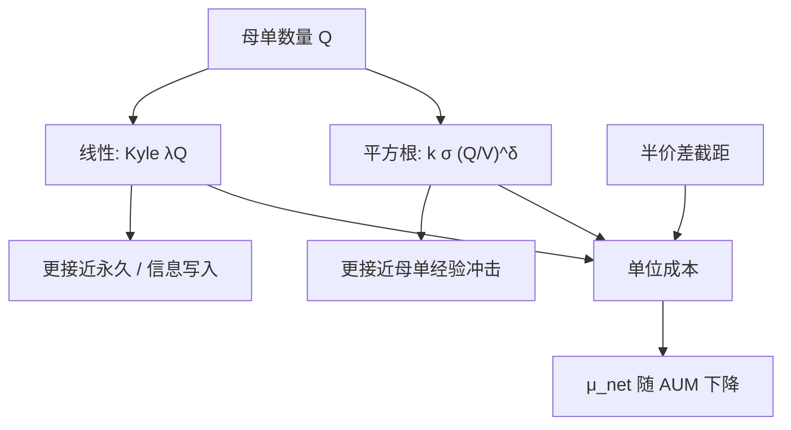

# 线性与平方根冲击

经验上，组合交易对价格的冲击更接近成交量占比的平方根，而不是Kyle 单期均衡里那条过原点的直线；深度来自潜在流动性，不是来自已经挂出的那一薄层。

<footer>—— Almgren, Thum, Hauptmann and Li, Direct Estimation of Equity Market Impact, Risk, 2005；以及 Torre 对 BARRA 市场冲击的平方根设定</footer>

[Kyle 模型](/quant/kyle-model) 给出线性价格冲击：知情者的数量进入出清价，斜率 $\lambda$ 由噪声规模与价值不确定决定。执行与容量问题里，人们更常写

$$
\Delta P \propto \sigma\left(\frac{|Q|}{V}\right)^{\delta},
$$

$\delta\approx 1/2$，$V$ 是成交量或 ADV，$\sigma$ 是波动。Torre 的 BARRA 手册把平方根冲击写成可校准的工程公式；Almgren 等人（2005）用机构订单直接估计，发现指数接近 0.6 或平方根。Toth 等人（2011）从潜在流动性与临界现象的角度解释为什么是根号而不是线性。本篇写线性与平方根何时各自适用、如何校准、以及混用时优化器会犯什么错。它描述的是成本如何随规模上升，不承诺存在一个「最优规模使策略稳赚」。

## 问题

组合要把一块目标仓位 $Q$ 换成持仓，价格会走。若冲击对 $Q$ 线性，边际成本恒定，容量问题是一条斜线：净期望 $\mu_{\mathrm{gross}}-\lambda Q$ 在某有限 $Q$ 过零。若冲击是平方根，边际成本随 $Q^{-1/2}$ 下降（平均成本仍升），小单很贵（相对价差主导，见 [价差成本](/quant/spread-cost)），中等单的增量成本上升较慢，直到潜在流动性耗尽、指数律破裂。问题是：你的账户落在哪一段，以及回测外推到更大 AUM 时该用哪一条曲线。

线性来自 Kyle 的正态–线性均衡，对象是一次批量出清里的信息含量，不是一天里把母单拆成几百笔的执行。平方根来自母单（metaorder）的经验：许多笔同向成交累积的持久影响。用 Kyle $\lambda$ 去给母单定价，或用平方根去描述单笔对 BBO 的即时走阔，都是对象错配。

### 指数 $\delta$ 改的是容量曲线的形状

平均冲击 $c(Q)=kQ^{\delta}$。$\delta=1$ 时总成本 $\propto Q^2$（若 $c$ 是对价格的加性冲击再乘 $Q$），最优执行与容量对 $k$ 极敏感。$\delta=1/2$ 时总成本 $\propto Q^{3/2}$，规模扩大时净 alpha 下降得比线性冲击更慢——这常让人误以为「平方根更乐观」。实际上平方根在小 $Q$ 处的平均成本可以高于过原点的线性（因为还要加价差截距），在极大 $Q$ 处又可能低估：簿耗尽后冲击超线性。容量结论必须画整条 $c(Q)$，而不是只报一个 $\delta$。

Huberman 与 Stanzl（2004）证明：永久冲击必须对数量线性，否则存在价格操纵与准套利。经验平方根描述的多是含暂时成分的母单冲击，或是对「已完成母单的持久部分」的有偏拟合。把 $\sqrt{Q}$ 写成不可逆的永久冲击，会与无操纵条件冲突，见 [瞬时与永久冲击](/quant/temp-perm-impact)。

## 方法

校准至少要分清：瞬时（成交时相对到达中点）、短暂（数分钟到数小时的恢复）、永久（母单结束后仍留下的）。Almgren 等人把临时冲击写成对交易速率的函数，永久冲击写成对总量的函数，并估计幂次。工程近似：

$$
\text{临时}\approx \eta\sigma\,\mathrm{sign}(v)\left(\frac{|v|}{V_{\mathrm{bar}}}\right)^{\delta_t},\qquad
\text{永久}\approx \gamma\sigma\,\mathrm{sign}(Q)\left(\frac{|Q|}{\mathrm{ADV}}\right)^{\delta_p}.
$$

常取 $\delta_t\approx 1$ 或 $0.5$，$\delta_p$ 在理论约束下应取 1；若数据把 $\delta_p$ 拟成 0.5，应理解为有效窗口里仍含未恢复的暂时项，而不是推翻 Huberman–Stanzl。

$V$ 的口径：当日已实现成交量前视；应用预测量或 ADV。$\sigma$ 用到达时的预测波动，使冲击在高波动日自动放大。按市值、价差、行业分层估计 $k$，不要全市场一个指数。母单应整段标记（同一决策、同一方向的一串子单），用子单回归会把平方根拟成更接近线性的「每笔很小」的世界。

### 在优化器里的凸性

二次规划喜欢线性冲击导致的二次成本 $Q^\top\Lambda Q$。平方根平均成本使总成本 $\propto |Q|^{3/2}$，对 $Q$ 仍凸（在过原点、符号可分的通常写法下），可以用锥规划或分段线性逼近。危险的是「小单用价差、大单用根号」的拼接：若拼接不当，边际成本不单调，优化器会把仓位卡在折点上。更干净的是：优化层用线性或二次惩罚做换手与冲击的保守代理，执行层用平方根估计真实短fall，两者定期核对，而不是让研究 QP 直接吃非凸启发式。

Loeb（1983）已经用机构交易成本对规模作图，显示成本随规模凹性上升。平方根是这一族经验曲线的参数化，不是 2005 年才出现的新市场定律。制度变了，指数可能变，但「成本对规模凹、对 ADV 占比升」这一形状比具体 0.50 更稳健。

## 机制

线性 Kyle 机制是信息不对称下的理性出清：流量的信息含量随 $Q$ 线性进入价格，深度 $1/\lambda$ 由噪声提供。平方根机制的叙事不同：可见簿很薄，更大的母单会从潜在流动性（未挂出的卖意、其他做市资本）里「挖」出增量深度；挖得越深，要价越高，但不是按已见档位线性加总。Toth 等把这写成流动性的临界状态：冲击与母单规模的平方根成正比，来自供给的幂律。Bouchaud 等人的传播函数则把单笔冲击的衰减加总成母单的有效根号。机制上，平方根是**许多暂时冲击叠加上缓慢衰减**的宏观表现，不必要求每一笔都服从 $\sqrt{q}$。

因此：单笔吃档更接近簿的几何（可能超线性，一旦打穿数档）；母单的持久影响更常看到根号；Kyle 线性更接近「这一股流量的信息被立刻写入」的永久部分。三层可以同时存在。执行算法若按单笔平方根控速，可能过慢（把信息优势耗在时间上）或过快（在薄簿上打穿）。应对齐你要付的是哪一层。

### 与价差截距的合成

完整单位成本常写成 $s/2+k(Q/\mathrm{ADV})^{\delta}$。$\delta\lt 1$ 时，存在一个规模使两项同量级；小于该规模，降换手主要靠少付价差（降频、加带宽）；大于该规模，容量受冲击斜率限制。因子衰减慢、换手低的策略往往活在价差段；统计套利日频活在两段之间；大规模指数调整活在冲击段。用单一 $\delta$ 去给三类策略做容量，会得到同一条好看但错位的曲线。

## 边界与工程取舍

幂律在 $Q/\mathrm{ADV}$ 的中间段最稳，两端失效：极小单被最小报价单位与半价差主导；极大单改变交易机制（谈判、大宗、停牌）。拥挤时同类母单同向，$V$ 分母被高估（ADV 含了拥挤流），冲击高于平静期校准。2007 年 8 月不是把 $\delta$ 从 0.5 改成 0.7 能概括的，而是流动性供给撤了。

不要把回归 $\Delta p=\lambda Q+\varepsilon$ 的 $\lambda$ 叫做「已估计的 Kyle 深度」又拿去当平方根的 $k$。不要在 [Almgren–Chriss](/quant/almgren-chriss) 的线性临时冲击闭式解里直接把项换成 $\sqrt{v}$ 还沿用双曲正弦轨迹——那是另一个变分问题。不要用全样本拟合 $\delta$ 再声称容量。应预留一段执行数据做样本外短fall 核对，并按波动分位分层。

A 股涨跌停使冲击在板上变成「无穷」：不是 $\delta$ 变大，而是约束 $Q$ 不可执行。平方根公式在这些日子不应外推，应把可成交集合当成硬约束。

同一 $\delta$ 在买卖两侧可以不同：跌停附近卖出、停牌再开的买入，供给弹性不对称。校准应分方向，至少检查买入母单与卖出母单的短fall 曲线是否能共用一套 $k$。

## 小结

- Kyle 线性冲击描述信息批量出清；平方根冲击是母单执行的经验律（Torre；Almgren et al., 2005；Toth et al., 2011）。
- 永久冲击在无操纵条件下应线性（Huberman–Stanzl）；经验根号多混有未恢复的暂时成分。
- 容量曲线的形状由 $\delta$ 与价差截距共同决定，不能只报一个指数。
- 优化层宜用凸代理，执行层用平方根估短fall；不要把闭式线性 AC 轨迹套到 $\sqrt{v}$ 上。
- 两端与涨跌停、拥挤使幂律破裂，ADV 分母在拥挤时会给出过低冲击。
- 出处：Almgren, Thum, Hauptmann and Li, *Direct Estimation of Equity Market Impact*, Risk, 2005；Torre, BARRA *Market Impact Model*；Kyle, *Econometrica*, 1985；Huberman and Stanzl, *Econometrica*, 2004；Toth et al., *Physical Review X*, 2011。
