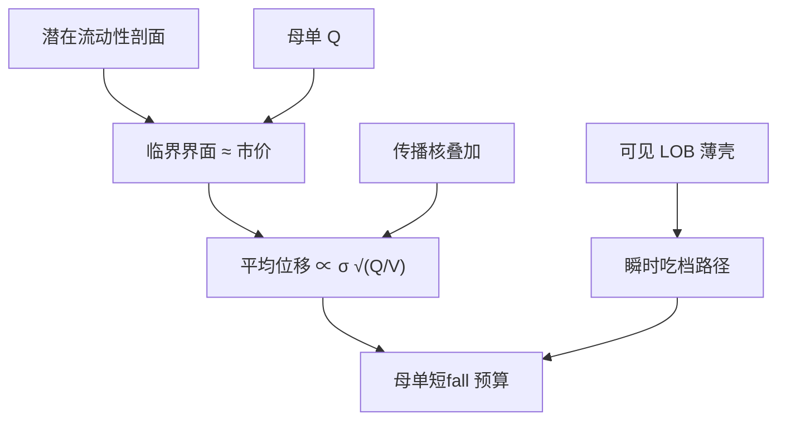

# 平方根冲击律

母单对价格的平均影响随参与率的平方根上升：可见簿只是潜在流动性的一层薄壳，往下挖时遇到的阻力来自临界附近的供给，而不是来自已经挂出的那几档。

<footer>—— Toth, Lempérière, Deremble, de Lataillade, Kockelkoren and Bouchaud, Anomalous price impact and the critical nature of liquidity, Physical Review X, 2011</footer>

[线性与平方根冲击](/quant/sqrt-impact) 已经在执行与容量的工程坐标里写过：Kyle 线性、Torre/Almgren 的经验根号、Huberman–Stanzl 对永久项的线性约束、以及优化器里 $\delta$ 如何改变容量曲线。本篇把镜头转到 Tóth 等人（2011）的**平方根冲击律**本身：为什么指数接近 $1/2$、潜在订单簿（latent order book）怎样给出这个指数、它与 [Bouchaud 传播核](/quant/bouchaud-propagator) 的叠加叙事如何兼容，以及定律在哪些尺度上失效。它是一条关于母单平均冲击的经验–理论陈述，不是仓位越大越有边的许可。

## 问题

把母单成交量记为 $Q$，同期或滚动成交量记为 $V$，波动为 $\sigma$。经验关系常写成

$$
\frac{\mathbb{E}[\Delta p\mid Q]}{\sigma}
\approx Y\,\mathrm{sign}(Q)\sqrt{\frac{|Q|}{V}},
$$

$Y$ 是无量纲因子，不同市场数量级往往在一个不太宽的范围内——这就是「律」比单一股票回归更强的地方。Kyle 的 $\lambda Q$ 给不出稳定的 $1/2$，也给不出 $Y$ 的近似普适。可见 LOB 的阶梯几何更倾向于：小单几乎只付价差，一旦打穿则超线性。母单却很少按可见档线性加总来定价，因为母单执行时间里簿会补货、隐藏量会现身、其他参与者会改报价。问题是找到一个供给对象，使边际冲击在中间尺度上呈现根号，而不是去把可见档拟合出 $0.5$。

Tóth 等人的回答是潜在流动性：大量买卖意向分布在价格上，但并未挂出；市场价格像在这条潜在密度的临界点附近游走。扰动母单相当于把这个临界界面推移，平均位移与 $\sqrt{Q}$ 相关。可见簿只是界面附近被激活的一层。

### 潜在簿、临界与指数 $1/2$

把潜在限价意向的密度在当前价附近写成近似平坦或弱依赖的剖面，界面的随机供给类似于临界系统里的响应。对界面推移 $Q$ 个单位，典型位移 $\Delta p\propto\sqrt{Q}$（在他们采用的随机供给设定下）。$V$ 进入分母，因为同期成交量度量有多少潜在流动性正在被「翻动」，参与率 $Q/V$ 才是无量纲的挖掘深度。$\sigma$ 把位移换成相对价格。$Y$ 吸收剖面的细节与市场结构。定律的主张是：在中间参与率上，$Y$ 缓慢变化，指数贴近 $1/2$，而不是精确的普适常数到小数点后两位。

「临界」在这里是统计物理的类比：系统停在供给几乎耗尽、任意扰动都触发大响应的边缘。它不是 Hawkes 分支比等于 1 的同义词，也不是可交易的崩盘警报。把两套临界混成一句「市场不稳定」，没有识别。

## 方法

估计必须在**母单**层：同一决策、同一方向、有开始与结束的一串子单。用子单或逐笔去回归 $\Delta p$ 对 $q$，会把定律拟成更接近线性或更接近价差截距的世界，因为每笔都小。$Q$ 用股数或金额应与 $V$ 一致；金额口径见 [金额不平衡条](/quant/dollar-imbalance-bars) 的同一逻辑。$\Delta p$ 的窗口要覆盖执行期并延伸到足够观察恢复：只取执行期结束瞬间，根号里含大量暂时项；取次日，则宏观噪声进入。应报告多个 $\tau$，并画 $Y(\tau)$。

对照实验：按波动分位、按 ADV 分位分层，看 $\sqrt{Q/V}$ 是否仍能把曲线叠在一起。若高波动日只是 $\sigma$ 缩放后重合，定律在该层成立；若 $Y$ 随波动陡升，则流动性在压力下撤了，普适破裂。买卖分侧、开盘半小时单独估。样本外：用前段估 $Y$，看后段母单短fall 的校准误差，而不是全样本一条漂亮的 $0.50$。

### 与传播核、线性永久项如何共存

微观上，单笔 $G(\tau)$ 衰减，同向子单叠加给出母单尺度的凹冲击，可以接近根号——这是传播叙事。宏观上，潜在簿的临界响应直接给出 $\sqrt{Q}$——这是 Tóth 叙事。二者不必互斥：临界剖面可以是 $G$ 衰减与补货之后仍留下的有效供给。工程上与 sqrt-impact 一文一致：把根号主要用于含暂时成分的执行短fall；永久部分用线性项满足无操纵。若数据在长窗口仍坚持根号，先延长窗口或加对照组，怀疑暂时项未死，而不是宣布 Huberman–Stanzl 失效。

可见档会计（吃掉 $q^a_1,q^a_2,\ldots$）用来解释**瞬时**路径，不用来解释母单定律。两者同时进入执行模拟：瞬时用簿，母单预算用根号或用 $G$ 叠加，再核对。

## 机制

机制的核心句：价格冲击由**潜在**供给弹性决定，可见深度是弹性在 BBO 的投影。母单进行时，界面被推移，新的意向被激活（挂出、改价、从暗处出现），旧的意向被成交或撤销。平方根来自这种激活过程的统计几何，而不是来自「每个人约定用根号报价」。因此定律对交易场所的微观规则有一定稳健性——只要存在大量未显示的意向、且市场经常运行在流动性紧张的边缘。这也解释为什么可见 LOB 那么薄却还能成交大母单：薄的是壳，壳下面有潜在量，但要价随挖掘上升。

信息机制仍然可以叠加。知情母单的 $Y$ 可以更高，因为供给在信息方向上更不愿意提供。Tóth 定律是平均陈述，混合了知情与非知情母单。用定律去「证明」某类账户没有信息，逻辑反了：定律不识别信息，只约束平均价格位移的尺度。

### 何时指数会离开 $1/2$

极小 $Q$：半价差与 tick 主导，有效指数接近 0（固定成本）。极大 $Q$：潜在供给耗尽、要走大宗或停牌，指数大于 $1/2$ 甚至冲击发散。拥挤：许多母单同向，$V$ 含了彼此，参与率被低估，$Y$ 表观上升。公告窗：潜在剖面本身在移动，定律的「剖面固定」假设坏了。涨跌停：位移被制度截断，根号无定义。这些在容量一文里作为工程破裂点出现；在本篇里它们是临界理论的边界条件——系统离开了「界面附近、剖面近似稳定」的区域。

$Y$ 不是 alpha。把它当截面因子去预测收益，是把成本参数误当成风险溢价。至多可以问：高 $Y$ 的日子里做市是否应更宽，那是流动性状态，仍要与毒性、波动一起看。

## 边界

定律是平均值。单个母单的短fall 散点极宽，$R^2$ 往往不高。用平均值去做每一笔的事前预算，必须加不确定性，否则执行台会在噪声里过度反应。标的若几乎没有潜在流动性（极薄的小盘、涨停板上），不要用大盘股估出来的 $Y$。中国市场的涨跌停、T+1、集合竞价改变潜在供给的激活方式，需要本地母单样本，不能把 PRX 2011 的图直接贴上。

不要与 Kyle $\lambda$ 互相改名。不要在单笔吃档上宣称平方根律被违反——对象从来不是单笔。不要把模拟的 QR 簿里打穿几档的瞬时曲线叫做对 Tóth 定律的拒绝；QR 通常没有潜在层。把潜在层加进仿真是研究前沿，不是 2015 年 QR 论文的默认件。

平方根律约束的是平均价格位移如何随参与率上升。它不告诉你该不该交易，也不保证慢执行一定更便宜——慢会把信息优势和时间风险换成另一张账单。

## 小结

- Tóth 等人的平方根冲击律：母单平均价格位移对波动标准化后，随参与率 $\sqrt{Q/V}$ 上升，$Y$ 在中间尺度上相对稳定。
- 机制是潜在订单簿在临界界面附近的响应；可见档只是被激活的薄壳。
- 与传播核兼容：单笔衰减响应的叠加可以在母单层长出根号。
- 永久项仍宜线性；经验根号多含暂时成分。两端、拥挤、公告与涨跌停使定律破裂。
- 必须在母单层估计，并做分层与样本外短fall 核对。
- 出处：Toth et al., *Physical Review X*, 2011；工程校准背景见 Almgren et al., *Risk*, 2005 与 Torre 的 BARRA 设定；无操纵约束见 Huberman and Stanzl, *Econometrica*, 2004。
