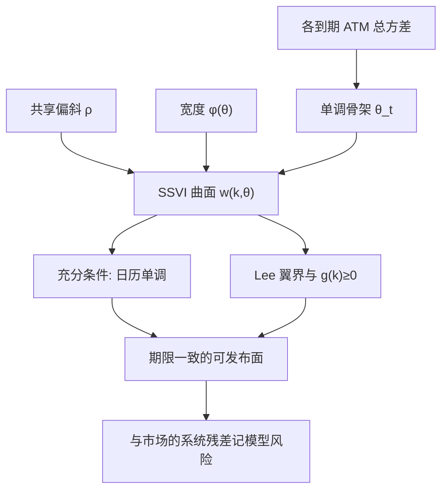

# SSVI 期限结构一致性

    
把每个到期的微笑挂在一条递增的 ATM 总方差骨架上，并限制微笑宽度随 $\theta$ 变的速度，可以使一整族切片满足无日历套利的充分条件；期限一致性指的是这条骨架与宽度函数彼此兼容，而不是各到期各自拟合再事后对齐。

    <footer>—— Gatheral and Jacquier, Arbitrage-free SVI volatility surfaces, Quantitative Finance, 2014</footer>

单切片的 [SVI 无套利参数化](/quant/svi-arb-params) 管蝶式与翼。日历套利是另一方向：更长的到期若在某一货币性上总方差更小，则在适当折现与远期对齐后可以锁定价差，见 [Gatheral 无套利](/quant/gatheral-arb-free) 与 [蝶式与日历](/quant/butterfly-calendar-arb)。逐到期独立拟合 raw SVI，很容易每片 $g\ge 0$ 但 $T\mapsto w(k,T)$ 非单调。Gatheral 与 Jacquier 的 SSVI（surface SVI）把微笑写成 ATM 总方差 $\theta_t=w(0,t)$ 的函数，使跨期自由度从「每片五个数」降到「一条递增的 $\theta_t$ 加上共享的偏斜与宽度函数 $\varphi$」。本篇写期限一致性：$\theta_t$ 为何必须递增、$\varphi(\theta)$ 上的充分条件在做什么、幂律例子 $\varphi(\theta)=\eta/\theta^\gamma$ 的 $\gamma$ 上界从何而来，以及强行投影到 SSVI 族时残差应记为模型风险。它不重复 raw 五参数的校准细节，也不把 $\varphi$ 解释成 [Heston](/quant/heston) 的 $\kappa$。

## 问题

固定对数货币性 $k$，在零利率、按远期货币性比较的标准设定下，无日历套利的常用充分条件是

$$
\partial_T w(k,T)\ge 0.
$$

直觉：更长时间应装进不少于更短时间的总方差。隐含波动 $\sigma_{\mathrm{imp}}$ 可以倒挂——短端高、长端低——只要 $w=\sigma_{\mathrm{imp}}^2 T$ 仍递增。对 $\sigma_{\mathrm{imp}}$ 做期限插值会把这一几何弄乱。问题是如何构造一族 $w(\cdot,T)$，使对所有 $k$ 同时有 $\partial_T w\ge 0$，而不是只让 ATM 单调。若每片独立，只能事后检查并手工拉参数，日历修复又会破坏蝶式。SSVI 要的是先验结构：先指定单调的 $\theta_t$，再让微笑形状随 $\theta$ 走一条被限制的道路，使日历在整张面上被充分条件管住。

SSVI 的一种标准形式为

$$
w(k,\theta)=\frac{\theta}{2}\left(1+\rho\,\varphi(\theta)\,k+\sqrt{\bigl(\varphi(\theta)\,k+\rho\bigr)^2+1-\rho^2}\right),
$$

其中 $\theta=\theta_t\gt 0$，$|\rho|\lt 1$，$\varphi(\theta)\gt 0$。$\rho$ 在该族里跨期共享（或随 $t$ 极慢变化），宽度由 $\varphi$ 承担。期限一致性的全部内容，就是 $\theta_t$ 与 $\varphi$ 的联合限制。

### 为何共享 $\rho$ 能消灭一类日历

独立 SVI 允许相邻到期的偏斜符号或翼角完全不同，于是某一侧 $k$ 上短到期 $w$ 可以超过长到期。共享 $\rho$、只让水平走 $\theta_t$，等于禁止「明天的翼与今天的翼无关」。这是拟合变差的来源，也是日历被控制的来源。市场若真的在短端跳主导、长端扩散主导，偏斜期限结构可以很陡，SSVI 会留下系统残差——充分条件保证的是**该族内部**无日历，不是保证市场落在该族里。一致性首先是模型族的自洽，其次才是与市场的距离。

$\theta_t$ 递增是 ATM 的日历条件，不是全部 $k$ 的日历条件。没有对 $\varphi$ 的限制，微笑可以随 $\theta$ 变宽得太快，使翼上的 $w$ 对 $T$ 下降。期限一致性必须同时约束骨架与宽度，不能只样条 ATM。

## 方法

骨架。用上市到期的 ATM 总方差（由中间价反解）构造一条对 $t$ 递增的 $\theta_t$。若原始 ATM 已非单调，先清洗报价或把倒挂解释为噪声并投影到单调锥，而不是让 SSVI 去「平均」非法骨架。单调样条、保形插值都可以；关键是 $\partial_t\theta_t\ge 0$ 作为硬约束。有利率与分红时，应对齐的是适当测度下的总方差，不能把 $\sigma_{\mathrm{imp}}$ 倒挂当成违例。

宽度。Gatheral–Jacquier 给出 $\varphi$ 与 $\rho$ 上的充分条件，使 $\partial_\theta w(k,\theta)\ge 0$ 对所有 $k$ 成立，从而 $\theta_t$ 递增即推出日历单调。核心是 $\theta\mapsto\theta\varphi(\theta)$ 的导数落在含 $\rho$ 的闭区间内：太快变宽会在翼上破坏日历，太不当的形状也会与蝶式冲突。蝶式侧，SSVI 的右翼渐近为 $w(k)/k\to(\theta\varphi(\theta)/2)(1+\rho)$，Lee 上界 $w/k\le 2$ 变成

$$
\theta\,\varphi(\theta)\,(1+|\rho|)\le 4,
$$

与 raw SVI 的 $b(1+|\rho|)\le 2$ 差一个由公式写法带来的因子，几何相同。实施应同时施加：日历充分条件、Lee 型翼界、以及网格上的 $g(k,\theta)\ge 0$。

### 幂律 $\varphi(\theta)=\eta/\theta^\gamma$ 的期限含义

论文中的标准例子是 $\varphi(\theta)=\eta\theta^{-\gamma}$，$\eta\gt 0$，$\gamma\in[0,1/2]$。$\gamma=0$ 时宽度不随期限衰减，长端微笑与短端一样陡，通常过陡且容易破日历或蝶式；$\gamma=1/2$ 对应总方差平方根尺度上的一种临界衰减，长端变平的速度与许多随机波动的直觉一致。$\gamma\gt 1/2$ 往往使宽度掉得过快或破坏充分条件，不是「更光滑」的免费午餐。$\eta$ 水平移动所有期限的弯曲，受 Lee 界 $\theta\varphi(1+|\rho|)\le 4$ 在最小 $\theta$（最短到期）上的最紧约束——短端 $\theta$ 小，$\varphi$ 大，翼先在短端撞墙。这解释了为何 SSVI 仍可能拟合不好极短到期：充分域在短端最窄，残差应预期，而不是把 $\eta$ 再加大。

## 机制

日历套利的机制是跨期比较同一货币性上的凸性价格。SSVI 把比较收成对 $\theta$ 的单调性：所有切片是同一条「微笑模板」被 $\theta$ 拉升、被 $\varphi(\theta)$ 改宽。$\varphi$ 随 $\theta$ 下降时，长端更圆、更平，与均值回复方差把微笑拍扁的叙事定性一致，但 $\varphi$ 不是 $\kappa$：没有 $v_t$ 过程，没有杠杆路径，只有静态期限骨架。用 SSVI 的 $\gamma$ 去冒充 Heston 回复速度，会把曲面几何当成动态。动态仍要另选模型；SSVI 只保证今日欧式表在日历方向上自洽。

一致性失败的典型模式有三种。其一，$\theta_t$ 倒挂，ATM 已经日历非法。其二，$\theta_t$ 递增但 $\varphi$ 太大，翼上 $\partial_T w\lt 0$。其三，各到期仍想用独立 $\rho$，短端负偏斜、某长端接近对称，投影到共享 $\rho$ 后一边残差系统为正、一边为负。前两种是套利，必须修；第三种是族太窄，修了日历会留下偏斜残差，应报告而不能用独立 SVI 偷回日历漏洞。期限一致性的「一致」，指套利约束下的自洽，不是指残差为零。

### 插值到期与上市到期

上市到期上 $\theta_{t_i}$ 单调且 $\varphi$ 满足充分条件，并不自动给全部中间 $t$ 合法切片，除非 $\theta_t$ 在中间也按同一单调函数走、且 $\varphi$ 定义在整个区间。生产发布需要对任意 $t$ 求 $w(k,t)$，因此 $\theta_t$ 必须是定义在连续期限上的递增函数，而不是仅在上市点上的一列数。中间到期的日历检查应在发布网格上做，而不是只在校准点上做。这与 [无套利插值](/quant/arb-free-iv) 的要求相同：约束是对函数的，不是对观测点的。

把相邻两片独立 SVI 的 $w$ 做线性插值，即使两端 $g\ge 0$，中间切片也可以日历倒挂或蝶式变负。SSVI 的价值是中间期限与校准期限共用同一充分域。用独立 SVI 加线性插值冒充「有期限结构」，是最常见的一致性幻觉。

## 边界与工程取舍

Gatheral–Jacquier（2014）给出的是充分条件：满足则在论文设定下无日历套利。必要条件更弱，市场可以无日历却不在 SSVI 里。强行投影的残差是模型风险，尤其在短端跳、分红跳、以及偏斜符号随期限翻转时。有随机利率、离散股息时，货币性对齐与 $\partial_T w\ge 0$ 的精确陈述要改，不能把股权指数的实现原样接到商品或可转债。SSVI 不管动态无套利，不管美式，不管单一标的以外的篮子。

与 Heston、SABR 的分工不变：SSVI 发布香草期限结构；Heston 解释方差均值回复与杠杆路径；SABR 管理单到期微笑语言，其跨期参数插值是另一套工程，见 [SABR 校准](/quant/sabr-calib)，不自动满足 Gatheral–Jacquier 的 $\varphi$ 条件。三套工具可以在同一张桌上，但期限一致性以 SSVI 或显式的 $w$ 单调扫描为准，不以「Heston 已经全局校准」为准——五个动力学参数贴面，不保证中间 $(k,T)$ 上 $\partial_T w\ge 0$ 的插值层合法。

$\varphi(\theta)=\eta/\theta^\gamma$ 的 $\gamma$ 若每日无约束地估，期限结构会把一日噪声写成「衰减变了」。生产上宜冻结 $\gamma$ 在合理区间（例如 $1/2$ 附近），只估 $\eta$ 与 $\rho$，把剩余自由度留给 $\theta_t$。这是识别策略，与冻 SABR 的 $\beta$ 同类。

## 小结

- SSVI 用递增的 ATM 总方差 $\theta_t$ 与受限的宽度 $\varphi(\theta)$ 给出跨期无日历套利的充分条件。
- 仅 ATM 单调不够；$\varphi$ 变宽过快会在翼上破坏 $\partial_T w\ge 0$。
- 幂律 $\gamma\in[0,1/2]$ 是标准例子；短端 Lee 界 $\theta\varphi(1+|\rho|)\le 4$ 往往最先收紧。
- 期限一致性是函数级约束，中间到期必须落在同一充分域，独立 SVI 插值不构成一致曲面。
- 出处：Gatheral and Jacquier, *Quantitative Finance*, 2014；总方差几何见 Gatheral, *The Volatility Surface*, 2006；矩界见 Lee, 2004。
