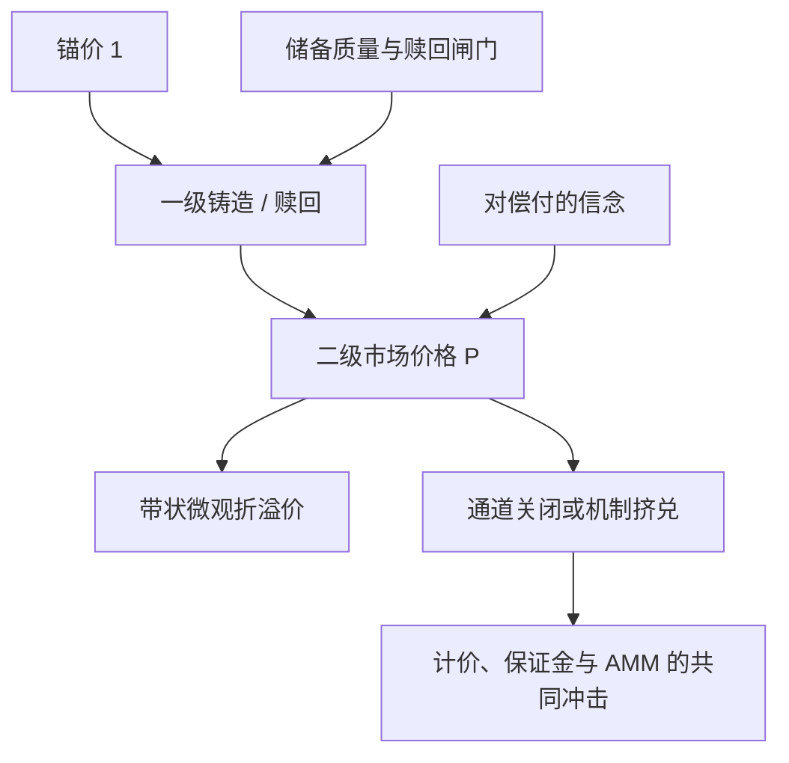

# 稳定币脱锚风险

    
稳定币把「一单位永远接近一美元」写成承诺，而不是写成无风险债券；承诺靠储备、套利与信心维持，当赎回或储备被质疑时，价格可以离开锚，且离开的速度由挤兑博弈决定。

    <footer>—— Lyons and Viswanath-Natraj, What keeps stablecoins stable?, JIMF 2023；挤兑与算法锚见 Uhlig, A Luna-tic Stablecoin Crash, 2022</footer>

美元稳定币被用作加密市场的计价单位、保证金与跨所桥梁。设计目标是使市价 $P_t$ 贴近 $1$。贴近不是恒等式：USDT、USDC、DAI 都出现过折溢价；2022 年 UST 的崩塌、2023 年 3 月 USDC 因储备银行风险的折价，说明锚是可破的。Lyons 与 Viswanath-Natraj 问的是什么机制让中心化抵押稳定币在多数日子里回到 $1$：一级市场的铸造/赎回套利，以及二级市场上对储备质量的信念。Gorton 与 Zhang 把某些稳定币比作历史上一度缺乏主权支撑的私人货币。Griffin 与 Shams 则从 Tether 的增发与比特币价格的同步性提出储备与市场影响的经验问题。本篇写脱锚作为**风险因子**：折溢价的会计、赎回闸门、算法锚与抵押锚的不同崩溃模式。它不是预测下一次挤兑的时间表。

## 问题

记锚为 $1$（或一篮子）。市价 $P_t$ 在二级场所（中心化限价簿与 AMM）形成。若一级市场允许以 $1$ 美元等值资产兑换 $1$ 枚稳定币（铸造）或以 $1$ 枚稳定币赎回 $1$ 美元等值，则当 $P>1$ 时存在铸造并在二级卖出的压力，当 $P<1$ 时存在买入并赎回的压力。Lyons–Viswanath-Natraj 的核心观察是：这一套利把二级价格钉在锚附近，**前提是一级通道开放、储备可被相信、赎回能在约定时间内按面值结算**。三个前提任一失效，$P$ 就可以离开 $1$，且不再有无风险的回锚。

问题因而分成两类。第一类是暂时的微观折溢价：某场所流动性薄、某条链上的桥接资产不同步、周末银行通道关闭，带状偏离类似 [CEX-DEX](/quant/cex-dex-arb) 的成本带。第二类是对偿付能力或机制本身的质疑：储备资产减记、发行人暂停赎回、算法锚的吸收资产同时下跌。第二类是挤兑：Diamond–Dybvig 意义上，先赎回的人得到更接近面值的东西，后赎回的人承担剩余资产的缺口。稳定币的「稳定」在计量上应被写成 $P_t$ 的分布与赎回约束的状态，而不是写成常数 $1$。

### 抵押、算法与超额抵押不是同一锚

中心化法币抵押（USDC、部分时期的 USDT）承诺用现金与短期国债一类资产支撑。锚的风险是储备的信用与流动性：银行破产、国债折价变现、审计与托管是否可验证。Griffin–Shams 对 Tether 的研究不自动推广到所有法币币，但它提醒：增发路径与储备透明度是定价变量。超额抵押的链上稳定币（DAI 一类）用加密资产超额抵押、再加稳定费与清算；锚的风险是抵押品暴跌时清算能否完成、以及目标利率能否把 $P$ 拉回。算法锚（UST 与 LUNA 的销毁/铸造对）用一种浮动币去吸收稳定币的供求：膨胀时铸造浮动币回收稳定币。Uhlig 以及 Liu、Makarov、Schoar 对 Terra 的解剖表明：当信心反转，吸收资产的市值可以同时蒸发，锚没有外部储备可兑，脱锚是机制内生的。

把所有稳定币的历史波动放进同一个「脱锚因子」会混掉机制。法币抵押的折价往往是对特定储备事件的跳；算法锚的折价可以自我强化到零。回归里应至少按设计类型分层，否则系数没有解释。

## 方法

价格。$P_t$ 必须标明场所与计价：美元银行电汇、另一稳定币、还是某条链上的 AMM。USDC 在 SVB 事件中相对美元折价，同时相对某些加密计价可能看起来不同。用脱锚币去给其他资产计价，会把锚的冲击写成「全市场暴跌」或「全市场暴涨」。会计上应选尽可能接近法币的参考，并把稳定币对稳定币的交叉也当作基差，而不是当作无风险 $1$。

套利度量。一级赎回若仍开放，折价幅度应与「赎回延迟期间的利率与信用」比较：折价 $1-P$ 是持有至赎回的贴现，还是对违约概率的报价。若赎回暂停，$1-P$ 变成对最终回收的市场定价，应用信用产品的语言，而不是用「很快会回锚」的叙事。Lyons–Viswanath-Natraj 用铸造/赎回流量与二级价差的关系来检验套利通道是否在工作：流量对价差敏感，说明钉住机制在运行；价差大而一级流量枯竭，说明通道已断，二级价格是信念。

### 作为风险因子：谁在裸露

杠杆市场普遍用稳定币做保证金与结算。$P$ 下跌时，以该币计价的负债名义不变，但兑法币的净值下降；若平台按 $1$ 记账而用户按法币经济敞口思考，会出现隐性错配。AMM 里稳定币对构成大量「低波动」池，脱锚使曲线沿错误的一价定律做市，LP 承担的是信用跳而不是汇率噪声。期货与永续的指数若混入脱锚场所的报价，标记价格会把锚的折价传进强平，见 [清算](/quant/liquidation-cascade)。风险报告应把「稳定币净值」与「法币净值」分列，并列出赎回状态、储备披露时点与主要银行/托管对手方——这些是公开信息，不是内幕。

## 机制

钉住的日常机制是套利：折价时，有储备信任的参与者买入并赎回，供给减少，$P$ 回升；溢价时铸造增加供给。这与 ETF 一级市场、与货币局用储备兑付本币是同一逻辑。脱锚的机制是这一回路断裂或反转。法币抵押下，断裂通常来自储备侧新闻（银行、国债、冻结）或发行人主动设闸；价格跳完之后，若市场相信最终仍能按接近面值兑付，折价可以在数日收窄，USDC 在 2023 年 3 月的路径接近这种「有回收预期的折价」。算法锚下，断裂来自二级抛售迫使系统增发吸收资产，吸收资产价格下跌再削弱信心，Uhlig 把它写成挤兑与螺旋。Liu–Makarov–Schoar 用链上数据表明赎回与抛售如何在短窗内耗尽吸收能力。两种路径的共同数学是：锚是多重均衡里的一个，信念一跳可以切换到低价格均衡。

交叉传染。一种主要稳定币折价，会使「稳定对」AMM、借贷协议的利率与清算阈值同时动。其他稳定币可能溢价（资金逃向被视作更安全的锚）或同跌（对整类私人货币的质疑）。Gorton–Zhang 的监管讨论正是针对这种私人货币在压力下的转换风险。对投资组合，脱锚不是 idiosyncratic 的一分钱噪声：它是计价单位失效，所有以该单位报告的收益、杠杆与对冲比都要重标。

### 回锚不是均值回复策略的证明

历史上多数中心化稳定币的折价事后收窄，不等于无条件做多折价稳定币有正的风险调整收益。收窄的样本条件是：赎回最终恢复、储备缺口被注资或被证明不存在。失败的样本（UST）里折价不收窄。用存活的币的分钟级回归证明「脱锚可套利」，是典型的存活者偏差，见 [存活偏差](/quant/survivorship-bias)。可研究的是：折价对公开新闻的跳、一级流量是否响应、以及折价期间跨场所基差——这些是机制检验。把 $1-P$ 当利差去加杠杆，是在卖出尚未发生的挤兑。

稳定币的「市值」按 $P\times$ 供给计算时，脱锚会同时降低 $P$ 与（若赎回）供给，螺旋里两个量一起掉。算法锚里供给甚至可能在崩溃过程中先增后减。不要用锚为 $1$ 时的市值去推断崩溃过程中的可赎回上限。

## 边界与工程取舍

本篇不评估任何发行人当前储备的真伪，那需要审计与监管文件，而不是价格公式。经验文献给出的是机制与案例：Lyons–Viswanath-Natraj 解释为何有一级市场的抵押稳定币多数时候稳；Griffin–Shams 提出增发与资产价格同步的问题；Uhlig 与 Liu–Makarov–Schoar 解释算法锚如何失败；Gorton–Zhang 提供货币史与监管框架。报价实务上，应避免用单一稳定币作为全部策略的无风险记账单位，至少准备法币或短债作为第二记账。压力测试应包含：主要稳定币折价若干个百分点、赎回延迟若干日、AMM 稳定对深度蒸发——这些情景在已发生的样本里不是想象。

桥接与包裹资产是另一层脱锚：链上「USDC」可能是原生也可能是桥后的索取权，信用主体不同。$\delta$ 必须按合约地址与赎回路径定义。把所有代号为 USDC 的代币当成同一锚，会在桥的事件里把信用风险写成「稳定币噪声」。

期权与永续若用稳定币保证金，希腊字母对「标的美元价格」与「保证金单位价格」的暴露不同。脱锚时，后者可以主导一日的 P&amp;L。风险系统应把保证金资产的 $P$ 当成显式风险因子，而不是常数 1。

## 小结

- 稳定币锚靠一级赎回套利与储备信念维持；通道关闭或机制挤兑时，$P=1$ 不再是约束。
- 法币抵押、超额抵押与算法锚的脱锚路径不同，不能合成单一历史因子。
- 折价在通道仍开放时像赎回贴现，在通道关闭时像信用回收；回锚样本不能用来证明无条件套利。
- 脱锚冲击计价、保证金、清算与稳定对 AMM，是共同因子而不是一分钱微观噪声。
- 出处：Lyons and Viswanath-Natraj, *JIMF*, 2023；Griffin and Shams, *Journal of Finance*, 2020；Uhlig, 2022；Liu, Makarov and Schoar, 2023；Gorton and Zhang；案例对照 2023 年 3 月 USDC。
