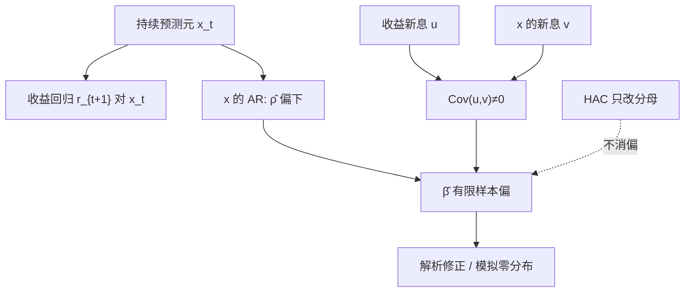

# Stambaugh 偏差

用持续而带新息的预测变量去预报收益时，回归元的新息与收益相关，最小二乘的斜率在有限样本里系统性地偏向远离零的一侧。

<footer>—— Stambaugh, Predictive Regressions, Journal of Financial Economics, 1999</footer>

[事件研究](/quant/event-study) 的识别靠短窗；预测回归的识别靠「今天的估值预报明天的收益」。股利价格比、短期利率、通胀一类变量高度持续，几乎像单位根，新息又与同期收益相关——价格涨则 $D/P$ 立刻变小。Stambaugh 给出这种设定下 OLS 的有限样本偏误：即使真 $\beta=0$，估计也会像有预测力。本课缺口是 **HAC 与聚类都不消这条偏**，因为它来自回归元的设定而非残差方差公式。后课把预测期拉长、观测重叠，偏误会与重叠推断缠在一起。

## 问题

$$
r_{t+1}=\alpha+\beta x_t+u_{t+1},\qquad x_{t+1}=\rho x_t+v_{t+1},
$$

$\rho$ 接近 1，$E[u_{t+1}v_{t+1}]=\sigma_{uv}<0$（对 $D/P$：收益正冲击伴随 $x$ 负冲击）。Stambaugh 证明

$$
E[\hat\beta-\beta]\approx\frac{\sigma_{uv}}{\sigma_v^2}E[\hat\rho-\rho].
$$

$\hat\rho$ 在近单位根下偏下（$\hat\rho<\rho$），$\sigma_{uv}<0$ 则 $E[\hat\beta-\beta]>0$：OLS 倾向于找出「$x$ 能正向预测收益」。问题是：样本内 $t$ 显著，究竟是可预报性，还是这条偏误。

Nelson 与 Kim（1993）用模拟展示了同类现象；Stambaugh 给出解析近似。对象是**有限样本**，不是渐近不一致——$T\to\infty$ 时 OLS 仍一致，但金融的 $T$ 以十年计，$\rho=0.98$ 的月度变量偏误可以吃掉真 $\beta$。

### 与单位根、HAC 的边界

$x$ 若真是单位根且与 $u$ 相关，进入局部到单位根的渐近，$t$ 的极限不是正态。Newey–West 加大滞后不会把 $E[\hat\rho-\rho]$ 变成零。预白化、把 $x$ 差分，会改变问题：差分后的 $x$ 往往没有预测力，对象变成「变化」而不是「水平估值」。

样本内 $R^2$ 高、样本外崩溃，是这条偏的常见经验貌。Goyal–Welch 对股权溢价预测的样本外检验，应与 Stambaugh 偏一起读：不是「市场不可预测」的哲学，而是水平持续回归元的统计陷阱。

## 方法

**偏误修正。** 用 $\hat\rho$ 的已知偏公式去减 $E[\hat\beta-\beta]$（Stambaugh 的解析修正）；Amihud–Hurvich 一类改进；或直接模拟：在 $\beta=0$ 下按估计的 $(\rho,\sigma_{uv})$ 抽 $(r,x)$，看 $\hat\beta$ 的分布，用该分布当零。

**推断。** 局部到单位根的临界值、Campbell–Yogo 的 Bonferroni 区间、或 [bootstrap](/quant/bootstrap-finance) 时必须保持 $(u,v)$ 的同期相关并整条重抽 $x$ 路径——对行 i.i.d. 自助会拆掉持续性，低估偏误。

**多预测变量。** 若干个近单位根 $x$ 一起回归，偏误会在系数间分配，单变量修正不够。应报告联合样本外，而不是只修其中一个斜率。

### 哪些回归元中招

估值比率、利率、期限利差、通胀、消费财富比：持续且与价格同新息。过去 12 个月收益（动量）持续性弱得多，Stambaugh 项小，偏误不是主故事。已实现波动作预测元时，$\rho$ 高但 $\sigma_{uv}$ 的符号取决于杠杆，须单独估，不能套 $D/P$ 的负号。

## 机制

$\hat\rho$ 偏下是近单位根 OLS 的经典结果（均值附近的序列被估得太均值回复）。$\sigma_{uv}\neq 0$ 把这条偏传到 $\hat\beta$：估 $x$ 的人用同一段价格新息，收益方程与 $x$ 方程共享冲击。机制是**共享新息 + 持续**，不是异方差。所以 White 三明治可以给出「精确但有偏」的区间——覆盖的是错误中心。

与 [Fama–MacBeth](/quant/fama-macbeth) 的生成回归量不同：那里 $\beta$ 是估出来的载荷；这里 $x_t$ 是观测到的，但**动态上**像生成的。Shanken 修的是第一步估计误差；Stambaugh 修的是预测元自回归的有限样本。

若能把 $x_t$ 换成事先可知、且新息与 $u_{t+1}$ 正交的变量（宏观意外的滞后），Stambaugh 项消失。许多「聪明」的同期宏观不是预先可知，会变成另一层前视。

### 经济幅度

即使修正后 $\beta>0$，可预报性的 $R^2$ 仍常在几个百分点。偏误修正回答的是「零假设还能否拒绝」，不自动给出可交易夏普。交易成本与时变 $\beta$ 会把剩下的 $R^2$ 再削一层。

## 边界与工程取舍

$T$ 短、$\rho$ 极近 1 时解析近似也差，应模拟。结构突变（$\rho$ 在样本中改变）让单 $\rho$ 修正错误。把 $x$ 换成递归的样本外均值差，是 Welch–Goyal 的纪律，不是偏误公式的替代，但能挡住样本内过拟合。

工程：凡用估值水平预测收益，并列 OLS、$t$、Stambaugh 修正或模拟 p 值、样本外。不要只用 Newey–West 宣称稳健。不要在 $\rho$ 接近 1 时把 $x$ 当普通平稳回归元做 [VAR](/quant/var-irf) 脉冲还用标准 $t$。下一课把 $r_{t+1}$ 换成 $r_{t+1}+\cdots+r_{t+h}$，重叠会让 $t$ 再膨胀一截。

## 小结

- 持续预测元与收益共享新息时，OLS 的 $\hat\beta$ 在有限样本偏向「有预测力」。
- 偏误公式连着 $E[\hat\rho-\rho]$ 与 $\sigma_{uv}$；HAC、聚类、White 都不消除它。
- 推断应用偏误修正、局部到单位根区间，或保持相关结构的路径自助。
- 样本外检验是对抗这条偏与过拟合的纪律，不是附属图表。
- 出处：Stambaugh, *Journal of Financial Economics*, 1999；相关模拟见 Nelson and Kim, *Journal of Finance*, 1993。
