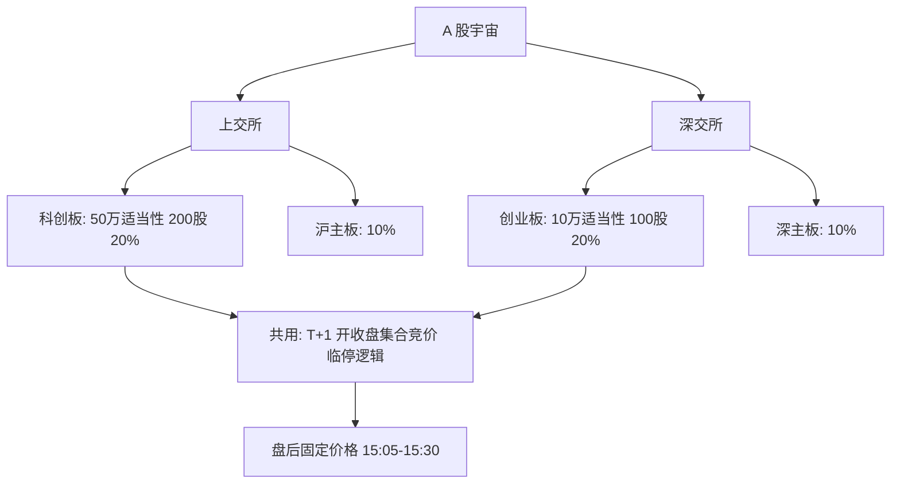

# 科创板 / 创业板制度差异

科创板股票竞价交易的涨跌幅限制比例为 20%；上市后前五个交易日等情形不实行涨跌幅限制。限价申报数量不小于 200 股。

<footer>—— 《上海证券交易所交易规则（2026 年修订）》第 6.6、6.7 条；创业板对应安排见深交所创业板交易特别规定与交易规则</footer>

[上一课](/quant/stock-connect)把北向写成带额度与通日历的通道，不是无约束外资账户；假日错位使信息集分裂。缺口是境内板块本身也不是一套规则：科创板与创业板日常涨跌幅均为 20%，适当性、最小申报与上市定位与主板不同。把两板当成「同一个 20% 市场」会在门槛、流动性与指数编制上出错。本课比较公开的交易与适当性差异，不重写北向额度。涨跌停的共同逻辑见 [集合竞价](/quant/cn-limit-auction)；两板股票同样适用 [T+1](/quant/cn-tplus1)。

## 问题

因子样本若把沪深 A 股一视同仁，等于假设同一套涨跌幅、同一最小申报单位、同一投资者集合。科创板个人投资者适当性为申请前 20 个交易日日均资产不低于 50 万元人民币且 24 个月交易经验（以交易所与会员适当性规则为准）；创业板改革后为日均资产不低于 10 万元且 24 个月经验。门槛差把散户增量供给切成两层，同样市值的股票，订单流结构不同。科创板限价单笔不小于 200 股、可按 1 股递增，市价不小于 200 股且不超过 5 万股；创业板竞价仍以 100 股为申报单位的整数倍（余额不足一次卖出）。价格离散与零股处理不同，微观结构参数不能共用。

上市与退市标准、行业定位（科创板强调科创属性与硬科技，创业板强调成长型创新创业）改变公司行为与指数。未盈利上市、表决权差异、红筹与 CDR 等安排在两板的可适用性与披露要求不同，财务特征的缺失机制因此不同。问题是在组合与风险模型里给板块一个制度标签，而不是只给一个行业哑元。

### 涨跌幅看起来一样，生效历史不一样

两板日常涨跌幅都是 20%，新股上市后前五日不设涨跌幅，盘中相对开盘价首次 $\pm30\%$、$\pm60\%$ 各临停 10 分钟。但创业板在 2020 年改革前长期是 10%，改革后新老划断：改革前已上市创业板股票自实施日起适用 20%，新股前五日不设限适用于改革后上市的股票。科创板自开板即按 20% 与前五日不设限。全样本波动与涨跌停频率必须按制度分段，不能用 2018 年创业板的 10% 走廊去校准 2021 年的冲击。主板 10% 与两板 20% 的锁定概率不同，用统一的「涨跌停虚拟变量」会在 20% 板上漏掉真正锁定、在 10% 板上过度标记接近 10% 的波动。

2026 年交易规则修订将盘后固定价格交易由科创板（及深市创业板已有安排）扩展到全部 A 股与 ETF。此后「有没有盘后」不再是两板相对主板的差异；差异回到申报单位、适当性、上市标准与部分大宗确认时间。

## 方法

股票主数据应固定：交易所、板块、代码段、适当性类别、最小申报数量、涨跌幅制度版本的生效日。组合优化的最小交易单位按板块：科创板 200 股起，创业板 100 股起，剩余不足一次卖出。不可达的零股不要在回测里按连续股数成交。投资者集合影响容量：策略客户若达不到科创板适当性，该板应从可投资宇宙删除，而不是假设与主板同样可买。指数与 ETF 跟踪科创 50 或创业板指时，成分调入受流通与适当性约束，冲击在调仓日按 20% 走廊重新校准。

风险模型应允许板块特异因子或至少允许 20% 走廊与 10% 走廊分块估波动。涨跌停截断对 20% 板更弱、对前五日无涨跌幅样本极强，已实现波动与协方差在新股五日应单独处理或剔除。融券标的与出借信息披露在科创板另有自律监管指南；空头可行集不要照搬主板名单逻辑，见[融券约束](/quant/cn-short-constraint)。北向是否纳入某只创业板或科创板股票，以通标的定期调整为准，不是「20% 板即可北向」。

### 盘后固定价格与大宗

盘后固定价格：收盘集合竞价之后，15:05–15:30 按当日收盘价、时间优先撮合收盘定价申报；15:00 仍停牌的不进行。申报可带保护限价，收盘价越界则该申报无效。这是无价格发现、只有数量匹配的场所，实施缺口相对收盘价接近零，但成交与否取决于反向申报，不能当成无限深度的收盘价流动性。科创板大宗成交申报确认时间与主板不完全相同（规则允许盘中确认等安排，以现行第 6.13 条及深市对应规则为准）。大额调仓要把竞价、盘后、大宗分成三条路径记账，不要全部写成 15:00 收盘成交。

## 机制

适当性门槛提高，参与者平均风险承受与单笔规模上升，但潜在买方人数下降。科创板相对创业板更窄的个人投资者集合，会改变小单到达强度与盘口厚度，尤其在非指数成分上。200 股最低申报提高了最低票面，低价股的最小订单金额更大，散户切片更少。20% 走廊让日内价格多走一倍才锁定，知情交易写入价格的空间更大，开盘集合竞价的未匹配量在极端日仍会堆在涨跌停价上，只是阈值更高。前五日无涨跌幅加上临停，是另一套发现机制：临时停牌插入集合竞价，连续路径被切开，已实现波动在时钟上出现平台。

注册制下的上市标准差异改变「质量」因子的会计定义：未盈利公司没有传统 PE，研发资本化与科创属性披露成为特征，缺失值机制与主板不同。用全市场统一的价值因子而不处理未盈利，等于把科创板成长股系统性打进廉价或昂贵的错误一侧。退市与风险警示在科创板不进入主板风险警示板（上交所规则第 6.14 条），公开信息披露与交易公开信息阈值（如收盘涨跌幅 $\pm15\%$、振幅 30%、换手 30%）也按科创板条款，监控特征不能与主板 7%、15%、20% 的阈值混用。

两板权限互不通用，换会员要重新校验适当性。研究账户与产品合同的投资范围必须写明板块，否则回测宇宙大于真实可下单宇宙。

### 指数、ETF 与 20% 基金

跟踪成份仅为科创板或 20% 股票的 ETF，以及合同约定高比例投资 20% 股票的上市基金，自身涨跌幅可为 20%（第 6.6 条）。期现、ETF 套利的带宽随成分涨跌停与基金自身走廊变化。创业板指与科创 50 的调仓、流动性与适当性不同，不能把一个板的冲击系数套到另一个板的 ETF。北向纳入 ETF 后，通道流量在个股与 ETF 间分流，解释个股北向时要看该股是否同时被通标的 ETF 持有。

## 边界与工程取舍

上市审核、发行定价、战略配售与保荐跟投影响上市前五日的股东结构与可流通量，交易规则管的是上市之后。本篇不进入发行定价。北交所 30% 涨跌幅与另一套适当性，不可与科创、创业混称「注册制板块」。规则修订（盘后扩容、ST 涨跌幅、大宗确认时间）按生效日进入历史模拟。深市创业板与沪市科创板的条文编号不同，标的以所属交易所为准。

不要用主板 10% 的涨跌停过滤器清洗两板。不要假设科创板可以 100 股下单。不要把未盈利科创公司硬套主板价值因子。不要设计规避适当性门槛的交易结构。可交易性研究只把门槛、申报单位、走廊宽度与盘后机制当作公开约束，并在容量与波动上分开校准。

代码前缀（688、300）是方便的板块代理，不是法律定义。退市整理、转板、代码变更时以交易所板块归属字段为准，并在变更日切换制度版本。

## 小结

- 科创板与创业板日常涨跌幅均为 20%，前五日不设限与盘中临停逻辑同族，但生效历史与主板 10% 不同。
- 适当性（约 50 万对 10 万）与最小申报（200 股对 100 股）改变投资者集合与可执行数量。
- 盘后固定价格按收盘价时间优先撮合，2026 年修订后不再是两板独占，但仍须与竞价收盘分开记账。
- 上市定位与未盈利等安排改变因子定义与缺失机制；科创板公开信息阈值与风险警示安排有专条。
- 回测必须按板块与规则生效日切换走廊、申报单位与可投资宇宙。
- 出处：《上海证券交易所交易规则（2026 年修订）》第六章；《深圳证券交易所创业板交易特别规定》及深交所交易规则；两市投资者适当性管理办法；证监会关于科创板与创业板改革的公开规则。
