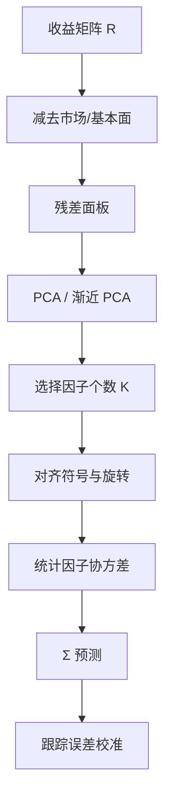

# 统计风险模型 PCA

不给因子起名字，只让收益自己说出共同方向：主成分能更快跟上相关结构的破裂，也更容易在每个窗口里换一套无法解释的坐标。

<footer>—— Connor–Korajczyk 与 Bai–Ng 之后的统计因子风险模型</footer>

[上一课](/quant/fundamental-risk-model)用可观测载荷加低维因子协方差与特异方差逼近 $\Sigma$，载荷须期初可观测，因子收益由截面回归拆出。缺口是真实共同冲击不必长得像账面市值比：拥挤、流动性枯竭、监管事件可以在几天内制造新的高方差方向，而这条方向在财报描述子里还不存在。统计风险模型用 PCA（常在基本面残差上）捕捉未命名的共同运动。本课写 Connor–Korajczyk、Bai–Ng 与实务里把 $K$ 当风险预算参数。不重写 Barra 的 $X$ 定义。后课拥挤默认已经知道残差 PCA 抓的是哪一层。

## 问题

真实的共同冲击不必长得像「账面市值比」。量化拥挤、流动性枯竭、监管事件、指数再平衡，都可以在几天内制造一条新的高方差方向，而这条方向在财报描述子里还不存在。基本面 $X$ 若漏掉它，预测 $\Sigma$ 会系统性低估组合在该方向上的风险。统计 PCA 的承诺是：只要这条方向已经出现在近期收益里，最大特征值对应的特征向量就会把它吸收进来。

代价是识别性。特征向量在符号、顺序、混合上都不稳定：本周的「第二主成分」可能是上周的第三与第四的旋转。Chamberlain 与 Rothschild 的近似因子结构允许特异协方差有界非对角，但并不给因子经济名字。用于归因时，你只能说「统计因子 3 贡献了 40 个基点」，无法对投委会解释。

### 高维下的主成分

设 $T$ 期、$N$ 只股票的收益矩阵为 $R$。当 $N$ 与 $T$ 同阶，样本协方差的特征值被高维噪声撑开，Ledoit–Wolf 等收缩、随机矩阵理论的去噪，都是在修这件事。Connor–Korajczyk 的渐近 PCA 在 $N\to\infty$ 时用 $RR^\top$ 的特征向量估因子（时间维），Bai–Ng（2002）给出 $IC_{p1}$ 一类准则在 $N,T\to\infty$ 时一致地选 $K$。实务上 $K$ 往往不是「真理」，而是风险预算能消化的维数：太少则漏风险，太多则把特异噪声抬成可交易因子。

对原始收益做 PCA，第一主成分几乎总是市场。更常见的做法是先减去市场或基本面因子，再对残差做 PCA，专抓「模型没命名的共同残差」。2007 年量化震荡里，崩的正是这一层。

## 方法

残差统计模型。先用基本面或市场模型得到 $u_t$，对 $u$ 的协方差做 PCA，取前 $K$ 个。组合风险是基本面部分加统计残差部分。这是混合模型的标准形态：名字留给 Barra，补丁留给 PCA。

纯统计模型。直接对收益做 PCA 或因子极大似然。载荷每个再估窗口更新，因子收益是 $r$ 在载荷上的投影。为了让短期波动跟上，可对主成分做 EWMA，或用风险度量里的指数加权 PCA。

因子个数。特征值比、平行分析、Bai–Ng IC、以及「解释方差达到某阈值」都被用过。阈值法最不稳定：波动升高时前几主成分自动变强，$K$ 的经济含义在变。更稳的是固定 $K$，让方差在 $F$ 的对角上起伏，而不是让因子集合每天增减。

### 旋转与符号

即使 $K$ 固定，特征向量仍可乘正交阵。若不加限制，相邻窗口的载荷会对不齐，暴露时间序列会跳。实务用 Procrustes 旋转、符号约定（让市场载荷为正）、或对上一窗口载荷做回归来对齐。这些都是工程，不是识别定理。统计模型适合做风险数字，不适合做跨越多年的风格历史。

把 PCA 因子拿去当 alpha 来交易，等于在交易样本内最大方差方向的反转或动量。那是另一种策略，与「用 PCA 估风险」不是同一许可。

## 机制

近似因子模型假定少数共同因子驱动大部分协方差，特异部分的最大特征值相对 $N$ 不爆炸。PCA 一致性依赖这一稀疏性：若共同结构本身有很多弱因子，前 $K$ 个只是截断，剩余相关会在组合高度分散后仍显现。Bai–Ng 的理论告诉我们能估几个强因子，没有承诺弱因子不重要——对高度中性的量化组合，弱因子恰恰是跟踪误差的来源。

与基本面模型的互补是信息集不同。基本面用公司特性，即使某段时间该特性还没表现为收益共变，载荷也在；PCA 只用已实现共变，对尚未发生的结构性断裂没有前瞻。宏观状态切换时，PCA 反应快，但总是慢一拍——要等足够多的日子把新方向写进协方差。

### 优化器怎么滥用 PCA

统计因子没有经济约束，优化器可以在第 8 个主成分上把暴露加到很大，以换取样本内方差下降。那一维往往是过拟合的行业内部噪声。必须对统计因子暴露做岭惩罚或硬上限，并对特异风险保底。纯最小化 $w^\top \hat\Sigma_{\mathrm{PCA}} w$ 而不约束 $X^\top w$，会得到无法解释、不可交易的组合。

## 边界与工程取舍

样本期。太短则特征向量噪，太长则包含过期相关。EWMA 半衰期是超参，应在预测 TE 校准上选，而不是在样本内似然上选。覆盖。停牌、新股、退市使面板不平衡，PCA 需要插补或配对删除；插补本身会制造假相关。A 股涨跌停让日收益截断，尾部共同运动被压扁，统计因子在板期会低估崩盘相关。

解释性。监管与客户归因几乎总是要求行业与风格。因此统计模型很少单独上场，而是作为基本面残差的补充。若两者给出的 TE 差很远，应检查是否有未建模的拥挤或主题——那往往是该加一个显式因子，而不是盲目增加 $K$。

随机矩阵的 Marchenko–Pastur 边界能告诉你哪些特征值像噪声。它不能告诉你「刚好压在边界上的那一维」明天会不会变成拥挤崩。校准与情景分析仍不可省。

## 小结

- 统计风险模型用 PCA（常在基本面残差上）捕捉未命名的共同运动，补基本面 $X$ 的漏项。
- Connor–Korajczyk 渐近 PCA 与 Bai–Ng 因子个数准则是高维估计的理论骨干；实务中 $K$ 更常被当成风险预算参数。
- 特征向量的符号与旋转不稳定，适合估风险，不适合做长期风格归因。
- 优化器必须限制统计因子暴露，否则会在噪声特征上过拟合。
- 与 Barra 类模型混合使用最常见：慢含义留给基本面，快相关留给 PCA。
- 出处：Connor and Korajczyk, *Performance Measurement with the Arbitrage Pricing Theory*, Journal of Financial Economics, 1986；Bai and Ng, *Determining the Number of Factors in Approximate Factor Models*, Econometrica, 2002；Chamberlain and Rothschild, *Arbitrage, Factor Structure, and Mean-Variance Analysis*, Econometrica, 1983。
