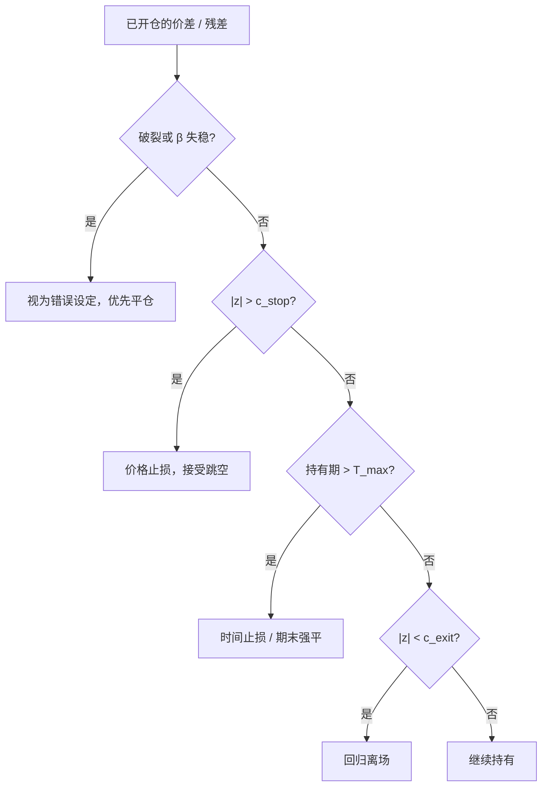

# 止损与时间止损

    
止损规则能否「止住损失」，取决于价格是回归、趋势还是带跳的混合；在随机游走上机械止损往往只是把左尾提前实现，并额外支付一笔交易费用。

    <footer>—— Kaminski & Lo, When Do Stop-Loss Rules Stop Losses?, Journal of Financial Markets, 2014</footer>

统计套利有三种常见离场：价差回到均值（获利了结）、价格止损（残差继续走扩到某倍数）、时间止损（持有期满强制平仓）。GGR 的 6 个月期末强平是时间止损的经典；Avellaneda–Lee 则更常讨论偏离过大时视为模型失效。Kaminski 与 Lo 在一般资产上给出一个干净的分析框架：若收益有动量，止损可能改善；若均值回归，止损可能有害；随机游走上止损主要增加换手。把这一套不加修改地套到配对残差上会出错——残差被假定回归，价格止损与时间止损的含义正好相反于趋势跟随。成本、缺口跳空与拥挤平仓使「止损价」经常不是可成交价。

## 问题

开仓之后，路径有三种结束方式。回归离场：这是策略的假设兑现。价格止损：承认假设错了或错得太久，用一个 $z$ 或亏损百分比切掉。时间止损：无论 $z$ 如何，到期离场，避免把资本锁在慢死亡的价差里。问题是这三种规则在同一条 OU 加跳跃的路径上互相干扰。过紧的价格止损会在 OU 的正常波动里反复止出，把正期望交易切成负期望的往返；过松则在破裂里变成「没有止损」。时间止损会在价差最宽、流动性最差的日历日强制成交，冲击最大。

Kaminski–Lo 的核心不是推荐某一个百分比，而是：止损是一个非线性滤波器，其期望取决于数据生成过程。统计套利文档必须声明自己假设的 DGP，再选规则。若你相信残差是 OU，价格止损在纯扩散上通常降低期望；你仍然可能要它，因为真实 DGP 含体制转换，见[协整破裂](/quant/cointegration-break)。止损此时买的是对模型误设的保险，保费是回归策略的部分期望。

### 时间止损不是免费的风险控制

GGR 在交易期末强平，使样本里每对的最大持有期有上界，便于统计，也避免无限期等待。代价是：未回归的对往往是「错了的对」，强平实现的是选择偏差后的亏损腿，而且许多 vintage 在同一天到期会制造额外的同期冲击。把时间止损从 6 个月改成 10 日，策略从中期相对价值变成短持有反转，成本结构完全不同，不能沿用 RFS 2006 的扣费结果。

盘中止损若用收盘规则去回测，会忽略缺口：隔夜跳空直接穿过止损价，实现损失大于设定。规则应写成「触及或跳过则次日中点离场」，并把跳过的额外损失计入期望。

## 方法

把离场写成优先级明确的状态机。例如：破裂检测（滚动 $\beta$ 失稳或 Gregory–Hansen 型诊断）> 价格止损 $|z|>c_{\mathrm{stop}}$ > 时间止损 $T_{\max}$ > 回归平仓 $|z|<c_{\mathrm{exit}}$。优先级反了会出现「已经破裂仍等回归」。$c_{\mathrm{stop}}$ 应宽于开仓 $c$，否则开仓即接近止损，信号只贡献换手。$T_{\max}$ 应按半衰期标定：若 $\hat\kappa$ 对应半衰期 5 日，$T_{\max}=60$ 日意味着你愿意等十几个半衰期，这对纯 OU 过宽、对含破裂的混合分布可能仍不够——因为破裂不按半衰期工作。

组合层面还要有相关性止损：当许多对同时亏损，说明残差的共同因子回来了，单对止损会在同一天集体触发，变成组合级踩踏。应对是先降总杠杆，再按规则离场，而不是让每一对的止损单去抢已经变薄的账簿。这与 2007 年量化平仓的描述一致：止损与去杠杆同步发生时，价格止损是冲击的来源而不是缓冲。

### 再入场与止损距离

止损后是否允许立刻按同一 $z$ 再开仓，决定规则会不会在震荡里刷单。常见冷却期或要求 $z$ 先回到开仓带内再重新武装。再入场等于把一次破裂切成多次止损，成本倍增。止损距离若按开仓后的最大不利偏移（MAE）校准，必须用样本外：用全样本 MAE 的 95% 分位去设止损，会把最坏路径的信息漏进规则。更干净的是按开仓时的 $\hat\sigma$ 设 $k$ 倍，并在波动翻倍时自动加宽，避免在高压期被正常波动扫出。

获利了结的 $c_{\mathrm{exit}}$ 过近，会切断回归的右尾，使盈亏比恶化，再靠提高胜率在样本内补回来。扣费后，高胜率短盈利往往是负期望。平仓阈值与止损阈值要一起优化，且目标必须是净期望，不是胜率。

## 机制

纯 OU：最优往往是在偏离处开、在均值附近平，中间的价格止损是对正期望路径的截断。带漂移的错误设定（$\mu$ 已经跳到新水平）：价格止损与时间止损都是在截断对错误原点的等待，期望改善。动量残差（拥挤平仓）：止损与众人同步，可能卖在最差的流动性上；此时随机止损时间或降低仓位可能优于固定价格线。Kaminski–Lo 对趋势资产的「止损有时有用」在这里对应的是残差动量化的状态，而不是股票指数本身。

跳空与涨跌停使止损变成期权空头：你以为损失有界，实际交付的是开盘不可成交的缺口。统计套利空腿若遇停牌，止损单无法执行，多腿仍在交易，中性破裂。规则必须包含「单腿无法成交则市价平掉可成交腿并停止开新仓」。这在回测里要用停牌标志，否则历史夏普假设了不存在的流动性。

### 成本如何改变止损的符号

无成本时，某些 DGP 下止损的期望可能接近零（随机游走）。有成本时，止损几乎必然贡献负的实施缺口：它增加换手，且触发时价差更宽。因此「有止损的回测夏普更高」若未用有效价差，多半是在无摩擦世界里截断了左尾、却没付截断的手续费。正确的比较是：同一开仓规则，有无止损都扣[有效价差](/quant/effective-realized-spread)与冲击，再看净期望与最大回撤。回撤改善但净期望下降，说明你买了保险；是否值得取决于委托约束，不是取决于样本内夏普是否更高。

## 边界与工程取舍

不要把趋势跟随的跟踪止损原样搬到配对上。不要用盘后人工「这次不算」去改历史止损。A 股涨跌停让止损价经常不可达，时间止损更现实，但到期日可能仍停牌。指数与 ETF 套利的离场应优先于结算日或申赎窗口，而不是 $z$ 止损；机制收敛有日历，统计回归没有。

文档应报告：止损触发频率、触发时的后续价差路径（止损后是否继续走扩，用于检验规则是否过早）、时间止损日的冲击、以及集体触发日的组合亏损。若止损后价差大多回归，规则在纯 OU 上过紧；若止损后继续走扩，规则在买保险上有效，但仍要扣除触发日流动性成本才能谈净效果。

GGR 的期末强平是研究设计也是风险规则。复制时若改成无限持有直到回归，样本内会留下少数极大亏损对，均值可能仍正，但那是未被时间截断的破裂，不能解释成「改进了原文策略」。

## 小结

- 统计套利离场包括回归平仓、价格止损与时间止损；优先级必须预先写死，破裂检测应高于 $z$ 止损。
- Kaminski–Lo（2014）表明止损的期望依赖 DGP：回归过程上机械止损常有害，趋势上或有益；残差策略默认更接近前者，止损是对破裂的保险而非提高期望的自由午餐。
- GGR 期末强平是时间止损，会在价差最宽时成交；缩短 $T_{\max}$ 会改变策略类别与成本。
- 有交易成本时止损增加换手并常在流动性差时触发；必须用有效价差比较有无止损的净期望与回撤。
- 出处：Kaminski and Lo, *Journal of Financial Markets*, 2014；Gatev, Goetzmann and Rouwenhorst, *RFS*, 2006；结构转换见 Gregory–Hansen, 1996；拥挤平仓见 Khandani and Lo, 2007。
