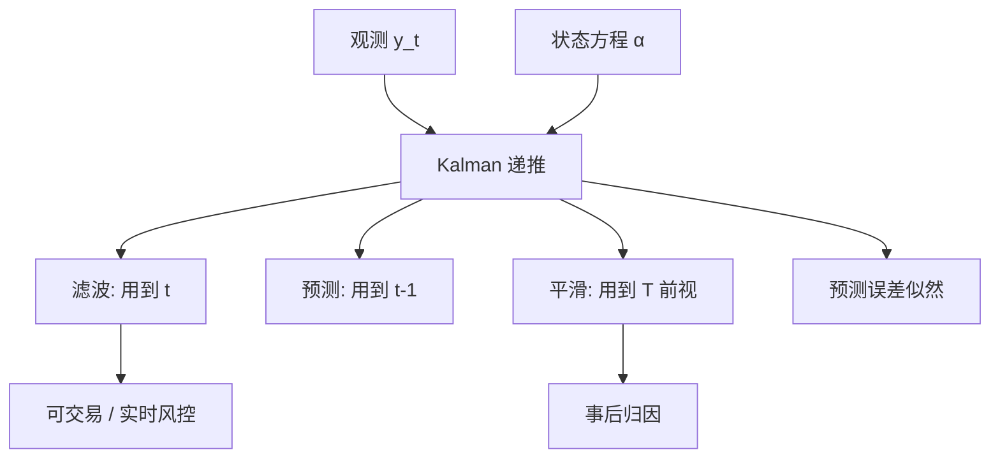

# 状态空间与 Kalman 平滑

把不可观测的状态写成线性递推，把观测写成状态的带噪读数；向前滤波给出实时条件均值，向后平滑给出全样本最优路径。

<footer>—— Kalman, A New Approach to Linear Filtering and Prediction Problems, Journal of Basic Engineering, 1960；教科书见 Harvey, Forecasting, Structural Time Series Models and the Kalman Filter, 1989</footer>

[VAR](/quant/var-irf) 假定所有变量都观测到。[Granger](/quant/granger-causality) 检验的也是观测块。金融里大量对象是潜的：时变 $\beta$、潜波动、趋势与季节、宏观因子。Kalman 滤波在线性高斯状态空间上给出 $E[\alpha_t\mid y_{1:t}]$；平滑器给出 $E[\alpha_t\mid y_{1:T}]$。配对里已经用过 [Kalman 对冲比](/quant/kalman-hedge)；本课把装置收成一般计量：似然、预测误差分解、以及平滑与滤波的对象差别。缺口是：**滤波是实时，平滑会用到未来观测**——回测若用平滑路径当信号，是前视。下一课 Chow 处理参数突变；状态空间可以让状态跳，但先把线性高斯讲清。

## 问题

状态方程 $\alpha_{t+1}=T_t\alpha_t+R_t\eta_t$，观测 $y_t=Z_t\alpha_t+\varepsilon_t$。$\eta,\varepsilon$ 高斯、独立时，Kalman 递推精确。问题是设定 $(T,Z,Q,H)$：哪些当状态、过程噪声对量测噪声的比如何决定「跟多紧」。Harvey 的结构时间序列把趋势、季节、不规则项写成状态；金融把 $\beta_t$ 当随机游走或 AR(1)。

ARMA 有状态空间表示，精确似然就是预测误差分解——这是 [ARMA](/quant/arma) 课提到的 Kalman 用法。本课对象是**潜状态推断**，不只是把 ARMA 算似然。

### 滤波 vs 平滑 vs 预测

- 预测：$E[\alpha_t\mid y_{1:t-1}]$，一步。
- 滤波：$E[\alpha_t\mid y_{1:t}]$，当日收盘后的状态。
- 平滑：$E[\alpha_t\mid y_{1:T}]$，事后修订。

风控限额应用滤波或预测；历史归因用平滑会更稳，但不能当当时可交易信号。报告必须写用的是哪一个。

过程噪声 $Q$ 大，状态跟着残差跑，接近滚动回归；量测噪声 $H$ 大，状态粘，接近全样本常数。两者比是带宽。用样本内似然估 $Q,H$ 会把带宽调到拟合历史，样本外状态可能过抖或过粘。

## 方法

**估计。** 高斯似然由预测误差 $v_t=y_t-Z_ta_{t|t-1}$ 与其方差 $F_t$ 相加。未知参数（$Q$ 的尺度、AR 系数）用数值最大似然。非高斯、随机波动要用粒子或准似然，本课不展开；日频 SV 与 [GARCH](/quant/garch) 的分工仍是：GARCH 的 $\sigma_t$ 可测，SV 的 $\sigma_t$ 要滤波。

**诊断。** 标准化 $v_t/\sqrt{F_t}$ 应近白噪声。若仍有 ACF，状态维不够或 $T_t$ 误设。若平方相关，缺异方差，应让 $H_t$ 随时间变或接到 GARCH 量测。

**多元。** 因子状态空间：$y_t=\Lambda f_t+\varepsilon_t$，$f_t$ 为 AR。这是时变因子模型的滤波写法，与静态 PCA 不同。高维时 $\Lambda$ 要约束或收缩，否则滤波噪声极大。

### 与局部投影、滚动回归

滚动窗口 OLS 是固定窗宽的滤波近似，没有最优增益。Kalman 的增益由 $Q,H$ 与 $P_{t|t-1}$ 决定，窗宽自适应：不确定性大时更跟新息。局部投影是另一对象（IRF）。不要用平滑 $\beta_t$ 路径去做 Granger——平滑引入未来，检验水平坏。

## 机制

预测误差分解：新息 $v_t$ 正交于过去观测，似然因式化。Kalman 增益 $K_t=P_{t|t-1}Z^\top F_t^{-1}$ 把新息写进状态更新，权衡先验不确定与量测噪声。平滑器（Rauch–Tung–Striebel 或 Durbin–Koopman 模拟平滑）再把未来新息回传，修订早先状态——这就是「用了未来」。

线性高斯下条件均值与条件方差公式封闭。一旦跳跃、体制、厚尾，条件均值不是最优，滤波会滞后跳或把跳当成状态噪声。后课跳跃与 Chow 补这些缺口。

Durbin–Koopman 的模拟平滑为非高斯模型提供算法基础。本课工程上：线性高斯用标准滤波；要对冲比路径做置信带，用平滑方差，但交易只用滤波。

### 金融误用

用全样本平滑波动当「当时的条件方差」去做事后 VaR 回测，覆盖率会被美化。用平滑 $\beta$ 做 FM 第二步，生成回归量问题变成「超级前视的 $\beta$」。应滤波或滚动。状态空间不是许可证把未来信息写进 $t$ 时刻的特征。

## 边界与工程取舍

初值 $P_0$ 在短样本影响大，应用扩散先验或把预热段丢掉。缺测（停牌）Kalman 可跳过量测更新，只做预测步——这是合法处理，优于乱插值。非线性（平方根波动）用扩展 Kalman 近似差，应换粒子或专门 SV。

工程：时变对冲与宏观因子滤波用线性高斯 + 样本外验证 $Q$；似然估超参要滚动。不要对 tick 做无噪声修正的状态空间当「有效价格」却忽略微观结构——Hasbrouck 的定价误差 VAR 才是那一对象。不要把平滑路径画在研报里当实时信号。下一课：参数若不是平滑游走而是某一日断掉，滤波会把断点抹成斜坡，需要 Chow。

## 小结

- 线性高斯状态空间上，Kalman 滤波/平滑给出状态的条件均值与方差；似然是预测误差分解。
- 滤波与预测可实时；平滑用未来观测，不能当当时信号。
- $Q$ 与 $H$ 的比是带宽，样本内最大似然会过拟合这条带宽。
- 跳跃、体制、厚尾破坏封闭公式；缺测可跳过量测更新。
- 出处：Kalman, *Journal of Basic Engineering*, 1960；Harvey, 1989；算法表述见 Durbin and Koopman, *Time Series Analysis by State Space Methods*。
