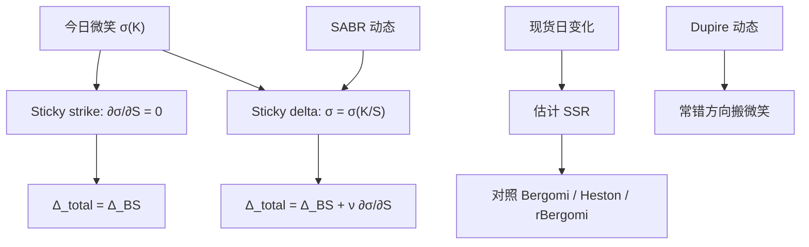

# Sticky delta / sticky strike

    
现货移动时，交易员用两条启发式搬微笑：执行价不动则隐含波动暂不变，或 Delta（货币性）不动则隐含波动暂不变；二者给出不同的对冲比，且一般都不满足无套利动态。

    <footer>—— 粘性比见 Bergomi, Stochastic Volatility Modeling, 2016；SABR 动态与局部波动的冲突见 Hagan et al.；规则作为对冲惯例见市场实践</footer>

[Skew 与微笑](/quant/vol-skew) 写今日切片的形状；[SABR](/quant/sabr) 与 [Dupire](/quant/dupire) 给出两种过程，现货一动未来切片的搬法不同。本篇把交易台的两条经验规则写成明确的偏导：sticky strike 与 sticky delta，以及 Bergomi 的偏斜粘性比（skew stickiness ratio, SSR）。它们是对冲坐标，不是模型。不重复 SABR 展开，不把两因子 Bergomi 核再推一遍，也不把 Heston 五参数当作 sticky 的微积分。

## 问题

记 $\sigma(K,S)$ 为今日把现货 $S$、执行价 $K$ 插入报价曲面得到的 Black 隐含波动（到期固定）。现货从 $S$ 变到 $S+\mathrm{d}S$ 时，同一张期权的 $\sigma$ 怎么变，决定总 Delta：

$$
\Delta_{\mathrm{total}}=\Delta_{\mathrm{BS}}+\nu\frac{\partial\sigma}{\partial S}.
$$

第二项是微笑的跟随。若假设 $\sigma$ 只是 $K$ 的函数、与 $S$ 无关，则 $\partial\sigma/\partial S=0$，这是 **sticky strike**。若假设 $\sigma$ 只是 $K/S$ 或 Delta 的函数，现货上移时整条微笑随远期平移，固定 $K$ 的 $\sigma$ 会变，这是 **sticky delta**（亦称 sticky moneyness）。两条规则对同一偏斜给出相反符号的跟随项：负偏斜下，sticky delta 让下跌时 ATM 波动上升（对冲更像「杠杆」），sticky strike 则让 ATM 波动沿固定 $K$ 的切片读数走，通常跟得少。问题是：市场更接近哪一条、如何用一个数（SSR）度量，以及局部波动与随机波动分别掉进哪一侧。

规则在短时段、小移动上有时够用；大跳、期限结构扭转、翼部流动性枯竭时两者都失败。它们也不是无套利：任意规定 $\sigma(K,S)$ 的动态，可以与 Dupire 密度或与方差曲线鞅条件冲突。

### 偏斜粘性比 SSR

Bergomi 定义（领头、ATM 附近）

$$
\mathrm{SSR}=\frac{\mathrm{d}\sigma_{\mathrm{ATM}}/\mathrm{d}\log S}{\partial\sigma/\partial k},
$$

分母是微笑对对数货币性 $k=\ln(K/F)$ 的偏斜。Sticky strike 对应 SSR $\approx 0$（ATM 波动不随 $S$ 动）；sticky delta 对应 SSR $\approx 1$（ATM 波动的移动恰好等于偏斜所暗示的平移）。市场指数期权的 SSR 常落在 $0.5$–$2$ 一带，随期限变：短端往往更 sticky delta，长端更钝。一因子对数正态方差容易给出错误期限的 SSR；两因子 Bergomi 用快因子打短端粘性、慢因子打长端。Heston 的 SSR 被 $\kappa,\rho$ 锁成特定期限结构，短端常不够粘。

SSR 不是「市场有多有效」。它是对冲假设的一维摘要。把它校准成 1 再声称已做完动态，等于只拟合了 ATM 跟随，没拟合翼部如何搬。

## 方法

**从规则到 Delta。** Sticky strike：用 Black $\Delta(K,\sigma(K))$，Vega 跟随为零。Sticky delta：对 $\sigma=\sigma(K/S)$ 求导，

$$
\frac{\partial\sigma}{\partial S}=-\frac{K}{S^2}\sigma'(K/S),
$$

总 Delta = Black Delta + Vega $\times$ 该项。负偏斜、看跌，$K<S$，$\sigma'$ 的符号使下跌抬高该 $K$ 的隐含波动，多头看跌的总 Delta 更负（更需要买现货对冲）。做市若用错规则，会系统性偏一侧库存。

**从市场估计 SSR。** 用现货移动日的 ATM 隐含波动变化对 $\Delta\log S$ 回归，再用同日偏斜标准化。噪声大，需按期限分桶、剔除事件日或单独报事件日。不要用跨到期混合样本。对照模型：在 Bergomi / Heston / rBergomi 里对 $S$ 做 bump（或看模拟的条件微笑），读出 SSR 期限结构，再与回归值比，而不是只比今日拟合。

**与 SABR、局部波动的定性。** Hagan 指出 SABR 的随机 $\alpha$ 使微笑有随远期平移的成分，对冲更接近 sticky delta；Dupire 局部波动在 $S$ 下跌时往往把未来微笑朝错误方向搬（sticky strike 的一种「错的」加强），障碍因此对模型敏感。LSV 用混合强度在二者之间插值，见 [混合校准](/quant/lsv-hybrid-calib)。

### 规则与无套利动态的裂缝

把 sticky delta 当成真实过程，方差曲线一般不再对每个到期为鞅，日历套利可以在动态里出现。把 sticky strike 当成过程，杠杆效应（下跌抬波动）进不来，与指数现货–波动相关的符号冲突。正确做法是：规则只用于**当日** Delta 的快速近似；账面风险用 Bergomi / LSV / rBergomi 的桶 Vega 与模型 Delta。日内用规则、隔夜用模型，必须在同一张期权上对账一次，否则 PnL 解释会在两种 Delta 之间跳。

## 机制

负偏斜来自「低执行价更贵」。现货下跌后，若微笑粘在货币性上，原来的 ATM 变成虚值看涨一侧，新的 ATM 读到更高的波动——这就是 sticky delta 产生的杠杆。若微笑粘在绝对执行价上，新 ATM 仍读附近的 $K$，波动变化只来自原来切片的斜率，通常较小。市场短期行为更接近前者，因为交易员按 Delta 报、按 $k$ 看图；长期行为被均值回复与方差曲线形状拉回，SSR 下降。粗糙核抬高短端 vol-of-vol，短端 SSR 可以更大，与陡偏斜一致。

对冲误差：用 sticky strike Delta 去对冲一个按 sticky delta 计价的簿，现货趋势日会积累「假的」Gamma / Vega PnL，其实是动态假设不一致，见 [Gamma scalping](/quant/gamma-scalping-pnl)。应先锁规则或模型，再谈频率。

### 外汇与股票指数的惯例差

外汇经纪商按 Delta 报 RR 与蝶式，sticky delta 是默认语言。股票指数按执行价上市，图上却常画对数货币性；做市商内部混用。同一名字在两套系统里 Delta 差几个百分点并不罕见。报告希腊字母必须写：Black、sticky strike、sticky delta，还是 SABR/Bergomi。Vanna–Volga 用 RR 当工具，隐含的是 Delta 坐标上的微笑，与 sticky delta 同一族。

「市场是 sticky delta」是局部回归结论，不是定理。把 SSR 设成 1 再给一年期障碍定价，等于把短端规则外推到长路径，障碍会错。

## 边界与工程取舍

大跳后执行价网格与 Delta 网格都要重贴，两条规则在跳的那一瞬间没有定义——微笑可以整体上移（危机模式）。翼部流动性差时，$\partial\sigma/\partial k$ 估不稳，SSR 分母抖。多到期联动：现货动时短切片与长切片 SSR 不同，单一规则不能管整张面。

不要把 sticky 规则写进无套利插值层：插值管的是今日 $C(K,T)$ 凸性，不管 $\partial\sigma/\partial S$。不要用 Heston 特征函数的解析 Delta 去冒充 sticky delta，除非你验证过该参数下 SSR 碰巧接近 1。不要在 LSV 里把 $L$ 校准到香草、却用 sticky strike 报对冲比——两套动态。

Bergomi 的 SSR 是曲线模型的可观测；Hagan 的评论是 SABR 对冲的动机。二者都不是「证明局部波动不能用」。局部波动对香草拟合仍合法，错的是用它的动态去对冲路径产品。

Sticky delta 的「delta」是 Black Delta 还是带微笑的总 Delta，定义循环。实务用未调整的 Black Delta 或 $K/F$ 当货币性，避免把总 Delta 再喂回规则。

## 小结

- Sticky strike：$\sigma(K)$ 暂不变，总 Delta 等于 Black Delta；sticky delta：$\sigma(K/S)$ 不变，总 Delta 含 Vega 跟随。
- SSR 把 ATM 跟随相对偏斜标准化；0 近 strike，1 近 delta，市场常介于其间且随期限变。
- SABR 动态偏 sticky delta；Dupire 动态常错方向；Bergomi 两因子用于分期限拟合 SSR。
- 规则是日内对冲近似，不是无套利过程；大账应用曲线或 LSV 的模型 Delta 对账。
- 用错规则会把动态误设写成 Gamma scalping PnL。
- 出处：Bergomi, *Stochastic Volatility Modeling*, 2016；Hagan et al., SABR；对照 Dupire 局部波动动态；短端核见 rBergomi。
