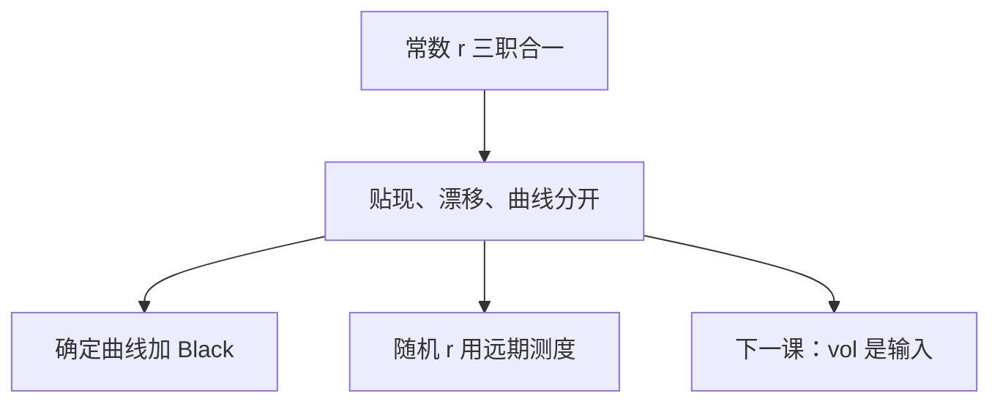

# 利率不是常数

常数 $r$ 让贴现与漂移共用一个数。真实的短期利率是过程，$B_t=\exp(\int r)$ 本身随机；股票公式里的 $r$ 必须裂开成贴现、远期与测度三块。

<footer>—— 据 Vasicek, Journal of Financial Economics, 1977；Heath, Jarrow and Morton, Econometrica, 1992；Brigo and Mercurio, Interest Rate Models 整理</footer>

上一课[远期测度](/quant/forward-measure)已经在随机 $r$ 下把期望写对。缺口是正面承认：本课程主干到目前为止把 $r$ 当常数，是为了先走完 GBM 与 PDE；后面凡是期限、贴现曲线、债券凸性，都不能再共用同一个数。本课只拆开接口，不建立 HJM 或短期利率的完整课序。

## 问题

BSM 里 $r$ 同时扮演：(i) 货币市场增长率；(ii) 风险中性下 $S$ 的漂移；(iii) 把期望提出来的贴现因子。$r$ 一旦是过程 $r_t$，三件事分开：$B$ 的增长是 $\int r$；$S$ 的漂移在 $Q$ 下仍是 $r_t S_t$（无股息）；贴现是随机量 $1/B_T$，一般与 $S_T$ 相关。缺口是停止把「输入一个 $r=3\%$」当成模型完备。收益率曲线给出一整条 $T\mapsto P(0,T)$，单一 $r$ 拟合不了两个到期。

本课不重写 Girsanov。需要的话，用 $Q^T$ 把随机贴现提出去。

### 不是「用到期收益率替换 $r$」就结束

把 BSM 的 $r$ 换成该期权到期的 YTM，对短期限股票期权常常够用，但不是随机利率模型：它仍把贴现当确定数，忽略 $r$ 与 $S$ 的协方差、忽略债券凸性。利率衍生品不能走这条捷径。股票课可以把「确定的贴现曲线」当作第一修正，把随机 $r$ 留给债与混合产品。

短期利率 $r_t$、瞬时远期 $f(t,T)$、贴现 $P(t,T)$ 是同一期限结构的三种坐标。HJM 直接写 $f$ 的漂移限制；Vasicek 写 $r$ 的 SDE。本课只要求认出它们不是同一个常数。

## 方法

接口三条。(1) 观察 $P(0,T)$，定义确定的贴现曲线，股票欧式仍可用 Black，把 $F=S/P(0,T)$（无股息、确定曲线）。(2) 若 $r$ 随机且与 $S$ 相关，价格是 $\mathbb E_Q[H/B_T]$，或 $P(0,T)\mathbb E^{Q^T}[H]$；需指定 $r$ 或 $P(\cdot,T)$ 的 SDE。(3) 债券自身是利率期权的标的，波动来自 $r$，不是来自股票 $\sigma$。后课若只做股票与公司基本面，默认用 (1)；碰到可转债、利率混合再用 (2)(3)。

PDE 侧：状态要为 $(S,r)$ 或 $(S,P(\cdot,T))$ 扩维，生成元加利率坐标的 $\mathcal A_r$。一维 BSM 方程不再封闭。

## 机制

无套利对瞬时远期的漂移施加 HJM 条件：不能任意写 $\mathrm d f$，否则贴现债券相对 $B$ 不是局部鞅。这与股票侧「$\mu$ 被 $Q$ 取消、$\sigma$ 留下」是同一逻辑，只是对象换成整条曲线。Vasicek 的高斯 $r$ 给出债券闭式，但是负利率；CIR 保正但校准更硬。本课不选模型，只指出：写 $\mathrm d r$ 必须同时声明债券如何被定价，否则 $Q$ 未定义。

与股票 $\sigma$ 的关系：$r$ 随机并不自动改变股票的瞬时 $\sigma$，但改变远期 $F=S/P(\cdot,T)$ 的波动，因为 $P$ 自己在动。Black 输入应是远期波动率。

## 边界

本课不推导仿射期限结构，不写互换、上下限、Swaption 公式。不进入货币政策与宏观利率决定——那是金融栏。后课默认：短到期股票欧式可用确定贴现曲线；随机 $r$ 出现时用 $Q^T$，不把单一 $r$ 硬塞进所有 $T$。下一课[波动率是输入不是输出](/quant/vol-as-input)对 $\sigma$ 做同样的「角色拆开」。

## 小结

- 常数 $r$ 把贴现、漂移、曲线压成一个数；随机 $r$ 必须拆开。
- 确定的 $P(0,T)$ 是股票 Black 的第一修正。
- 真随机利率用 $Q^T$ 或扩维 PDE。
- 债券波动来自曲线，不是股票 $\sigma$。
- 出处：Vasicek 1977；Heath–Jarrow–Morton 1992。
