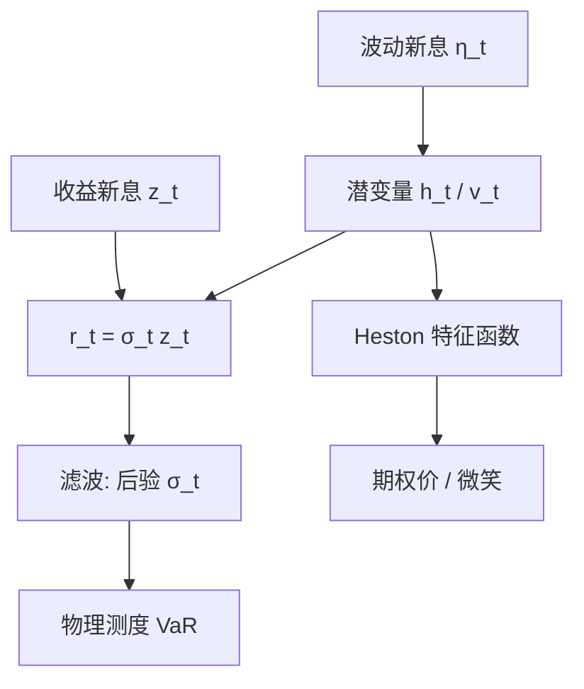

# 随机波动 SV

把收益写成两个随机过程的乘积，方差自己再走一条自回归，波动就不再是过去收益的可测函数，而须从潜过程里滤出来。

<footer>—— Taylor, Financial Returns Modelled by the Product of Two Stochastic Processes, 1982；Heston, A Closed-Form Solution for Options with Stochastic Volatility, Review of Financial Studies 1993</footer>

[上一课](/quant/egarch-gjr)用 EGARCH 与 GJR 拟合新闻冲击曲线，符号偏检验能发现对称 GARCH 抽不干的非对称。缺口是：GARCH 的 $\sigma_t$ 仍由过去残差完全决定。随机波动给方差一个自己的冲击：即使昨日收益平静，今日波动也可以被潜过程抬起。Taylor 的离散 SV 与 Heston 的连续时间平方根方差是两条写法。本课问波动是否有不可由收益平方完全观测的成分，以及这笔额外风险如何进入期权与滤波。不重写 $\gamma$ 的新闻冲击曲线。后课已实现 GARCH 默认已经知道潜方差与可测条件方差的差别。

## 问题

为何要额外的波动冲击？GARCH 一步预测的 $\sigma_t$ 完全可知，期权的条件密度在给定过去收益后没有「波动的波动」这一层随机性。市场里，即使最近收益不大，隐含波动也可以跳——那是信息进入方差，尚未进入收益平方。SV 把这层写成 $\eta_t$ 或 $dW^v$。代价是滤波：你永远只有 $h_t$ 的后验，而不是 GARCH 那种点值。问题是在「可测条件方差」与「潜方差加滤波」之间，哪一个更匹配你的决策：交易日频 VaR，还是给带波动微笑的期权定价。

离散 SV 的 $|\phi|$ 接近 1，对应波动持续；$\mathrm{Var}(\eta)$ 是波动的波动。连续时间 Heston 的 $\kappa$ 是回复速度，$\xi$ 是方差的波动。两组参数可粗略对应，但离散化、杠杆进入方式、以及是否允许 $v=0$，并不相同。

「随机波动」在文献里有时泛指一切时变波动，包括 GARCH。本篇按 Taylor/Heston 的用法：方差方程有自己的新息。GARCH 是确定性条件方差（相对过去收益），SV 是潜过程。

### 日频离散化不是 Heston 的日采样

用 Euler 把 Heston 当成日频 SV 来估，会有离散化偏差：平方根扩散在零附近、杠杆相关、以及一日之内 $v$ 的路径都被压成一步。反过来，把 Taylor SV 的 $\exp(h_t)$ 当成 Heston 的 $v_t$，期权特征函数不能用。对象必须先选：为日收益密度而估离散 SV，还是为欧式期权而校准连续时间仿射模型。混用参数表，是把两种数据生成过程的符号写成同一个 $\sigma$。

## 方法

Taylor 型离散 SV：

$$
r_t=\exp(h_t/2)\,z_t,\qquad h_t=\mu+\phi(h_{t-1}-\mu)+\eta_t,
$$

$z_t$ 与 $\eta_t$ 可以相关（杠杆）。$h_t$ 不可直接观测，似然是高维积分。Jacquier、Polson 与 Rossi 用 MCMC；Kim、Shephard 与 Chib 用混合高斯近似对数 $\chi^2$，把 SV 写成线性状态空间再做准极大似然。工程上这比 GARCH 重一个数量级：没有「插进标准包就出 $\sigma_t$」那么轻。

Heston 连续时间：

$$
dS_t=\mu S_t\,dt+\sqrt{v_t}S_t\,dW^S_t,\qquad
dv_t=\kappa(\theta-v_t)\,dt+\xi\sqrt{v_t}\,dW^v_t,
$$

$\mathrm{Corr}(dW^S,dW^v)=\rho$。$\rho\lt 0$ 是连续时间的杠杆。Feller 条件 $2\kappa\theta\gt \xi^2$ 防止方差碰到零。期权定价用特征函数反演，这是 Heston 相对早期 Hull–White、Scott 模型的工程优势：不必对每张期权都 Monte Carlo。

### 估计对象要写清是收益还是期权面

只用日收益估 SV，识别来自平方的持续与肥尾，对 $\xi$ 与 $\rho$ 的把握弱。只用期权面校准 Heston，得到的是风险中性参数，与物理测度下的 $\kappa,\theta$ 差一截市场风险价格。把风险中性 $\sqrt{\theta}$ 拿去当实现波动的预测，会系统性偏离，差异里有方差风险溢价。联合估计（收益+期权）或用 RV 当 $v_t$ 的代理，才能把物理与风险中性分开。不要用一套 Heston 参数同时报「历史拟合好」和「隐含面拟合好」而不声明测度。

## 机制

乘积过程：收益等于噪声乘以缓慢变动的尺度。尺度的自回归产生波动聚集；尺度的额外冲击产生「波动可以自己跳」的路径，从而使收益的峰度与期权的微笑不再完全由过去 $r^2$ 决定。杠杆 $\rho\lt 0$ 或 $\mathrm{Corr}(z,\eta)\lt 0$ 让价格下跌与方差上升同时发生，生成偏斜的风险中性密度，这是 Heston 能拟合偏度的机制。GARCH 的非对称（EGARCH/GJR）把同一现象写进可测方程，下一步 $\sigma$ 在下跌后确定性地更高；SV 允许下跌当日方差就被相关布朗运动抬起，时点更「同期」。

滤波机制：观测 $r_t$ 只告诉你 $|r_t|$ 大则 $h_t$ 可能大，但仍有 $z_t$ 与 $\eta_t$ 的混淆。RV 出现后，一日之内有大量平方和，$h_t$ 几乎被钉住，SV 与已实现测量模型开始合流。没有 RV 时，SV 的滤波宽度可以很大，一步 VaR 的点预测未必赢 GARCH，赢的是对密度与期权的描述。

Heston 的平方根扩散让特征函数仿射，这是定价机制，不是「波动在零附近的真实行为」。$\xi$ 大时 Feller 条件常被违反，模拟要处理 $v$ 的反射或吸收。校准出违反 Feller 的参数很常见，应报告，并检查短到期微笑是否靠这一违规去拟合。

### 与体制切换的分工

Hamilton 体制是离散、持续数周到数年的状态；SV 是连续、每日都有小冲击的方差。危机既可以是 SV 的一次大 $\eta$，也可以是体制跳到高 $\theta$。短样本里两者可互换拟合。配置上，体制切换改的是均值与相关的分段；SV 改的是路径上的波动风险。需要熊市相关升高时，只校准单资产 Heston 不够，要多元 SV 或体制。需要期权微笑时，只做两体制高斯混合往往不够光滑。

## 边界与工程取舍

离散 SV 估计重、初值敏感、杠杆识别弱，日频风控默认仍是 GARCH/GJR。Heston 校准快，但参数不稳定、期限结构用单因子 $v_t$ 往往不够（短端与长端不能同时好），实务常加跳跃（Bates）或第二方差因子。不要用 Heston 的 $\theta$ 去替代 HAR 对 RV 的预测而不做测度转换。不要在 tick 上估离散 SV——噪声会把 $h_t$ 的短记忆当成波动冲击，应先核估计 IV，再对日频 $h_t$ 建模。

计算：MCMC 适合研究与参数不确定性；生产滤波可用粒子滤波或 Kim–Shephard–Chib 的混合。期权账簿用特征函数反演时，注意积分截断与虚数偏移。工程默认可以是：历史波动与 VaR 用 GARCH 或 HAR；微笑与对冲用 Heston 或局部波动；有 RV 则让测量方程说话，潜过程只保留测量没覆盖的那一层。

Taylor 的乘积模型原本也用于周频、月频收益。样本越稀疏，$\phi$ 越难与 $\mathrm{Var}(\eta)$ 分开。月频 SV 看起来「持续极高」，可能只是采样把短波动平均掉了。频率与参数不可分，报告必须写清采样。

## 小结

- Taylor 的离散 SV 让对数方差走带新息的自回归；Heston 的连续时间平方根方差给出期权特征函数。
- 与 GARCH 的核心差别是：方差不是过去收益的可测函数，必须滤波；一步点预测因此不一定更准，密度与期权更自然。
- 杠杆来自收益新息与波动新息的相关，能生成风险中性偏度；须声明物理测度还是风险中性校准。
- 有 RV 时潜波动被钉住，SV 与已实现测量模型合流；无 RV 时日频风控仍常以 GARCH 为工作马。
- 单因子 Heston 难以同时拟合短长期限微笑；Feller 条件在校准中常被违反，需要报告。
- 出处：Taylor, *Financial Returns Modelled by the Product of Two Stochastic Processes*, 1982，及 *Modelling Financial Time Series*, 1986；Heston, *A Closed-Form Solution for Options with Stochastic Volatility…*, Review of Financial Studies, 1993。
