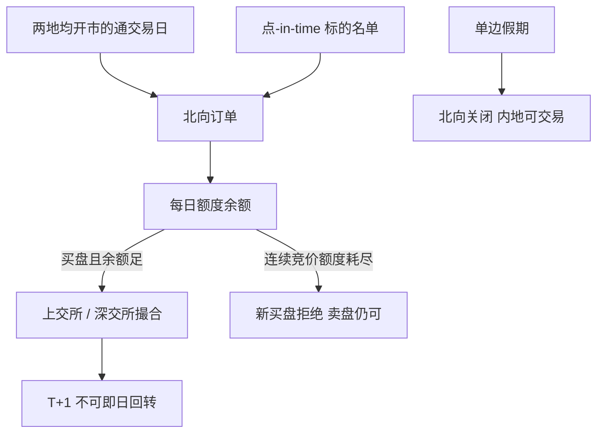

# 北向资金与沪深港通

北向交易跟随上交所与深交所的交易时间，并受每日额度限制；额度每日更新，未使用部分不结转。通股票不允许回转交易。

<footer>—— 香港交易所《沪深港通投资者资料册》及沪/深港通业务实施办法的公开安排</footer>

沪港通于 2014 年 11 月 17 日开通，深港通于 2016 年 12 月 5 日开通，使香港及海外投资者经联交所通道买卖规定范围内的上交所、深交所证券（北向），内地投资者经沪深交易所通道买卖规定范围内的联交所证券（南向）。总额度已取消（沪港通总额度于 2016 年 8 月 16 日取消），每日额度保留：北向每个市场人民币 520 亿元，南向每个市场人民币 420 亿元，股票与符合条件的 ETF 共享额度。标的、日历、额度、前端持仓检查与名义持有人结构，把「A 股」拆成两个可交易子集：境内账户与北向账户。本篇写公开机制如何进入资金流与价格，不讨论规避额度或持股比例限制的安排。北向投资者同样遵守 A 股 [T+1](/quant/cn-tplus1)、[涨跌停与集合竞价](/quant/cn-limit-auction)。

## 问题

把北向成交额当成「外资观点」有三层混淆。第一，北向只覆盖标的名单内的证券，不是全部 A 股；名单定期与临时调整，创业板等还受投资者适当性影响。第二，每日额度限制净买入：余额 $=$ 每日额度 $-$ 买盘订单 $+$ 卖盘成交 $+$ 微调；连续竞价或收盘集合竞价阶段额度用尽后，新买盘被拒绝，卖盘仍可进行，下一交易日才恢复买盘（开盘集合竞价阶段额度因撤单可能回正并再接受买盘）。第三，公布的北向资金是通道流量，含配置、对冲、套利与中转，不是单一宏观投资者的订单簿。问题是把北向写成带额度、日历与标的约束的订单流，而不是写成无约束的「聪明钱」因子。

交易日历要求内地与香港均开市（北向还涉及香港银行交收安排，具体以港交所公布的通交易日历为准）。一边放假则北向关闭，A 股仍可能交易，于是境内投资者与北向投资者的信息集在假日前后分裂。结算上，北向证券与资金交收安排与香港投资者习惯的股票/资金周期不同，资料册要求投资者按内地周期理解：买入后不可即日卖出。把港股 T+2 直觉套到北向，会在前端检查上废单。

### 额度是净买入上限，不是成交上限

卖出成交会把额度「还回去」，因此大额减持可以在额度紧张时仍发生，而新的增持被挡住。额度在买盘申报时即扣减，撤单或废单再调回，开盘集合竞价大量撤单会使余额跳动。策略若用「额度耗尽」当看涨信号，必须区分：耗尽发生在集合竞价试单阶段还是连续竞价真实净买入阶段。资料册写明余额低于 30% 时才高频披露具体数字，否则显示可用；用盘中额度当高频特征，识别集随披露规则变。南向额度对称地约束内地买港股，与北向不是同一个瓶颈。

沪股通与深股通的北向额度分开计算，各 520 亿元。一个市场额度用尽不自动打开另一个市场。标的不在通名单里的股票，北向流量恒为零，不能用全市场北向去解释它的收益。

## 方法

研究北向对价格的影响，先构建点-in-time 标的集合与通交易日历。流量用官方披露的北向成交与持股（交易所与港交所、中华通披露口径），时间戳用公布时点：盘后持股不能当盘中状态。额度状态用港交所披露的余额或「可用」标志。回归或事件研究应加入：当日是否通交易日、额度是否在连续竞价阶段耗尽、该证券是否在名单内、以及 A 股自身的涨跌停与停牌。把全市场北向净买入直接横截面回归到所有股票，对非标的是测量误差。

持股比例方面，境外投资者持有单一 A 股达到一定比例须履行披露，并受外资持股上限（与 QFII、RQFII、战略投资等合计，公开规则为达到 28% 暂停买入、30% 强制卖出等安排，以当时有效规定为准）。北向持仓接近上限时，增量需求被制度截断，价格影响从「继续买」变成「只能卖或等待」。方法是把距离上限的余量当作该票北向需求的硬顶，而不是把历史弹性外推。

### 名义持有与前端检查

北向证券由香港结算作为名义持有人，投资者权益通过结算链持有。卖出须通过前端检查确认可卖数量，禁止即日回转。这对执行的含义与境内 T+1 同类：库存状态要分可卖与当日新买。订单类型、涨跌停、集合竞价时段跟随上交所或深交所，联交所在内地开市前有输入时段，但内地主机未开时取消不一定立刻返还额度。模拟北向执行必须用通交易日历与额度引擎，不能只用 A 股日历。南向则跟随联交所时间、港股交易规则与南向额度，是另一套 $P$。

## 机制

北向订单流进入 A 股价格，仍通过交易所的集合竞价与连续竞价，没有单独的「外资价格」。有约束时，机制变成：标的内股票多一条需求曲线，额度用尽则该曲线的买盘被截断，卖盘仍在。假日错位时，境外信息在香港交易、内地不通过北向写入，次一通交易日的开盘集合竞价承担补记。这会造成通交易日开盘的额外发现，与境内隔夜不是同一信息集。配置型资金按指数权重在标的内交易，冲击集中在权重股与调入调出日；用北向总额去解释小盘非标的，是把通道当成了全市场因子。

额度耗尽的价格含义取决于当时是净买入压力还是试单。集合竞价阶段因撤单导致余额回正，并不等于需求消失。连续竞价阶段买盘被拒，增量买盘只能等到次日，当日价格由境内与北向卖盘、以及仍可买的另一方市场（沪或深）决定。把「额度用尽」一律解读为看涨，忽略了截断本身会阻止边际买方进入。

北向持股披露有滞后与汇总层级。用披露增量当聪明钱因子，先处理公布延迟，否则是用公开信息的旧值去「预测」已经发生的收益，见[未来函数](/quant/no-future-function)。

### 与境内账户不可加总为同一策略

同一标的上，境内投资者与北向投资者的税费、额度、日历、适当性不同，不能把两边的回测加总成一个无约束组合。套利受通标的、假期与额度限制，不是无风险平价。A 股涨跌停在北向同样有效；额度与涨停同时出现时，买方可能既付不到涨停价上的量，也被额度拒绝。执行清单要把通状态与 A 股会话状态做成与冲击同级的字段。

## 边界与工程取舍

额度、标的纳入标准（含股票 ETF）、投资者识别码与披露频率均以两地交易所现行实施办法及港交所资料册为准，历史上有过扩容与调整。南向内地投资者适当性、港股通标的与汇率交收另文处理。不要用「北向连续 N 日净买入」当无成本信号而不扣其换手与额度截断。不要把通道流量等同于最终受益人国籍。不要设计拆单规避额度或持股上限的方案；公开研究只把额度与上限当作可观测约束。

日历以港交所公布的通交易日为准，不要用内地日历减香港公众假期的简单差集自行发明——银行交收日会造成额外关闭。ETF 纳入后，北向流量在成分股与 ETF 之间可替代，解释个股北向时要考虑 ETF 申赎与通买 ETF 的分流。

实时行情里的「北向成交」口径因供应商而异：有的是成交，有的是申报。特征字典必须写明字段是成交还是订单，以及是否含撤单前的买盘扣减。

## 小结

- 沪深港通北向是带每日额度、标的名单与通交易日历的通道，不是无约束外资账户。
- 北向每个市场每日额度 520 亿元人民币，未使用不结转；卖出可回补额度，买盘在额度耗尽时被拒。
- 通股票不可即日回转，前端检查卖出前须有券；交易时段与涨跌停跟随内地交易所。
- 假日错位使北向与境内信息集分裂，下一通交易日开盘承担补记。
- 流量研究必须点-in-time 标的化，并处理披露时滞与持股上限。
- 出处：港交所《沪深港通投资者资料册》与 FAQ；《上海证券交易所沪港通业务实施办法》《深圳证券交易所深港通业务实施办法》；两地交易所关于额度调整的公告。
