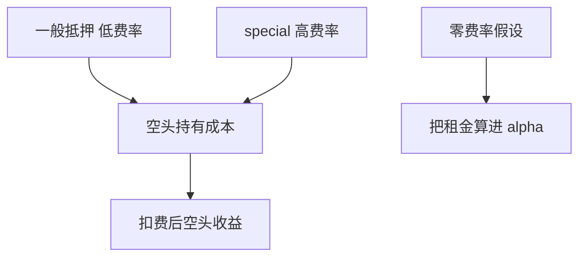

# 借券费率

能借到只解决资格；费率决定空头的持有成本。用零借券费回测硬空头，等于把稀缺证券的租金算进 alpha。

<footer>—— 据 D'Avolio, 2002；Cohen, Diether and Malloy, Journal of Finance, 2007 整理</footer>

上一课[融资融券机制](/quant/margin-securities-lending)给出可借集合与召回。本课把资格换成价格：借券费率（loan fee / rebate 的另一面）。资金成本课会把各项摩擦收成 alpha 底；本课只把空头特有的券息钉死。不重写可借名单。

## 问题

一般抵押券（GC）借券费接近零或甚至有 rebate；热门券（special）费率可以高到年化数十个百分点，并按日重置。Cohen–Diether–Malloy 把借券费与未来回报联系起来：贵的空头往往随后下跌，但扣除费用后可实施利润变薄。缺口是回测的空头腿必须乘上**当时费率**，费率本身也要 PIT：用后来才变得 special 的费率回填过去，或用样本均值费率，都会错。

零费率假设对大盘股大致无害，对质量空头、小市值、新股、并购目标有害——恰好是异象空头最爱待的地方。

### 借券费不是融券利息那么一个数

融资利率是借钱的价格；借券费是借券的价格。空头同时可能付融资相关成本与借券费，取决于账户如何记账。把两笔合成一个「融券日利率」可以，但来源要拆得开，否则后课回购与资金底会重复扣或漏扣。Rebate 下降就是借券变贵，符号要与费用支出一致。

费率数据本身稀缺、且 vendor 常有延迟。用公开的 indicative fee 当成交费率，会偏乐观：真正借到热门券的成交价往往更差。

## 方法

每日对每条空头持仓计入当时借券费，可用日期取费率发布日或库存报价日，不得用期末 special 状态回填。无费率数据时，至少按可借性分档给惩罚（GC / 中等 / special），并做敏感性，而不是当零。召回日除了缺口价，还要停计此后未持有期间的费——不要在回补后仍扣费，也不要在未能开仓的日子「节省」了从未付出的费还当收益。

多头融资利率下一课回购与再后课资金底再收；本课不要把 GC 融资利率写进借券费。

无费率时分档惩罚，默认档不得为零。indicative 偏乐观，扣完若 alpha 已没，实盘更不会剩。召回后停计费；未开成的空头不是「低成本优势」。

## 机制

借券费是出借人的租金，补偿借出期间不能卖出或投票、以及对手方风险。供给紧时费率跳升，同时上一课的召回更频繁：成本与强制回补正相关。于是纸面 PEAD 空头、应计空头在拥挤期看起来最赚钱，实盘却在付 special 费或根本开不出仓。这是资金约束修正因子收益的标准通道，不是「市场无效消失」的哲学结论——先把费扣掉，再谈剩余。

后课做空规则（报升）限制的是成交方式；本课限制的是持有成本。两者都让空头纸面收益偏高，机制不同。

每日空头市值乘当时 indicative 或成交费率，计入账单。无数据时按 GC / 中等 / special 分档给惩罚，并报告区间，默认档不得为零。费率 as-of 取报价日，禁止用个券历史最高费率或样本均值替代危机周。召回后停计费；未开成的空头不得因为「没付费」而在相对比较里显得更优——那是没有暴露，不是低成本。

## 边界

不估计借券市场的结构模型，不把证券借贷做成权益互换定价全文。下一课[回购与抵押品](/quant/repo-collateral)转向现金融资与 haircut。后课默认：空头损益含 PIT 借券费；零费率只允许作为大盘 GC 的对照，不能当默认。

后课回购谈的是借钱的折扣；本课是借券的租金。两笔都进资金底，但来源分开，避免重复扣。indicative 费率偏乐观这一点要写进局限：真实 special 成交往往更贵，因此扣 indicative 之后若 alpha 已消失，实盘更不会剩。

后课默认空头损益含 PIT 借券费；零费率只允许作为大盘 GC 对照，不能当空头腿的默认。

费率按日重置，持有期越长越不能用开仓日费率冻住。special 状态可以在一周内出现和消失，PIT 费率序列应与可借名单一起更新，而不是按月均值摊到每一个持有日。

## 小结

- 可借是资格，费率是空头租金。
- special 费率按日变，必须 PIT，禁止终局回填。
- 零费率把稀缺租金记进 alpha，偏差集中在异象空头。
- 费率与召回正相关，拥挤期纸面收益最不可实施。
- 融资利率不要与借券费混成一笔糊涂账。
- 出处：D'Avolio (2002)；Cohen, Diether and Malloy (2007)。
