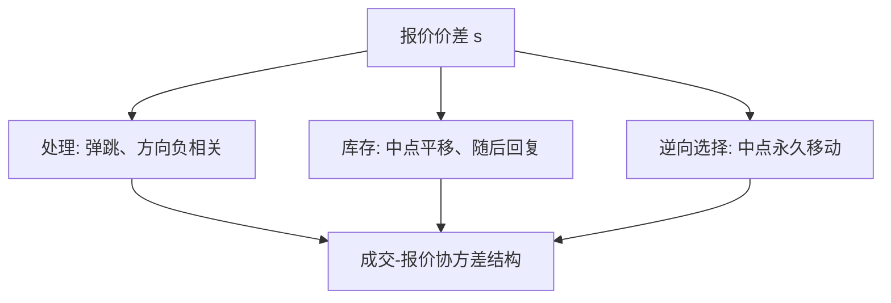

# Stoll 价差三成分

报价价差里至少有三笔账：处理指令的经营成本、持有存货的风险，以及与知情对手成交的期望损失。同一张买卖价差，分解之前不能拿去当某一种理论的充分统计量。

<footer>—— Stoll, Inferring the Components of the Bid-Ask Spread: Theory and Empirical Tests, Journal of Finance, 1989</footer>

[Amihud–Mendelson](/quant/amihud-mendelson)把价差当作一种交易成本去定价。缺口是：这个 $s$ 并不是单一成本。主干[价差分解](/quant/spread-decomposition)已在限价簿会计上列出三项；本课补 Stoll（1989）的**可估计结构**：用成交后报价的调整方向，把处理成本、库存、逆向选择从协方差里分开。Huang 与 Stoll（1997）给出更一般的成交指示回归。不在这里重画 BBO 几何。

## 问题

处理成本是每笔一块、对后续价值无影响：成交后中点不必朝成交方向跳，下一次反向成交会把价差赚回来（Roll 弹跳）。库存成本要求报价朝减库存方向平移，中点移动但是暂时的，等库存回去会反向。逆向选择要求成交后**有效价值**朝成交方向永久移动，流动性提供者的事后收入小于事前价差。三种机制对「成交后中点怎么走、下一笔方向与这一笔的相关」给出不同符号结构。问题是写出可检验的协方差，而不是再列一次三项名单。

若把整个 $s$ 送进 Amihud–Mendelson 回归，等于假设投资者在乎的是三项之和。资产定价若只补偿逆向选择，处理成本部分不应有溢价；经验上必须先分解。

### 成交指示与报价修订

记 $Q_t=\pm 1$ 为成交方向。Stoll 看成交后买卖报价如何相对成交价放置，以及相邻成交方向的相关。处理成本主导时，成交价在报价内侧弹跳，方向负相关强。库存主导时，报价整体平移，出现持续的方向不平衡直到库存调整完。信息主导时，成交后中点不回到原处，实现价差小于有效价差。

Glosten–Harris、George–Kaul–Nimalendran、Huang–Stoll 是同一识别问题的不同回归。本课以 Stoll（1989）为机制入口，1997 年一般式作为估计时的默认参照，不把每篇公式重推。

## 方法

Huang–Stoll 型成交指示模型把中点变化写成

$$
\Delta m_t = (\alpha+\beta) \frac{s}{2} Q_{t-1} + \cdots
$$

一类形式：$\alpha$ 捕获逆向选择（永久），$\beta$ 捕获库存（暂时但序列相关），剩余报价价差归处理成本。识别靠：$Q$ 的自相关、报价修订是否在成交后立即发生、以及随后是否部分回复。有效价差、实现价差的差是信息成分的粗会计，与结构参数应同方向，但会计不含库存的缓慢调整。

估计必须声明方向规则（Lee–Ready 等）、报价是否含深度、是否同步成交。离散 tick 会把处理成本抬高，因为弹跳被栅格放大。

### 三项不是正交的政策旋钮

做市商可以同时加宽价差应对信息、平移中点应对库存。回归里的正交化是线性近似。公告时段信息成分升、库存成分未必降；开盘库存与隔夜信息同时大。分解是把方差拆开，不是证明世界由三个独立开关组成。

## 机制

每一笔成交改写两样东西：现金与信念或库存。处理成本只改现金，价格过程应在 bid/ask 之间弹。库存改做市商的风险状态，价格过程有暂时漂移。信息改公共期望，价格过程有永久漂移。Stoll 的贡献是把这三种漂移写成可估计的协方差，而不是三种故事。经验上美股电子化之后处理成本下降、信息成分占比上升，并不意味着库存消失——库存转移到许多限价挂单者的加总头寸上，个体 $I$ 更难观测。

与 Kyle 对照：$\lambda$ 是订单流的永久冲击，接近信息成分，不是 $s$ 本身。与 Ho–Stoll 对照：库存项应对应中点偏度，而不是价差宽度的全部。

## 边界

线性、常系数、单一做市商隐含结构，在限价簿上只是近似。隐藏单、多市场、零售内化会让「成交方向」不再对应同一张簿的逆向选择。分解窗口若含公告，信息项被放大。Stoll（1989）用的是专家市场样本，系数不能当今日 HFT 做市的校准。

实现价差为负并不自动等于「做市商被知情者收割」：手续费返佣、库存短暂收益、中点度量误差都可以把它打负。要对照后续较长地平线的永久冲击。

## 小结

- Stoll（1989）与 Huang–Stoll（1997）用成交后报价行为把价差拆成处理、库存、逆向选择。
- 三项对方向自相关与中点永久/暂时移动的含义不同；整段 $s$ 不能直接当资产定价里的单一成本。
- 有效价差减实现价差是信息成分的会计近似，不是结构估计。
- 与 Kyle 的 $\lambda$、Ho–Stoll 的偏度是同一组现象的不同切片。
- 出处：Stoll, *Journal of Finance*, 1989；Huang and Stoll, *Review of Financial Studies*, 1997。
