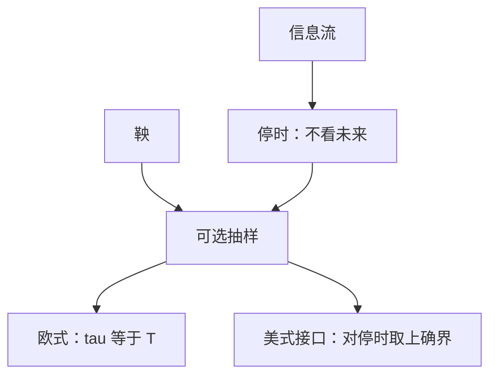

# 停时与可选抽样

停时是不偷看未来的随机时刻。可选抽样说：在可积条件下，鞅在停时处仍然公平，$\mathbb E[M_{\tau\wedge t}]=M_0$。

<footer>—— 据 Karatzas and Shreve, 1991, 第 1 章；Shreve, Stochastic Calculus for Finance I, 2004, 第 4 章整理</footer>

上一课[鞅与局部鞅](/quant/martingale-local)给出走平的过程。缺口是：行权、触碰障碍、局部化，用的都不是固定时刻 $t$，而是随机时钟 $\tau$。若 $\tau$ 能根据尚未发生的增量来选，公平游戏可以被赌徒策略破坏。本课只定义停时，并给出可选抽样的可用形式；美式最优停的全部理论只留接口，不在这里展开。

## 问题

确定性时刻当然适应。随机时刻要满足 $\{\tau\le t\}\in\mathcal F_t$：到 $t$ 为止已经知道「停了没有」。这就是停时。缺口不是再定义一次鞅，而是证明——在有界停时、或一致可积、或非负上鞅的条件下——$\mathbb E[M_\tau]=\mathbb E[M_0]$（上鞅则 $\le$）。没有这条，障碍期权的触碰时刻、美式的行权时刻都不能放进期望。

无界停时可以让正鞅在无穷远处漏质量。可选抽样不是无条件的口号，是一组可核验的条件。

### 停时不是「看到最大值再停」

「等布朗达到未来的最大值再卖」用了整条路径，不是停时。合法的是：触及已设定的障碍、或根据到现在为止的信息解出的行权规则。后课美式期权的最优停，搜索的是停时类上的上确界，不是任意随机时刻类。

首次击中 $a$ 的时刻 $\tau_a=\inf\{t:W_t=a\}$ 是停时。反射原理与其分布后课若用到障碍，会直接调用，本课只确认它合法。

## 方法

$\tau:\Omega\to[0,\infty]$ 为停时，若对每个 $t$，$\{\tau\le t\}\in\mathcal F_t$。$\tau\wedge t$、$\tau\wedge\sigma$ 仍是停时。停时 $\sigma\le\tau$ 时，在 UI 鞅上 $\mathbb E[M_\tau\mid\mathcal F_\sigma]=M_\sigma$。有界停时对全体鞅成立；非负上鞅有 $\mathbb E[M_\tau]\le\mathbb E[M_0]$。局部化序列本身就是停时，用来把局部鞅变成真鞅。

定价接口：欧式支付在固定 $T$ 取期望；障碍与美式把 $T$ 换成 $\tau\wedge T$。本课把 $\tau$ 放进记号，最优选择交给[美式提前行权与最优停](/quant/american-optimal-stop)。局部化序列 $\tau_n$ 本身也是停时：伊藤积分先在 $\tau_n$ 上变成真鞅，再让 $n\to\infty$，这是[鞅与局部鞅](/quant/martingale-local)里「升级」的操作型含义。

## 机制

「不看未来」挡住了根据 $\mathrm d W$ 的符号再决定是否停。鞅增量与已停/未停的示性独立，期望才能继续走平。有界性或 UI 防止质量逃到无穷：双倍下注直到翻本在无界时间上可以制造严格优势，对应的停时不可积，可选抽样的前提坏掉——这不是反例，是条件被违反。定价里把到期截断成 $\tau\wedge T$，有界条件自动满足，欧式、障碍、美式都落在这条安全区内。

连续路径上，开集的首中时是停时（对右连左极过程需对过滤的通常条件）。后课写障碍，默认首中时可用。离散时间更简单：$\tau$ 由到 $n$ 的信息决定即可。

## 边界

本课不证 Doob 可选抽样的全部形式，不引入预示过程与随机积分的可料性细节。美式的 Snell 包络、自由边界不在这里。后课默认：合法的随机时刻都是停时；有界或 UI 时鞅在停时处仍公平。到期截断 $\tau\wedge T$ 始终可用。下一课离开时间，进入测度：[Radon–Nikodym 导数](/quant/radon-nikodym)。

## 小结

- 停时：$\{\tau\le t\}$ 在 $\mathcal F_t$ 里，不偷看未来。
- 可选抽样：有界或 UI 时，鞅在停时仍公平。
- 「看到未来再停」不是停时；美式只在停时类上优化。
- 局部化、障碍、行权共用这一接口。
- 出处：Karatzas–Shreve 第 1 章；Shreve SDE I 第 4 章。
