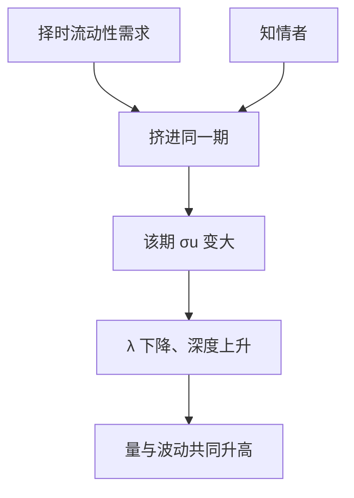

# 策略交易者与噪声交易者

若流动性交易者也能选择何时来，他们会避开被知情者收割的时段，或挤进同一时段互相掩护。噪声不再是外生的 $\sigma_u$，深度和日内形态一起被决定。

<footer>—— Admati and Pfleiderer, A Theory of Intraday Patterns: Volume and Price Variability, Review of Financial Studies, 1988</footer>

[方差比](/quant/price-efficiency-measures)把暂时成分当成收益的残差。缺口是：制造残差的「噪声交易者」若会优化，残差就不是残差。Kyle 把 $u$ 当外生；Admati 与 Pfleiderer（1988）让非知情者选择在哪一期集中交易，Black（1986）把噪声本身写成市场存在的条件。本课补策略性流动性交易，不重推单期 $\lambda$。

## 问题

外生噪声保证知情者有掩护、做市商有对手。一旦非知情者可以选择时点，他们有动机：(i) 避开信息不对称严重的期，以免被收割；(ii) 与其他非知情者挤在同一期，用厚度降低 $\lambda$。知情者预见到聚集，也会选择在厚的时段释放信息。均衡可以出现内生的「热闹期」：成交量大、波动大、但单位流量的冲击未必更大。问题是：日内成交量与波动的共同高峰，能否在没有外生时钟新闻的情况下被这种聚集产生。

Black 的要点更先验：若没有把价格推离价值的噪声，知情者无法隐蔽，市场关闭。策略噪声是把这句话变成博弈。

### 谁在优化、目标是什么

Admati–Pfleiderer 区分必须交易的流动性交易者（discretionary 在日内择时，non-discretionary 不能等）与知情者。择时者最小化被收割的成本，等价于寻找深度最大的期。做市商仍零利润定价。这与 Grossman–Miller 的「是否在场」不同：这里是客户侧择时，不是做市商进入。

Kyle（1985）的噪声是需求冲击；Kyle（1989）的不完全竞争知情者提交需求函数，对手方仍可以是噪声。策略噪声与策略知情是两个方向，不要合成一个「大家都策略」的模糊模型。

## 方法

把交易日分成若干期，每期一个 Kyle 式批量。择时流动性交易者分配各期的 $u_n$，总流动性需求给定。均衡时他们集中在少数期，使那些期的 $\sigma_u$ 变大，$\lambda$ 变小；知情者的交易强度随 $\sigma_u$ 上升，信息释放也集中。结果：量与价格波动在同一期升高。这是对 U 型日内形态的一条理论，不是唯一条——开收盘还有制度性拍卖与存货。

比较静态：不能择时的流动性交易越多，聚集动机越弱，形态被抹平。知情者人数增加，抢信息租金，热闹期的信息含量上升，择时者的好处下降。

### 噪声交易者不是非理性的同义词

Black 的噪声包括误解与外生需求。Admati–Pfleiderer 的择时者完全理性，只是没有私有信息。经验上把「散户」叫做噪声，必须声明是没有信息还是不会择时。会择时的非知情资金（指数再平衡、到期滚动）恰恰会制造可预测的量峰，那是策略噪声，不是随机 $u$。

## 机制

掩护是公共品。每个择时者希望别人先去制造厚度，自己跟在厚的一期。均衡聚集是协调：一旦某期被预期为厚，所有人的最优是去那里。这与银行挤兑相反的「挤入」。市场设计可以提供协调装置——开收盘竞价、到期日——把策略噪声正规化。连续限价簿上，聚集表现为某些时钟的队列变厚、价差变窄。

对效率度量：热闹期 VR 与冷清期不同。把全日 VR 当效率，会平均掉策略噪声的日内结构。对执行：故意和指数再平衡挤在一起，是在买别人的 $\sigma_u$，这是 Kyle 比较静态的操作版。

## 边界

离散期批量、每期重建线性 Kyle，忽略限价簿上的排队与撤单。真实新闻时钟（宏观公告）是外生聚集，与本模型的内生聚集纠缠。知情者若信息会过期（公告即将公开），他们不能等热闹期，聚集被打破。噪声若其实相关于价值（不是纯流动性），掩护变成额外的逆向选择。

「把单子拆到量最大的时候」并不总是降低冲击：若大家都这么做，该时点的知情密度也可能最高。Admati–Pfleiderer 均衡里量峰同时是信息峰。

## 小结

- 策略性流动性交易者会挤进同一时段互相掩护，内生出量与波动的高峰。
- 噪声在 Kyle 里是外生参数，在 Admati–Pfleiderer 里是博弈对象；Black 说明没有噪声则隐蔽与市场难以维持。
- 量峰可以同时是信息峰，执行上「跟量」不必更安全。
- 出处：Admati and Pfleiderer, *Review of Financial Studies*, 1988；概念见 Black, *Journal of Finance*, 1986；单期掩护见 Kyle, 1985。
