# 策略容量与冲击衰减

    
资产管理规模有一个「刚好」的量：再大，实施缺口就会把边际投资者的净优势吃掉。容量不是市场的属性，是策略、冲击与参与率共同决定的供给曲线。

    <footer>—— Perold and Salomon, The Right Amount of Assets Under Management, Financial Analysts Journal, 1991</footer>

[容量与参与率](/quant/capacity-participation) 给出一条静态曲线：规模 $A$ 上升，净边缘 $\mu_{\mathrm{net}}(A)$ 下降，过零点叫容量。本篇把时间加进去。冲击不是瞬时扣完的税，而是会衰减的路径：临时冲击按核函数退回，永久冲击留下新的公平价格。衰减快，同一笔 $q$ 对后续信号的伤害小，容量可以随持有期拉长而回升；衰减慢或根本不衰减，你自己的交易就是在改写 alpha。McLean 与 Pontiff（2016）记录的发表后可预测性下降，以及 Hou、Xue、Zhang 复制异常时经济幅度变小，都可以读成「容量被冲击与套利资本共同消耗」——不是因子公式写错了，是冲击没有在你假设的速度上消失。

## 问题

设无摩擦边缘为 $\mu_0$，下单量 $q$ 产生价格路径 $I(t)=\int G(t-s)\,dq_s$。$G$ 是[传播核](/quant/bouchaud-propagator)：$G$ 衰减快，临时冲击占主导，交易结束后中点部分回归；$G$ 接近常数，接近[永久冲击](/quant/temp-perm-impact)，公平价格被改写。容量问题因此有两轴：横轴是 $A$ 或参与率 $p=q/V$，纵轴是「冲击还剩多少」的时间。只报一个「容量 20 亿美元」，等于把 $G$ 冻在某一个持有期上。

第二层是别人的 $q$。发表、产品化、因子 ETF 化之后，同类资本把有效 $q$ 从你自己的规模换成 $A+A_{\mathrm{other}}$。McLean–Pontiff 把 97 个截面预测变量的多空收益拆成样本外下降 26%、发表后下降 58%，其中约 32 个百分点被解释为「发表知情交易」。那 32% 就是冲击与拥挤在样本路径上留下的容量消耗。Hou–Xue–Zhang 用 NYSE 分位与市值加权复制 452 个异常：交易摩擦类几乎全军覆没，活下来的异常经济幅度也远小于原文——微盘上等权组合的「容量」在可交易加权下不存在。

### 衰减核决定容量是存量还是流量

平方根冲击 $g\sim\sigma\sqrt{q/V}$ 描述的是完成一笔交易时的瞬时成本，没有说这笔交易对明天信号的污染。若 $G$ 在数分钟内衰减到接近零，日频再平衡几乎只付临时冲击，容量由当日深度与[参与率封顶](/quant/participation-cap)决定。若 $G$ 按 $t^{-\gamma}$ 慢衰减（Bouchaud 一类传播核常见），昨天的买入仍抬着今天的价格，信号看起来还在，其实是自己的库存。Huberman–Stanzl 要求永久冲击对量近似线性，否则存在动态套利；Gatheral 对冲击函数的无套利约束，是容量曲线不能随便选凹凸的原因。把日频回测里的滑点写成常数基点，等于假设 $G$ 在 bar 内已经衰减完毕——对统计套利通常假，对季度再平衡的价值因子近似真。

容量数字必须带持有期。同一动量信号，持有一天与持有一个月面对的是不同的 $G$ 积分。Korajczyk–Sadka 已经表明：动量的可交易利润随规模假设翻转；再加上核的半衰期，翻转点还会再动。

## 方法

先固定执行风格与 $p_{\max}$，再对 $(A,h)$ 做网格：$h$ 是信号持有期。每个格子上，用校准过的 $G$ 把 $q(A)$ 卷积到价格路径，扣掉临时与永久两段，得到 $\mu_{\mathrm{net}}(A,h)$。容量定义为 $\mu_{\mathrm{net}}=0$ 或相对小账户减半的 $A$，必须声明 $h$。核的校准应用自己的成交回报，而不是永远借用论文系数；Frazzini–Israel–Moskowitz 的机构短fall 不能自动授予新渠道。

冲击衰减还要与信号衰减对齐。Grinold 的 $\mathrm{IR}\approx\mathrm{IC}\times\sqrt{B}$ 里，广度来自重下赌注的次数；每次重下都在付尚未衰减完的冲击。[因子衰减与换手](/quant/factor-decay-turnover) 给出 $\mathrm{IC}(h)$ 的期限结构：若 $\mathrm{IC}$ 的半衰期短于 $G$ 的半衰期，加快调仓只是在冲击尾巴上叠加新的 $q$，净 IR 下降。实务上应同时画两条曲线：信号对第 $k$ 日收益的预测力，以及一笔单位冲击在第 $k$ 日还剩多少。容量是这两条曲线的交，而不是 ADV 之和。

发表后样本要单独估一条容量。McLean–Pontiff 的发表后相关上升，意味着 $A_{\mathrm{other}}$ 在增大、$G$ 的有效永久成分在变厚。用发表前样本估 $G$、再把 $A$ 外推到今天，是把别人已经付过的冲击当成还能再付一次。复制手续应采用 Hou–Xue–Zhang 的精神：NYSE 断点、市值加权、剔除微盘之后再画 $\mu_{\mathrm{net}}(A)$；等权微盘上的过零点不是可部署容量。

### 把衰减写成可审计的状态机

工程上不要把 $G$ 藏在成交函数的一个常数里。最小实现是：每笔子单写下 $(q_t,p_t,\hat{I}_t)$，用指数或幂律核把库存冲击滚到下一根 bar，下一根的决策价必须是「历史中点 + 尚未衰减的自身冲击」，否则回测在用已污染的价格当无摩擦基准。拥挤态切换 $G$：平静期用较快衰减，拥挤期提高永久比例或放慢 $\gamma$。状态变量可以是借贷费率、因子组合残差第一主成分、或同类基金收益相关——见[因子拥挤](/quant/factor-crowding)。没有状态依赖的容量曲线，只描述了你一个人在交易。

「冲击会衰减，所以可以做大」只在 $G$ 的积分收敛时成立。若核不可积、或拥挤把衰减冻结，容量是存量：市场上能同时承载的相关名义有上限，加码的边际贡献为零甚至为负。

## 机制

临时冲击衰减，是流动性供给被重新补上：做市商库存平掉、冰山露出来、其他买方被价格吸引进来。永久冲击不衰减，是信息或存量需求：你揭示了私有信号，或市场必须找到新的持有人。alpha 策略两边都有。反转类信号吃的是临时不平衡，容量对 $G$ 的快衰减部分敏感；价值、盈利能力吃的是慢信息，容量对永久部分敏感，也更接近风险溢价而不是可耗尽的错误定价。McLean–Pontiff 发现高样本内收益、高特质波动、低流动性的预测变量发表后掉得更狠——正是冲击更贵、套利更难完全消灭、但一旦资金进来衰减也更快的区域。

Hou–Xue–Zhang 的复制失败，很多发生在交易摩擦分类：换手、价差、非流动性本身被当成 alpha。这类信号的 $\mu_0$ 本来就是对成本的补偿；用无成本回测去估容量，是在把成本叫成收益。正确的身份是：摩擦异常的「容量」应在扣完自身所度量的成本之后计算，过零点往往接近零。这与[费用敏感性](/quant/cost-sensitivity)一致，只是本篇强调成本还随时间衰减，不是一笔扣清。

### 自己的交易如何改写后续 IC

设信号 $x_t$ 与未来收益的相关为 IC。若你按 $x_t$ 买入，永久冲击使下一期价格向信号方向移动，实现收益里有一块是冲击，下一次截面里 $x_{t+1}$ 与残差收益的相关下降。这是内生衰减：不是市场「学会了」论文，是你的 $q$ 把可预测性交易进去了。拥挤时许多 $q$ 同向，衰减从账户层变成市场层，下一篇[拥挤 alpha 衰减](/quant/crowded-alpha-decay)专门写这一跳。对容量估计的含义是：小账户回测的 IC 不能线性外推；应在模拟器里把自身冲击反馈进下一期中点，看 IC 作为 $A$ 的函数何时掉到成本以下。

## 边界与工程取舍

历史 ADV 与平静期核不能外推到危机。波动上升时成交量往往上升，但价差走阔、$G$ 的永久成分变厚，净容量不定。不要用危机期高 ADV 论证危机期更能做大。A 股涨跌停使 $G$ 在板上的衰减被冻结：封板期间冲击不释放，打开后一次性释放，容量在板上瞬时为零。美股校准不可移植。

不要把冲击衰减当成优化目标去「找一个衰减最快的执行算法然后无限加码」。衰减快通常意味着你付了更多临时冲击或拖长了时间，信号可能先死。目标仍是约束下的 $\mu_{\mathrm{net}}$。研究环境用小 $A$ 发现信号，容量曲线决定能否加码，实盘成交回报回写 $G$，见[研究、模拟、实盘隔离](/quant/research-sim-prod)。没有闭环的衰减核是假设。

```mermaid
flowchart TD
  MU0["无摩擦边缘 μ_0"] --> Q["下单量 q(A)"]
  A["规模 A"] --> Q
  OTHER["同类资本 A_other"] --> Q
  Q --> G["冲击核 G(t)"]
  G --> TEMP["临时冲击 · 衰减"]
  G --> PERM["永久冲击 · 留下"]
  TEMP --> NET["μ_net(A, h)"]
  PERM --> NET
  MU0 --> NET
  IC["信号 IC(h)"] --> NET
  NET --> CAP["过零容量"]
  LIVE["实盘成交回写 G"] --> G
```

出处：Perold and Salomon, *FAJ*, 1991；McLean and Pontiff, *Journal of Finance*, 2016；Hou, Xue and Zhang, *Replicating Anomalies*, Review of Financial Studies, 2020；Almgren and Chriss, *Journal of Risk*, 2000/2001；Gatheral, *Quantitative Finance*, 2010；Huberman and Stanzl, *Journal of Financial Markets*, 2004。传播核见 Bouchaud 等人的订单流文献。

## 小结

- 容量是 $\mu_{\mathrm{net}}(A,h)$ 在给定冲击核与持有期下的过零点，不是 ADV 之和。
- 临时冲击衰减快则容量偏流量；永久冲击或慢核把容量变成存量，自身交易会改写后续 IC。
- McLean–Pontiff 的发表后下降与 Hou–Xue–Zhang 的复制缩水，是容量被套利资本与可交易加权消耗的样本证据。
- 容量曲线必须声明参与率、核的半衰期、拥挤态，并用自己的成交校准。
- 摩擦类异常应在扣完自身成本后估容量；等权微盘上的过零点不可部署。
- 出处：Perold–Salomon, *FAJ*, 1991；McLean–Pontiff, *JF*, 2016；Hou–Xue–Zhang, *RFS*, 2020；冲击核见 Almgren–Chriss、Gatheral、Huberman–Stanzl、Bouchaud。
