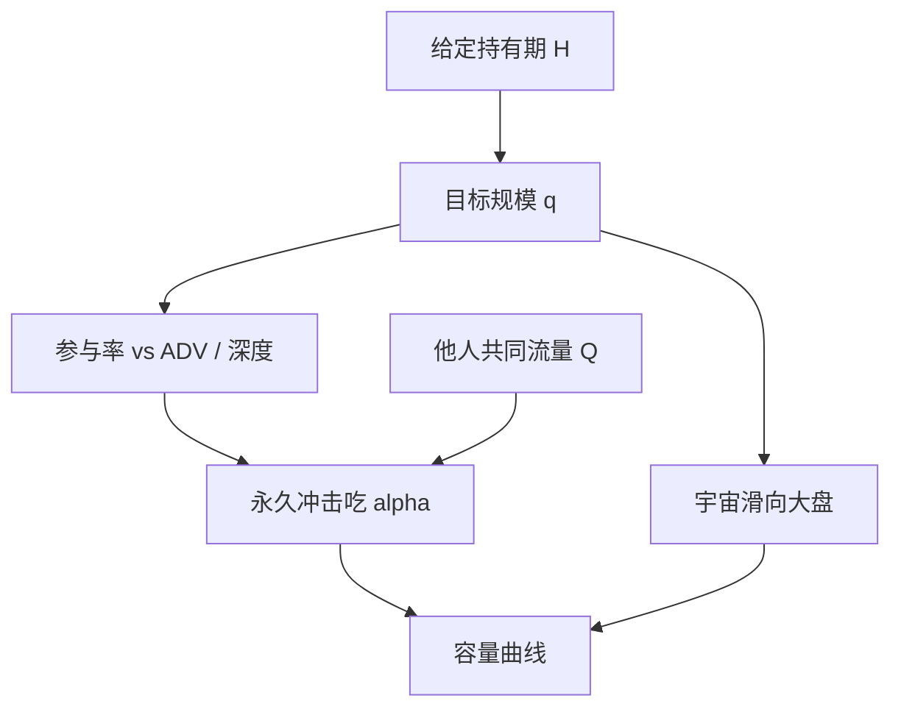

# 策略容量与拥挤

容量不是一个使夏普降到零的魔法金额。它是给定持有期与参与率时，额外资金开始改写你自己赖以存在的价格与拥挤状态的那条曲线。

<footer>—— 据 Pástor, Stambaugh and Taylor 对技能与规模的讨论；对照 Stein 对同质套利者制造不稳定的论述</footer>

[持有期与换手](/quant/holding-horizon)钉死了策略时钟 $H$ 和它该付的那一截摩擦。本课的缺口是规模：同样的 $H$，10 个亿与 10 个万面对的冲击、借券和拥挤不是线性外推。Pástor、Stambaugh 与 Taylor 把基金规模与技能的递减写进资产定价；执行文献用参与率把规模映射到冲击。拥挤是别人的规模叠在同一信号上。后课延迟预算假定容量讨论已经把「不能靠更快吃薄深度」的那部分分开。本课不重写 [Kyle](/quant/kyle-model) 的均衡推导，只借用「流量移动价格」这一句。

## 问题

纸面权重 $w$ 乘 AUM 得到股数 $q$。$q$ 相对 ADV、相对可见深度、相对可借券，决定你是价格接受者还是价格的一部分。容量问题是：在目标 $H$ 下，把 AUM 从 $K$ 增到 $K'$，净期望如何掉。掉的通道至少三条。冲击：参与率上升，永久冲击吃掉 alpha。可交易宇宙：小名字先触达手数与深度上限，组合被迫滑向大盘，风格漂移。拥挤：其他资金读到同一公开信号，你的 $q$ 只是总量 $Q$ 的一小截，价格已经被 $Q$ 移动。只做自己的参与率应力测试，会高估容量。

拥挤与容量不是同义词。容量可以在你独享信号时仍受深度限制；拥挤可以在你规模很小时已把 alpha 压光。问题是同时估计「自己的弹性」和「看不见的 $Q$」。

### 参与率是桥梁，不是容量本身

日参与率 $q/(H\cdot \mathrm{ADV})$ 把规模变成执行参数。同一 AUM，拉长 $H$ 可以降低参与率，这是上一课的交点。容量曲线应在固定 $H$ 上画，再在另一张图上允许 $H$ 调整。把「我们把再平衡从日改成周，容量变大」写成能力，其实是改了产品。Novy-Marx–Velikov 已经说明低换手更容易活过成本；那是 $H$ 的选择，不是无限 AUM。

用全样本 ADV 当分母会高估压力期容量。ADV 在你正要退出时下降，正是流动性螺旋的入口。压力 ADV 应单独成列。

## 方法

构造容量曲线：在回测里把目标名义按比例放大，用带永久冲击的成交模型重算净收益，直到净夏普或净 IR 降到预设门槛。冲击模型至少随参与率上升，禁止用常数滑点——常数会让容量看起来无限，直到你任意设定的滑点把 alpha 吃完。报告风格漂移：放大后的加权平均市值、有效股票数。借券约束对空头单独画一条曲线。

拥挤代理：信号的横截面离散度、实现换手相对历史、因子 ETF 与期货持仓、借券费率。这些是公开可观测的拥挤，不是别人的机密 AUM。Stein 指出同质化套利本身是不稳定来源；拥挤指标变极端时，应把容量门槛下调，而不是仍用平静期曲线。附录里还有更专门的容量衰减课，本课只把曲线与拥挤状态写成制度。

### 自己的冲击与共同冲击

校准若只用自己的历史成交，估计的是「在当时拥挤水平上再加一点」的局部弹性，不是「全市场跟你一起翻倍」的弹性。压力情景应把共同流量 $Q$ 放大，而不是只放大自己的 $q$。这与 [Kyle](/quant/kyle-lambda) 经验回归的精神一致：$\Delta p$ 对总带符号流量，不是对你的账号流量。把账号级 TCA 的 lambda 当策略容量，会把别人已经造成的价格当成你可以再走一次的空间。

## 机制

规模通过永久冲击改写未来可交易的 alpha：你今天买，明天的开仓价已经含你的 $\Lambda q$。拥挤通过同一通道，只是 $q$ 换成 $Q$。可交易宇宙收缩使策略暴露滑向市场因子，毛 alpha 的风格纯度下降，即使冲击模型显示「还能做」。三条机制在不同 AUM 上轮流成为紧约束：小规模时紧的是换手与价差（上一课），中等规模时紧的是冲击与借券，大规模时紧的是拥挤与风格漂移。

做市类策略的容量是存货风险与逆向选择，不是 ADV 的某一百分比；把 POV 容量公式套到做市上，对象错了。本课默认对象是有方向、有再平衡的组合策略。

不要把容量报成单一美元数。报曲线：在若干 AUM 上的净 IR、参与率、有效 N。单一数字一定对应某个未声明的门槛与某个未声明的冲击函数。

### 做市容量不是 ADV 的百分比

方向性组合用参与率桥接到冲击；做市的紧约束是存货方差与毒性。把 POV 公式套到做市，会在窄价差名字上高估可挂规模。产品类型要先分类再画曲线。

## 边界

另类数据与私人订单流的容量，受数据许可和覆盖率约束，ADV 不是紧的。债券 OTC 的容量是询价网络与存货，见后课，不要用股票 ADV。本课不写如何把单子拆到别人看不见以「扩大容量」的手法。下一课在给定规模与 $H$ 上分配延迟：不是所有策略都需要抢 tick。

另类数据策略的容量往往先碰到覆盖与许可，而不是 ADV。那条曲线应另画，不要和股票冲击曲线叠成一个美元数。

## 小结

- 容量是固定 $H$ 上净表现相对 AUM 的曲线，外加拥挤状态。
- 参与率连接规模与冲击；拉长 $H$ 是改产品，不是提高能力。
- 局部 TCA lambda 低估共同流量放大时的冲击。
- 紧约束从价差换手，转到冲击借券，再转到拥挤与风格漂移。
- 只报一个美元容量而不报门槛与冲击函数，没有信息。
- 出处：Pástor, Stambaugh and Taylor, *JFE*, 2015；Stein, *JFE*, 2009；冲击与参与率见 Almgren–Chriss 传统与 Novy-Marx–Velikov 的成本后异常。
