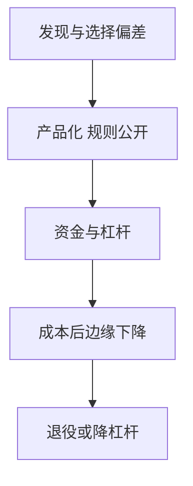

# 策略生命周期

异象在样本内被发现、在论文与产品里被传播、在资金涌入后衰减；发表后的衰减不是市场变有效的修辞，而是可测量的拥挤与成本上升。

<footer>—— McLean and Pontiff, Does Academic Research Destroy Stock Return Predictability?, Journal of Finance, 2016</footer>

[上一课](/quant/thematic-narrative)把主题收进风格资金。策略地图到此走完多空、宏观、RV、ARP 与叙事。生命周期的缺口是**所有这些腿都会老化**。主干 [多重检验](/quant/multiple-testing-factors)、[因子拥挤](/quant/factor-crowding)、[净边缘](/quant/net-edge)、[策略容量](/quant/strategy-capacity) 已写零件。本课收口策略族：发现–产品化–拥挤–衰减–退役，后面业绩单元不再把样本内夏普当永续。

## 问题

McLean–Pontiff 比较论文样本内、发表后、样本外：可预测性平均下降，成本高的异象降得更多。Harvey–Liu–Zhu 说明发现阶段已经有选择偏差。问题是运营：何时把研究仓转成产品仓，何时降杠杆，何时停。不能等全样本 t 值掉到 1 再议——那时容量已经满了。Schwert 对异象「被发现后变弱」的观察与此同方向。

与择时：生命周期减仓是对**策略自身拥挤**的反应，不是对因子估值的逆向择时。两者可以同时发生，报告要分开。

### 衰减不是证明当初是假的

选择偏差解释一部分发表后下降；真实拥挤解释另一部分。把所有衰减都说成 p-hacking，会错过风控；把所有衰减都说成拥挤，会给假策略续命。应用发表前后、成本分层、持仓重叠一起看。

产品化本身加速衰减：透明规则、因子 ETF、风险模型里的风格因子，都在把信号变成公共品。ARP 课里「规则化便于复制」在这里变成成本。

## 方法

档案：预注册、试验次数、扣费后样本外。监控：IC 衰减、换手成本、拥挤代理、相关升。治理：预先写停损与退役规则（容量、IR 下限、拥挤上限）。新产品对照：相对已有腿的增量 IR，而不是孤立夏普。过 [放气夏普](/quant/deflated-sharpe)。

## 机制

发现把噪声标成信号；资本把信号标成拥挤；冲击与费用把拥挤标成零边缘。Grossman–Stiglitz 式的信息补偿在边际上被复制成本吃掉——此处只引用，不重推均衡。地图上每类策略的时钟不同：并购套利随 deal 流，短波动随卖方拥挤，日历效应随发表次数。

## 边界

本课不规定具体退役数值。法律与营销不能承诺「历史夏普会重复」。下一单元改问：即便策略还在，费用与业绩会计会吃掉多少。

## 小结

- 策略有发现–拥挤–衰减的生命周期，样本内夏普不是产品。
- 发表后衰减来自选择偏差与真实拥挤，要一起度量。
- 退役规则预先写，增量 IR 相对已有腿。
- 出处：McLean and Pontiff, *JF*, 2016；Harvey, Liu and Zhu, *RFS*, 2016。
