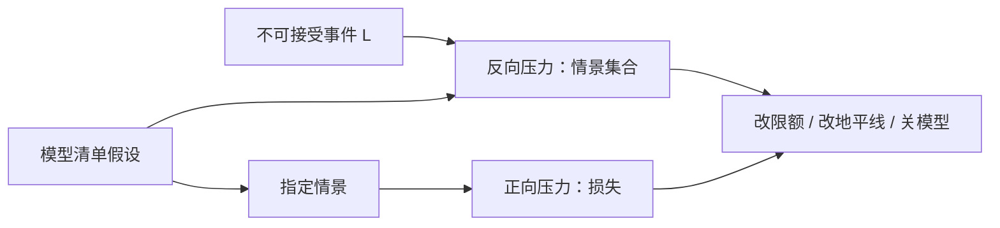

# 压力情景与反向压力

压力测试问「这个情景下我们亏多少」；反向压力问「什么样的情景会让我们无法存活」。前者从情景走到损失，后者从不可接受的损失走到情景。

<footer>—— 据英国金融监管当局对 reverse stress testing 的政策表述；对照巴塞尔委员会对压力测试的原则性文件</footer>

[模型风险清单](/quant/model-risk-inventory)给出了假设与可执行替代。本课的缺口是测试方向。常规压力：指定 2008、指定平行加息、指定价差扩大，读 PnL 与限额。反向压力：从「资本耗尽 / 无法变现 / 融资断掉」反推最小的一组市场与流动性移动。英格兰银行与 PRA 把 reverse stress testing 写成识别脆弱性的工具，而不是再加一个更惨的历史情景。模型风险课序在本课收束。

## 问题

历史情景受样本限制：你没见过的螺旋形状不会出现在「再放一遍 2008」里。假设情景受想象力限制：指定每个因子动多少，往往内部不一致（股票崩了但融资仍便宜）。两者都是正向映射 $ \text{情景}\mapsto\text{损失} $。反向压力改成：定义不可接受事件 $L$（例如：无法在流动性地平线内把杠杆降到合规、或净资本低于门槛），求解哪些状态变量组合导致 $L$，再问这些组合是否荒谬。若不荒谬，清单上对应假设必须改，限额必须先降。

缺口是把反向压力接到清单，而不是接到一个孤立的宏观故事。若脆弱性来自「债券变现时间被当成 10 天但 RFQ 会消失」，反推的情景应是公司债市场冻结，而不是再把股票波动乘以 3。

### 一致性：价格、相关、流动性、融资必须一起动

指定股票 $-20\%$、相关不变、价差不变、保证金不变，不是压力，是数字练习。螺旋课要求四者同向。反向压力的解常常是：不大的价格移动 $+$ 融资规则收紧 $+$ 变现时间翻倍。损失来自第二、第三项。若引擎不能让流动性地平线成为情景变量，反向压力无解，只能说明系统还没准备好——这本身是测试结果。

反向压力不是为了生成一个「最惨收益」。多个很不相同的情景可以达到同一 $L$。报告应给出若干最小路径，而不是一个假想的世界末日。

## 方法

正向压力：维护一套历史情景与一套假设情景，映射到清单上的每个模型用途，输出 PnL、保证金、变现时间、拒单（市场关闭）。假设情景要写清哪些相关被替换成压力矩阵、哪些冲击函数切换成凸形式。

反向压力：定义 $L$ 的操作化（资金、杠杆、流动性、合规）。在状态空间上搜索：因子收益、价差、ADV、保证金、赎回。搜索可以是网格加人工、或对关键杠杆的敏感性反解。得到候选情景后，做一致性检查：价格路径是否与融资规则相容、债券能否在假设地平线成交。把存活边界画成曲面：在拥挤高的时候，更小的价格移动就达到 $L$。

与 VaR 的关系：VaR 是损失分布的分位；压力是条件于情景的损失；反向压力是条件于损失门槛的情景集合。三者都要，不能用 99% VaR 代替反向压力。

### 从「会破产的故事」回到限额

测试的输出必须改行为：降低该因子的限额、拉长执行地平线、增加融资缓冲、关掉依赖单一流动性假设的策略。若输出只是一页 PPT，测试失败的是治理。SR 11-7 要求使用中的模型被持续挑战；反向压力是挑战的一种具体形式。

## 机制

正向压力暴露的是已知情景下的线性与一阶希腊。反向压力暴露的是结构脆弱：集中、拥挤、融资条款、无法交易的名字。机制上，它强迫你把清单里的「已知失效模式」定量化。例如：相关崩溃 $+$ 流动性螺旋同时发生时，$L$ 是否在两周内触及。若是，资本与变现计划必须按这个时点来，而不是按 10 日 VaR。

搜索会找到「荒谬」解，例如所有资产跌 90%。丢掉它们。留下的是「只动融资与流动性、价格中等移动」的解——那些才是模型风险，因为日常 VaR 几乎看不见融资条款。

不要用 [Roll](/quant/roll-model) 或单日有效价差去填压力里的变现成本。压力成本来自 RFQ 消失、价差跳档、期货升贴水，对象是流动性螺旋，不是买卖回跳。

### 反向压力要留下若干最小路径

单一世界末日情景没有信息。有用的是：只动融资与变现时间就能达到 $L$ 的路径，以及必须价格崩塌才达到 $L$ 的路径。前者才是模型风险，日常 VaR 看不见。

## 边界

监管要求的反向压力有正式文档；研究团队可以轻量做，但不能把「我们想象过闪崩」当成完成。加密强平连锁是可自动化的反向情景，见标记价格。本课不设计如何在压力中获利。风险课程在此结束；研究与回测课程会把过拟合再换成样本设计语言。

引擎若不能把流动性地平线当成情景变量，测试的失败项是系统，不是情景想象力。应先改引擎再写报告。

## 小结

- 正向压力：情景 → 损失；反向压力：不可接受损失 → 最小一致情景。
- 情景必须让价格、相关、流动性、融资一起动。
- 输出是若干条到达 $L$ 的路径，用来改限额与模型用途。
- 引擎若不能把变现时间当状态，反向压力无法进行。
- VaR 分位不能替代反向压力。
- 出处：Bank of England / PRA 对 reverse stress testing 的监管表述；Basel 压力测试原则；SR 11-7；机制见 Brunnermeier–Pedersen。
