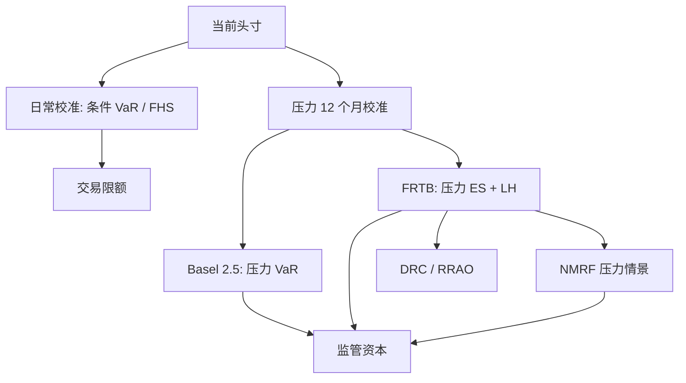

# 压力 VaR 与 FRTB

日常校准的分位数跟着平静期走；监管要的是：用一段显著压力的连续历史，把同一套损失定义再算一遍，使资本在波动回落之后仍记得危机的尺度。

<footer>—— BCBS, Revisions to the Basel II market risk framework, 2009；BCBS, Minimum capital requirements for market risk, 2016/2019</footer>

Basel 2.5 在 2009 年修订中给内部模型加上 **stressed VaR**：10 日 99% VaR，参数必须在一段连续 12 个月的显著压力期上校准，再与日常 VaR 并行进入资本。日常 [VaR](/quant/var-methods) 在 2003–2006 年估出来的 $\Sigma$ 到了 2007 年仍然偏小；危机后若立刻用危机样本重估，资本会在波动已经实现之后才升高，且随后随窗口滚出而下降。压力校准把「哪一段历史」写成制度，而不是写成交易台的选择。巴塞尔交易账本根本审查（FRTB，BCBS 2016 年标准、2019 年修订）进一步用 [Expected Shortfall](/quant/expected-shortfall) 替换 VaR 作为内部模型主度量，并保留压力校准、按风险因子分档的流动性期限、不可建模风险因子（NMRF）与违约风险。本篇只写公开的巴塞尔文本里这两层制度，不写各司法辖区的实施细则与厂商模型。

## 问题

条件 VaR 回答「给定今日信息，明天的分位数」。监管资本还要回答「若明天开始的市场像历史上最坏的那一年，分位数是多少」。两个问题的测度不同。日常模型用最近窗口或 EWMA，对近期 $\sigma_t$ 敏感，这是限额所需要的；资本若只用日常模型，繁荣期资本薄、危机后资本厚，顺周期。Stressed VaR 强制第二套数字：风险因子的波动与相关取自压力年，头寸仍是**当前**头寸。于是资本至少含「当前组合 × 压力测度」，繁荣期也不会把 2008 年的相关结构忘掉。

FRTB 认为 VaR 对尾巴形状不敏感、10 日平方根法则过粗、所有因子共用一个地平线不真实。于是主度量改为 97.5% ES，校准仍在压力期；不同因子有不同流动性期限（LH），不可 empirically 建模的因子从内部模型 ES 里拿出，改用压力情景加资本（NMRF）。问题从「多一个压力 VaR」变成「压力 ES + 分档地平线 + 可建模性认定」。日常交易限额仍可用条件 VaR/FHS；监管资本不再与限额用同一套窗口。

### 压力期如何选

Basel 2.5 要求连续 12 个月、对银行组合「显著压力」。公开文本给的是原则：覆盖一段市场显著紧张的时期，并随组合结构复核，而不是永远钉死 2008。FRTB 的压力期同样要最大化当前组合的 ES，并定期重选。这引入判断：压力期变成一个被选择的超参数。若用当前组合去搜历史上使 ES 最大的 12 个月，有过拟合成分，但监管意图是保守而非无偏。工程上应记录候选压力年、重选频率、以及换期对资本的跳跃，避免把「换压力期」当成降资本工具。

压力校准用的是压力期的风险因子变化，套在今日头寸上，不是把压力期的历史 P&amp;L 直接当资本。组合若已从信贷换成利率，2008 年的股票崩盘不再自动构成最坏 12 个月。头寸变了，压力年必须重找。

## 方法

**Basel 2.5 资本结构（公开框架）。** 市场风险内部模型大致为：日常 VaR 的乘数项（含回测附加）**加上** stressed VaR 的乘数项，再加上增量风险计提（IRC：违约与迁移）等。Stressed VaR 与日常 VaR 同一置信与地平线（10 日 99%），差别只在校准样本。乘数（监管因子）对日常 VaR 的回测表现敏感；压力项使资本不能仅靠「最近没有违反」而塌缩。具体乘数区间与各国实施以当时适用的监管文本为准，本文只保留「日常 + 压力并行」这一结构。

**FRTB 内部模型（IMA）。** 主度量是流动性期限调整后的 ES，置信 97.5%，在压力期校准。部分 ES：按监管规定的风险类别分别计算，再按公开公式加总（含未解释相关的惩罚），避免用一张全市场相关矩阵把分散化算满。NMRF：回测或数据长度达不到可建模标准的因子，不能进 ES 核心，须用压力情景资本。违约风险计提（DRC）覆盖跳跃违约；剩余风险附加（RRAO）覆盖无法用敏感性解释的奇异风险。交易台须通过损益归因（PLA）与回测才能用 IMA，否则退回标准法（SA：敏感性法 SBM + DRC + RRAO）。

**流动性期限。** 公开分档把利率、大盘股等放在较短 LH（如 10 天），信用、小盘、部分波动放到 20、40、60 乃至 120 天。这不是声称你真的会持有 120 天，而是压力市场里这类因子不能按 10 天退出。内部若所有因子共用 10 天，与 FRTB 精神相反，也与 [变现时间](/quant/liquidity-horizon) 的经济问题脱节。

### 与内部限额模型的接口

同一交易台会同时看到：条件 FHS/GARCH VaR（限额）、压力 ES（资本）、标准法（对照与保底）。三者必须能归因到同一套头寸与因子映射，否则 PLA 失败。压力期的因子时间序列要经过与日常模型同一套清洗与公司行为，只是样本换成压力年。不得在压力期上另做一套「更光滑」的插值来压低 ES。不可建模因子的清单是模型治理对象：把难估的因子改名塞进可建模集合，是监管套利，不是校准。

## 机制

压力校准的机制是换测度：把因子变化的经验（或参数）分布从「最近 $n$ 日」换成「指定 12 个月」。头寸映射 $g$ 不变，因此非线性、集中度、方向性都会在压力测度下重新显现。顺周期被部分切断：日常 $\sigma_t$ 回落不会等比例降低资本。FRTB 用 ES 替换 VaR，机制是让资本对压力年里那些超过分位数的损失均值敏感，而不仅对第 99 个百分位敏感。分档 LH 的机制是把「来不及退出」写成更长的积分地平线，而不是事后加一个流动性附加。

次可加在监管加总里被故意限制：类别之间的分散化不能按内部相关矩阵吃满，这是对估计相关在压力下失效的制度回应，与 Artzner 公理不是同一层——公理奖励真实分散化，监管惩罚不可信的分散化数字。

97.5% ES 对齐旧 99% VaR 只是校准选择，不是分布无关恒等式。厚尾下 ES/VaR 倍数变大，FRTB 资本相对 Basel 2.5 的变化不能用一个常数换算完。

### 标准法不是「低配内部模型」

FRTB SA 的敏感性法用监管给定的风险权重与相关，对 delta、vega、曲率收费。它不估计你的 $\Sigma$，因此没有内部模型的统计过拟合，但有监管权重是否匹配你的组合的模型风险。IMA 通过后资本通常更敏感、也可能更低；通不过 PLA 则 SA 是约束。两者都应计算：SA 是后备，也是对内部 ES 的对照。内部 ES 若远低于 SA，需要能解释是分散化还是 NMRF 漏计。

## 边界与工程取舍

公开巴塞尔文本不替代本国法规、过渡期与报告模板。压力期选择、NMRF 认定、PLA 红黄灯，都是治理而不是公式能消掉的判断。Stressed VaR/ES 仍然是标记价损失，不含强平路径与融资螺旋，见 [杠杆与强平](/quant/leverage-liquidation)。它也不含清算基金与 CCP 的会员责任。把 FRTB 资本当成「经济资本」会混对象：前者是监管可加总的规则，后者还要含模型不确定与业务风险。

不要用日常窗口的 Kupiec 通过率去证明压力 ES 正确：压力测度的违反应在压力年的回放上评估，样本极短，功效更低。不要把 FHS 的今日 $\sigma_t$ 乘一个「压力乘数」冒充 stressed VaR——那是尺度补丁，不是换了一段历史的联合变化。真正的压力校准是重跑因子路径。

FRTB 的 ES 估计在压力年大约 250 日、再按 LH 拉长，尾样本仍然稀。Yamai–Yoshiba 对 ES 估计方差的警告仍然适用。监管公式给出的是规则资本，不是低方差的统计量。

## 小结

- Stressed VaR（Basel 2.5）用连续 12 个月压力期校准 10 日 99% VaR，与日常 VaR 并行进入资本，减轻顺周期。
- FRTB 用 97.5% ES 替换 VaR，保留压力校准，并按流动性期限分档，NMRF 不得混入可建模 ES。
- 压力期随当前组合重选；头寸结构变了，2008 年不必仍是最坏年。
- 限额模型可以继续用条件 VaR；资本与限额必须能映射到同一套头寸，否则 PLA 失败。
- 出处：BCBS, *Revisions to the Basel II market risk framework*, 2009；BCBS, *Minimum capital requirements for market risk*, 2016 及 2019 年修订本。连贯性背景见 Artzner 等；ES 定义见 Acerbi–Tasche。
