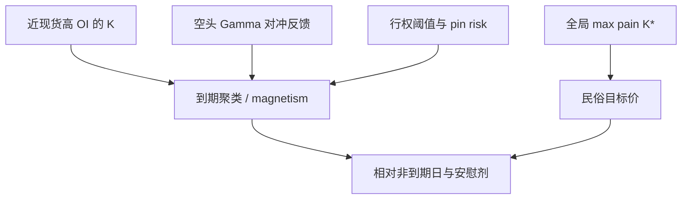

# Strike Magnetism / Max Pain

到期日现货收在高未平仓执行价附近的频率偏高，这一钉住有对冲与行权阈值的机制；「价格会被吸到最大痛点」则是把同一现象改写成了期权买方集体亏损最大化的民俗。

<footer>—— Ni, Pearson and Poteshman, Stock Price Clustering on Option Expiration Dates, Journal of Financial Economics, 2005；钉住的连续时间叙述见 Avellaneda and Lipkin；最大痛点公式来自从业口耳相传而非同一文献</footer>

到期附近，平值期权的 Gamma 变尖，做市对冲与行权决定在执行价 $K$ 处不连续，现货路径表现出向某些 $K$ 靠拢的统计倾向，称为钉住（pinning）或 **strike magnetism**。Ni、Pearson 与 Poteshman（2005）把它写成可检验的聚类：到期日收盘落在期权执行价上的频率，高于用非到期日校准的零假设。Avellaneda 与 Lipkin 用对冲反馈给出连续时间直觉。与此并列的零售指标 **max pain**（最大痛点）定义为：使全部未平仓看涨与看跌的内在价值之和最小的交割价，即「期权买方作为整体最痛」的点。本篇把二者拆开：前者是有机制、有证据的微观结构；后者是粗统计量加过强叙事。经销商 Gamma 的零点见 [Gamma Flip](/quant/gamma-flip-level)，到期缺口见 [pin risk](/quant/pin-risk)。

## 问题

Magnetism 要回答：为什么 $S$ 在到期日更常停在某个 $K$ 附近。机制候选有三。其一，Delta 对冲：空头 Gamma 的经销商在 $S$ 高于 $K$ 时卖、低于 $K$ 时买（或相反，取决于净符号），在 $K$ 附近形成局部恢复力——这要求净 Gamma 符号与对冲规则配合，不是对每个 $K$ 都成立。其二，行权与交割：现金或实物交割使 $K$ 成为阈值，最后一段时间的对冲无法平滑，停在 $K$ 上减少不确定。其三，操纵或「让买方最痛」：这需要协调且与做市竞争、与监管约束冲突，NPP 的证据并不需要这一条。

Max pain 把全部执行价的 OI 收成一个 $K^\star=\arg\min_K \sum_i \mathrm{intrinsic}(K_i;K)$。它忽略 Gamma 剖面、忽略谁持仓、忽略未到期合约，把「买方总内在价值」当成价格目标。问题是：即使 pinning 为真，被钉住的通常是**局部**高 OI、近现货的 $K$，不是全局 max pain——现货远离时，max pain 仍可指着一个很远的 $K$，价格并不会穿越半个指数去「完成民俗」。

### 民俗指标如何计算、何处走样

对候选交割价 $X$，看涨内在 $\max(S-K,0)$ 在 $S=X$ 时求和，看跌 $\max(K-S,0)$ 同样求和，找使总权利金内在最小的 $X$（通常在上市执行价网格上穷举）。它与「最大 OI 执行价」不同：远虚值看跌可以因为 OI 大而把痛点拉低。它与 GEX 更不同：不使用 $\Gamma$ 与 IV。走样发生在：用月期权 OI 去做 0DTE 日的痛点、用股票期权痛点去解释指数、以及把盘中现货与日终 OI 拼成一条会动的「痛点线」却暗示它是磁铁。

Max pain 最小化的是内在价值之和，不是经销商 P&L，也不是顾客 P&L 的任何可观测分位。权利金早已付出，到期「痛」的会计对象含混。名称本身在推销叙事。

## 方法

**钉住检验（NPP 风格）。** 在到期日，计算收盘价落到执行价网格上的频率，或落到最大 OI 的 $K$ 的某个带宽内的频率，与非到期日、或与打乱 OI 的安慰剂比较。控制当日已实现波动：波动大时随机落入某一 $K$ 的机会也变。应预指定带宽（例如半个执行价间距）与是否用开盘结算价。0DTE 上市后，每个交易日都是「到期日」，样本定义要改：检验的是下午到期窗口相对同日早盘，而不是月到期相对普通日，见 [0DTE](/quant/zero-dte-microstructure)。

**Max pain 作为对照。** 同一天计算 $K^\star$，报告 $|S_{\mathrm{close}}-K^\star|$ 的分布，以及 $K^\star$ 相对最大 OI 执行价、相对 Gamma Flip 的距离。预测检验：用 $t-1$ 的 $K^\star$ 预测 $t$ 到期收盘是否更近，控制 $t-1$ 现货位置。公开复制通常发现：近现货的高 OI 执行价有弱聚类，全局 max pain 的预测力更弱或为零。把这一对照写进正文，而不是只展示「某次刚好钉住」的图。

**机制回归。** 钉住强度对「近现货 OI」「净 Gamma 符号」回归，看是否符合对冲反馈而不是符合 $K^\star$。Avellaneda–Lipkin 型的连续钉住需要 Gamma 空头在 $K$ 附近；若公开 GEX 显示经销商在该 $K$ 其实是多头 Gamma，局部应是推离而不是吸引——这是可证伪的。

### 与 GEX、Flip 的统计分工

GEX 是加总凸性，Flip 是加总零点，OI 最大 $K$ 是局部厚度，max pain 是内在价值的一阶矩。钉住是局部的、到期的、关于 $K$ 的。四者可以数值接近，检验必须预指定。用 max pain 去代理 magnetism，等于用错误的充分统计量，会把远执行价的垃圾 OI 引进「目标价」。

个股实物交割的钉住还混进借券与交割意愿，比指数现金结算更脏。NPP 的样本是股票期权；把结论搬到 SPX 0DTE 要重新做，不能只改标题。

## 机制

对冲反馈在单一 $K$、空头 Gamma、连续交易的理想化下，确实像弹簧：偏离 $K$ 的 Delta 变化促使对冲把现货推回去。这是 magnetism 的「力」的来源，与 [正 Gamma 体制](/quant/dealer-gamma-regime) 的阻尼是亲戚：局部对一个 $K$ 阻尼，加总则对体制阻尼。跳跃、离散对冲带、多 $K$ 同时厚，都会破坏单弹簧图像。Pin risk 强调的是阈值不确定性，不是吸力：即使没有吸力，停在 $K$ 上对空头仍可能是最省事的交割结果，聚类可以部分来自「少动」。

Max pain 叙事把弹簧的锚写成「全体买方最亏的点」。没有均衡模型要求做市商或「市场」去最小化买方内在价值；做市商最大化的是价差与存货风险约束下的目标。若锚恰好靠近最大 OI 的近值 $K$，民俗会显得灵验，这是混淆。证据标准应是：样本外、有安慰剂、有与高 OI 执行价的增量。多数公开讨论达不到这一标准。

### 0DTE 是否让民俗更真

每天到期使「月痛点」更常被拿来画线，但 0DTE 的 OI 在盘中形成，日终 max pain 用的仓位可能不是下午高峰。更合理的对象是近现货、当日到期的 OI 峰。即便如此，聚类幅度通常是执行价间距量级，不是趋势策略的目标位。把 magnetism 写成可交易的「吸到某点再反转」，需要的是路径，公开证据给的是收盘截面的频率偏移。

## 边界与工程取舍

不要用 max pain 做到期方向交易：增量证据弱，且把对冲机制讲成了阴谋。不要把钉住的频率偏移夸大成确定性吸力。不要在薄上市、执行价间距很宽的标的上谈 magnetism。风险管理上，pin risk 仍然真实：空头在 $K$ 附近需要限额与情景，这与是否相信 max pain 无关。

正当用法：把高 OI 执行价与到期窗口列入**风险日历**；把 NPP 式聚类当微观结构事实；把 max pain 当需要对照的民俗指标，而不是当定价模型的输入。

社交媒体上的 max pain 图常常混用不同到期、不同标的。复制必须锁定一条链、一个到期、一个交割规则。

## 小结

- Strike magnetism / pinning 有对冲与行权阈值机制，NPP（2005）给出到期日执行价聚类的证据。
- Max pain 是使期权内在价值之和最小的交割价，名称强于识别；全局痛点通常不是被钉住的那个 $K$。
- 应预指定近现货高 OI 执行价作为 magnetism 对象，并把 max pain、Flip、GEX 分开检验。
- 0DTE 改变样本定义，不自动使民俗变真；盘中 OI 不可用日终痛点假装已知。
- 出处：Ni, Pearson and Poteshman, *JFE*, 2005；Avellaneda and Lipkin 钉住模型；pin risk 与希腊字母为标准对冲叙述；max pain 为从业民俗口径，须与上述文献对照而非等同。
