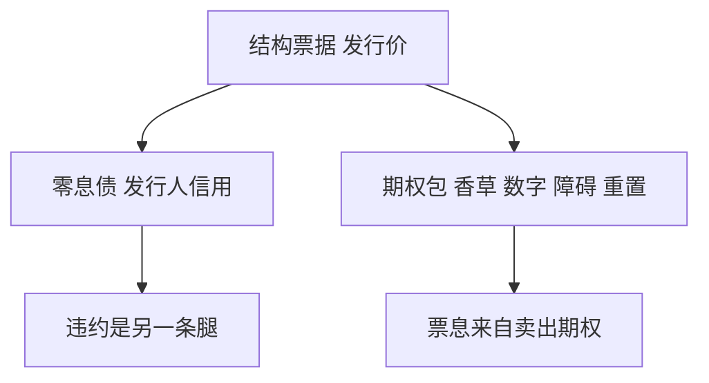

# 结构性票据拆解

结构票据是零息债加一包期权；票息是期权费的分期，不是债券信用利差的另一种写法。

<footer>—— 结构产品拆解见 Fabozzi 对 structured notes 的综述；障碍与自动赎回条款对照本课序前几课</footer>

[上一课](/quant/warrants-eso)把覆盖权证、公司权证与 ESO 分开：可对冲香草、稀释、作废与过早行权不是同一套希腊值。缺口是零售与私行看到的「票息 ×%、挂钩指数、有保护」——簿上应看到零息债、香草、数字、障碍、autocall、cliquet 的组合。本课把拆解当成强制步骤。不重讲 Hull–White 行为树。后课 AAD 默认已经读完：不拆开就无法把利率风险与股权风险交给不同的台。

## 问题

一张「保本看涨」= 零息债 + 虚值看涨（或看涨价差）。一张凤凰/雪球 = 债 + 卖出离散障碍与敲入看跌，票息是收费。问题不是再给雪球定价——[自动赎回](/quant/autocallable) 与 [雪球](/quant/snowball-pricing) 已写——而是：**发行价 100 里有多少是债、多少是期权费、多少是发行与对冲利润。** 不拆开，就无法把利率风险交给利率台、把股权风险交给期权台，也无法解释「票息为什么比存款高」。

信用：票据是发行人的无抵押债。股权结构再漂亮，仍承担发行人违约。把结构票据当「指数理财」，漏掉的是 [CVA](/quant/cva-lite) 那一层，后课 XVA 桥会再接。

### 拆解必须与条款时钟一致

观察日、记忆票息、最差表现、Quanto 结算、提前赎回权（发行人 call）每一条都对应前面某课的零件。拆错时钟（把离散敲出当连续障碍，把 quanto 当普通外国期权）比选错波动模型更致命。先画支付树，再选模型。

发行利润来自买卖价差、微笑上卖贵的那一侧、以及零售对路径概率的错误直觉。估值引擎应用卖方曲面，而不是用历史已实现波动去「解释票息」。

## 方法

步骤：(1) 把确定性支付贴现成债（用发行人曲线或融资曲线，视是否有抵押）；(2) 把或有支付映射到已有期权类型；(3) 在与香草一致的模型下估值，检查发行价与模型价的差；(4) 希腊值按拆开后的腿加总，再对冲。多标的 worst-of 先当彩虹/篮子，再叠加障碍。利率挂钩结构（区间计息、CMS 陡峭）用后课 caps/floors/swaptions，不要用股权局部波动去估 CMS。

文档与确认书优先于销售材料。销售材料里的情景不是风险中性概率。

## 机制

投资者买的是债的信用加卖出的期权包。市场好时票息像「超额收益」，其实是期权费摊还；市场坏时敲入或保本失效，才露出卖出的那条腿。发行人反向持有期权包并对冲，利润是收费减对冲成本减资本。拆解的意义是让这三层能分开盯市，而不是把整张票当一个「收益率产品」去比存款。

## 边界

提前赎回、展期、发行人置换权会让拆解随时间变形。监管与适当性限制销售对象，不改变拆解代数，但改变你能不能用批发曲面去解释零售价差。跨境票据还有税务与 FX，见 [quanto](/quant/quanto-options)。

本课不提供销售话术，也不讨论把结构改写成规避适当性的包装。

## 小结

- 结构票据 = 债 + 期权包；票息是期权费，不是信用利差的别名。
- 拆解必须对齐观察时钟与支付类型；错时钟比错模型更严重。
- 发行人信用是单独一条腿，后续接到 XVA。
- 出处：结构票据拆解见 Fabozzi 相关综述；零件分别见本课序障碍、数字、autocall、cliquet。
