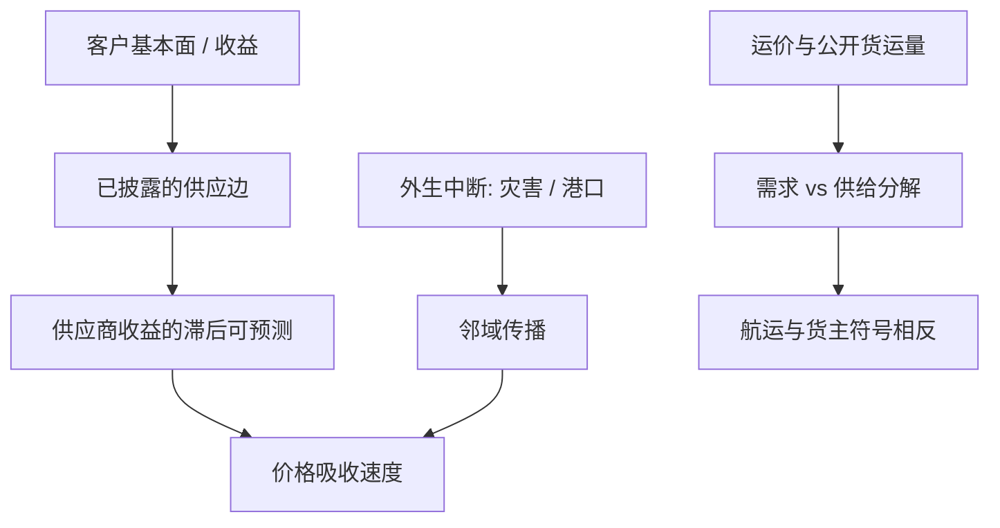

# 供应链与货运

客户与供应商的真实经济联系，使一家公司的股票收益可以预测其贸易伙伴随后的收益；这不是行业动量的别名，而是沿投入产出边传递的信息。

<footer>—— Cohen and Frazzini, Economic Links and Predictable Returns, Journal of Finance, 2008</footer>

[上一课](/quant/card-spending)把卡与账户流水写成流动性约束下的消费测量：评价应先看对官方序列的 nowcast，再问公司特异残差是否存在；授权日与结算日是测量问题。缺口是公司还连成有向图：客户公告、自然灾害与运价沿边传播，货运指数混合需求、船舶供给与拥塞。Cohen–Frazzini 与 Menzly–Ozbas 把贸易边写成收益可预测性；边必须滞后到可获得。本课写供应链与货运如何进入收益，不重写卡数据的家庭金融识别。对象是研究用公开或授权统计，不是如何定位单船。

## 问题

横截面资产定价习惯用行业哑变量吸收「同一生意」。供应链指出：汽车供应商与汽车整车厂可能不在同一 GICS 叶子，但需求冲击共用。问题是边的观测频率与质量。美国 10-K 的客户披露有销售占比门槛，图是稀疏且滞后的；FactSet Revere 一类产品更密，但是供应商定义与修订政策必须当 vintage 处理。中国披露与海关、上市公司大客户附注同样有截断。用一张静态邻接矩阵去预测十年收益，等于假设拓扑不变，而重组、垂直一体化与贸易转移一直在改边。

货运指数往往被当成全球增长的领先指标。Bakshi、Panayotov 与 Skoulakis 讨论波罗的海干散货指数（BDI）对商品与股票的预测；Kilian（2009）强调油价冲击要拆成供给、需求与预防性需求，运价与油价的共动不能自动翻译成「中国需求」。BDI 自身是即期运价，含船舶供给（Kalouptsidi 的 time-to-build）与港口拥塞，趋势与周期混在一起。问题是：你交易的是**运价风险溢价**、**宏观现在时**，还是**沿供应链的公司特异冲击**。三者需要不同的中性化。

### 拓扑冲击与运价水平不是同一个因子

地震、苏伊士阻塞、疫情封港是拓扑或容量冲击：某些边暂时断开，替代路径拉长交货。Barrot–Sauvagnat 与 Carvalho 等的识别靠的是外生中断，股票反应在供应商、客户与竞争对手上符号不同。运价水平上升可能是需求旺，也可能是船吨供给短缺；对航运股与对货主（零售进口商）的符号相反。把 BDI 动量直接套到所有「周期股」上，是把符号问题藏进行业定义。

客户–供应商可预测性依赖市场对边的忽略。一旦 ETF、风险模型与分析师把主要客户写进模板，Cohen–Frazzini 的滞后会缩短。复制应报告样本外与发表后衰减，而不是只重复 1980–2004 的表。

## 方法

**经济联系组合。** 按 Cohen–Frazzini：在 $t$ 用已披露的客户关系，把客户组合的月度收益当作供应商的信号，控制行业与规模，看供应商随后收益。边权可用销售占比。稳健性包括：只用新公告的客户、去掉同行业边（以免行业动量）、以及用 Menzly–Ozbas 的 IO 表边。Herskovic（2018）把生产网络的集中度写成资产定价因子，关心的是系统性网络风险，不是单边滞后——不要把两篇论文的回归左边混用。

**中断事件研究。** 以气象或公开灾难公告为时间零点，估计受影响节点及其邻域的异常收益与随后基本面（库存、毛利、交货日）。这是识别，容量有限，不能当成每日 alpha 引擎。价值在于校准「边的经济强度」，供日常图因子使用。

**货运现在时。** 用公开周频序列：AAR 铁路车皮、港口吞吐量、BDI 分船型、集装箱现货运价指数。与工业产出、出口、PMI 做实时预测，评价用 vintage。AIS 研究在交通经济学里用于估计贸易成本与船舶搜寻（Brancaccio 等）；金融应用应停留在**区域或船型的密度与等待时间统计**，与[卫星](/quant/satellite-geo)的港口堆场互相校验，而不是跟踪单船到货主。Gorton 与 Rouwenhorst（2006）把商品期货溢价与库存、对冲压力联系起来：运价是库存路径的输入，不是独立的魔法指标。

### 图特征的滞后与泄漏

邻接矩阵必须在信号日可获得：年报披露有法定滞后期，用当年 10-K 的客户去解释当年收益是前视。海关与增值税发票级的微观贸易数据在研究中需通过统计机构或授权库访问，结果以行业或上市公司聚合发表。日频「供应链因子」若依赖未公开的发票图，研究不可复制，也不应写成可交易声明。

运价有极强的均值回复与供给滞后：船造好时景气可能已经结束。把 BDI 当动量信号与当反向的供给信号，是两种策略，必须预先指定，不能看样本内哪个 t 大。

## 机制

沿边可预测的机制是有限注意与分析师覆盖沿 SIC 而不是沿客户名单。信息从客户盈余传到供应商需要时间，形成时间序列上的滞后 IC。当共同分析师或共同机构持股增加，滞后应下降。这与新闻文本的传播（Tetlock 传统，见[舆情](/quant/news-nlp-alpha)）可以叠加：同一则客户预告出现在新闻里，图滞后与文本滞后会双计。

网络放大：Acemoglu 等指出，若投入产出足够不对称，特质冲击不抵消。资产定价含义是：中心节点的特异性不可被行业因子完全吸收，风险模型应允许稀疏的网络因子，否则残差协方差被低估，[风险预算](/quant/risk-budgeting)会过度集中。2011 年地震与 2021 年堵塞是压力检验：相关性在受影响子图上上升，全市场相关矩阵的历史估计来不及。

货运机制分需求与供给。需求旺 → 运价升、货主利润受运费挤压、航运与港口受益。供给紧（船坞时滞、船员、运河）→ 运价升但宏观需求未必强，此时做多航运、做空进口零售可能成立，做多「周期」不成立。Kilian 式分解是为了不被单一指数带着走。

### 与卫星、卡数据的正交

港口卫星看堆场与泊位，AIS 看船，卡数据看进口零售的终端支出，海关看报关。四者在「美国从亚洲进口」这一宏观事实上高度共线。研究设计应预先指定一条主路径（例如 Cohen–Frazzini 的公司边，或 BDI 的宏观），其余作增量 $R^2$。把四家供应商的特征丢进 [GBDT](/quant/gbdt-alpha) 会得到漂亮的重要性排序，样本外一起随贸易周期翻脸。

## 边界与工程取舍

不要把客户动量做成无成本的日频策略：边稀疏、换手发生在重组与财报季，流动性在小供应商上差。不要用未授权的提单、发票或船舶识别去构造特征。A 股大客户披露与退市、壳使边的生存偏差更大。集装箱运价在 2020–2022 有一次历史性的水平移动，任何含这一段的全样本夏普都要单独报告。

指数化之后，BDI 本身可交易性差（复制摩擦），更多是信号而不是资产。交易应落在流动性足够的航运股、商品期货或进口敏感零售，并做[行业中性](/quant/industry-neutral)，以免只是在做多 Beta。

「供应链金融」在银行里指应付账款与保理，和本篇的股票横截面不是同一对象。不要把运价因子与发票融资的信用风险混在一张风险报告里而不拆栏目。

## 小结

- Cohen–Frazzini（2008）与 Menzly–Ozbas（2010）把贸易边写成收益可预测性；边必须滞后到可获得，并报告发表后衰减。
- Acemoglu 等（2012）、Barrot–Sauvagnat（2016）、Carvalho 等（2021）说明网络如何放大冲击；这是风险与识别，不是每日信号配方。
- 货运指数混合需求、船舶供给与拥塞；Kalouptsidi（2014）、Kilian（2009）、Gorton–Rouwenhorst（2006）要求先分解再交易。
- 公开周频运量、IO 表与年报客户关系是可复制输入；单船或发票级识别不属于可发表的选股研究设计。
- 出处：Cohen and Frazzini, *JF*, 2008；Menzly and Ozbas, *JF*, 2010；Acemoglu, Carvalho, Ozdaglar and Tahbaz-Salehi, *Econometrica*, 2012；Barrot and Sauvagnat, *QJE*, 2016；Carvalho, Nirei, Saito and Tahbaz-Salehi, *QJE*, 2021；Kalouptsidi, *AER*, 2014；Brancaccio, Kalouptsidi and Papageorgiou, *Econometrica*, 2020；Kilian, *AER*, 2009；Herskovic, *JF*, 2018。
