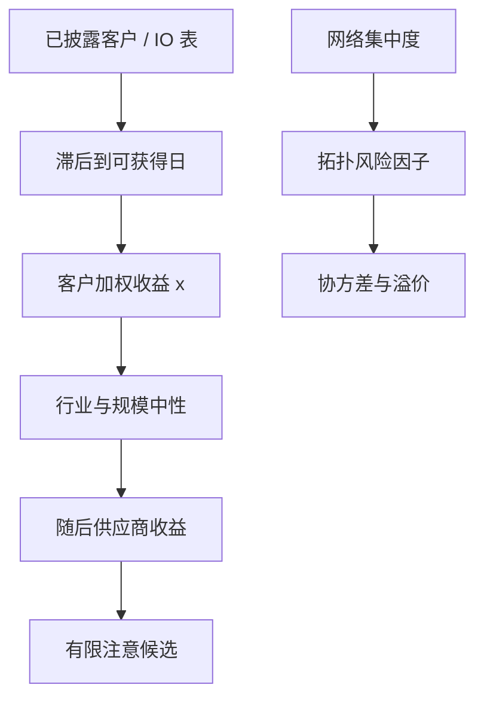

# 供应链网络因子

客户收益能够预测供应商随后的收益；把已披露的贸易边写成可交易的截面信号时，滞后、行业中性与发表后衰减决定它还是不是同一件事。

<footer>—— Cohen and Frazzini, Economic Links and Predictable Returns, Journal of Finance, 2008</footer>

[供应链与货运](/quant/supply-chain-alt) 把边、中断与运价放在一张地图上。本篇收窄到**可复制的截面因子**：如何从客户–供应商图构造信号、它与行业动量和会计动量的关系、以及网络拓扑本身（集中度、中心性）何时应被当成风险而不是 alpha。Cohen 与 Frazzini（2008）是锚。Menzly 与 Ozbas（2010）用投入产出表把边从公司对扩到行业对。Herskovic（2018）把生产网络的集中度变化写成资产定价因子。Barrot 与 Sauvagnat、Carvalho 等人用灾害识别边的强度，那是事件研究，容量有限，只为校准边权服务。图上的可学习版本见 [GNN 资产定价](/quant/gnn-asset-pricing)；本篇先把手工因子写清楚，以免神经网络重新发明一列未滞后的客户收益。

## 问题

横截面习惯用行业哑变量吸收「同一生意」。汽车零部件与整车厂可能不在同一 GICS 叶子，但需求冲击共用。Cohen–Frazzini 的观察是：客户的公开收益与盈余已经可交易，供应商价格却滞后调整，于是沿边有可预测性。问题是测量。美国 10-K 的客户披露有销售占比门槛，图稀疏、滞后且偏向大客户；中国上市公司大客户附注同样截断。用一张静态邻接去预测十年，等于假设拓扑不变。

第二句话是因子的左边。客户动量组合的收益，是供应商随后收益的预测变量，还是所有公司都要加载的系统性网络风险？前者是 alpha 候选（有限注意），后者是 Herskovic 式的风险价格。把客户动量的多空夏普写成「网络风险溢价」，或把集中度因子写成「供应链 alpha」，都是把论文的回归左边换掉。

### 边必须属于信息集

年报披露有法定日期。用财政年度 $t$ 的客户名单去解释日历年 $t$ 的收益，是前视。正确做法是：边在披露可获得之后才进入 $A_t$，并对公告日后的供应商收益做预测。修订与回溯（数据商后来补全的客户链）必须按 vintage 处理，与[时点基本面](/quant/point-in-time)同一纪律。IO 表是年份粗、覆盖宽的边，适合行业级因子；公司级客户名单适合个股因子。两者不要在同一回归里假装是同一张图。

客户动量一旦进入 ETF、风险模型与卖方模板，Cohen–Frazzini 的滞后会缩短。复制应报告发表后子样本，而不是只重复 1980–2004 的表。这与 McLean–Pontiff 对异常衰减的逻辑相同。

## 方法

**客户动量（公司级）。** 在 $t$，对每个供应商 $i$，取其已披露客户集合 $\mathcal{C}_{i,t}$，用销售占比 $w_{ij}$ 加权客户在最近一个月（或一周）的收益，得到

$$
x_{i,t}=\sum_{j\in\mathcal{C}_{i,t}} w_{ij}\,r_{j,t}.
$$

$x_{i,t}$ 在截面 rank 后，控制行业、规模与供应商自身滞后收益，看 $i$ 随后的收益。稳健性：去掉同行业边、只用新公告的客户、把边权改成等权。这是 Cohen–Frazzini 的可交易翻译。

**IO 动量（行业级）。** 按 Menzly–Ozbas：用投入产出表定义上游 / 下游行业组合，用相关行业的滞后收益预测本行业。它更宽、更慢，适合作为风险模型里的附加因子，而不是日频选股。

**拓扑风险。** 按 Herskovic：从生产网络估计集中度或中心性的时间序列，看其冲击是否被定价。这边的左边是资产对网络状态的载荷，不是 $x_{i,t}$ 的多空。中心节点的特异性应进入[统计风险 PCA](/quant/stat-risk-pca) 的残差协方差，否则风险预算会低估聚集。

事件研究（灾害、封港）用来估计边的传递系数，供 $w_{ij}$ 校准，不要把事件窗的异常收益年化成因子夏普。

### 中性化与双重计算

客户往往与供应商同周期，行业动量会混进 $x_{i,t}$。必须报告去掉同行业边之后的 IC。客户盈余公告与[PEAD](/quant/pead-sue) 重叠：同一则客户盈利意外既出现在新闻里，也出现在图上，见[舆情](/quant/news-nlp-alpha)。增量 $R^2$ 应在控制 PEAD、行业动量与供应商自身动量之后再报。否则「供应链因子」只是把已有因子沿边平均了一次。

## 机制

有限注意：覆盖沿 SIC / GICS，不沿客户名单，信息从客户价格传到供应商需要时间。共同分析师、共同机构持股增加时，滞后应下降——这是机制检验。风险：不对称的投入产出使特质冲击变成宏观波动（Acemoglu 等）；持有中心节点等于持有不可分散的网络风险，要求溢价。中断：边暂时断开时，邻域的符号在供应商、客户与竞争对手之间不同（Barrot–Sauvagnat），全样本线性因子无法表达这种状态依赖；那是压力情景，不是每日 $x_{i,t}$ 的理由。

与货运指数的分工：运价是宏观与航运供给的混合物，符号对货主与航运相反。网络因子是公司之间的相对收益。把 BDI 动量加进同一棵树，会与贸易周期共线，见供应链与货运篇。预先指定主路径：公司边或 IO 边；运价只做增量。

销售占比作边权会偏向大客户。大客户本身流动性好、调整快，信号可能更弱；小客户边更有信息、更不可交易。因子研究应同时报加权与等权、以及按供应商流动性分层的净 IR。

### 从手工因子到图模型

$x_{i,t}$ 是一阶邻居的线性聚合。GNN 把它换成可训练的核。若 GNN 不能在同一 vintage 图上打败 $x_{i,t}$，深度没有经济增量。若打败了，仍要做发表后衰减与可交易约束。手工因子是必须先赢的基准，地位与 GKX 里的弹性网相同。

## 边界与工程取舍

不要用未授权的发票或海关微观记录去加密图后声称可复制。不要做日频「供应链 alpha」却用年度边——那是把年报事件涂成每日 IC。A 股壳与退市使边的生存偏差更大，成分过滤应在回测内完成。指数化之后，客户动量的容量在小供应商上差，见[容量](/quant/capacity-participation)。

「供应链金融」在银行里指应付账款与保理，与本篇的股票截面因子不是同一对象。风险报告里应分栏，不要把贸易信用风险与客户动量暴露加在一个数里。

## 小结

- Cohen–Frazzini 的客户动量是供应链网络因子的可交易内核；边必须滞后到可获得，并报告发表后衰减。
- Menzly–Ozbas 的 IO 边更宽，适合行业层；Herskovic 的集中度是风险，不是同一列 alpha。
- 须对行业动量、PEAD 与自身动量做增量，避免沿边重复计算。
- 手工一阶聚合是 GNN 的基准；事件研究只校准边权，不年化夏普。
- 出处：Cohen and Frazzini, *JF*, 2008；Menzly and Ozbas, *JF*, 2010；Herskovic, *JF*, 2018；Acemoglu et al., *Econometrica*, 2012；Barrot and Sauvagnat, *QJE*, 2016。
