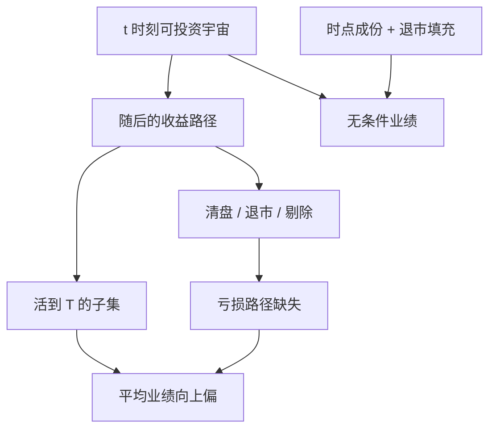

# 幸存者偏差

只研究仍然存在的基金或股票，等于按结果筛选样本；平均业绩会被向上推，消失者承担的那一段亏损从历史上被抹掉。

<footer>—— 对照 Brown, Goetzmann, Ibbotson and Ross, Survivorship Bias in Performance Studies, RFS 1992</footer>

[上一课](/quant/stress-reverse-stress)问极端情景怎么设。缺口是研究样本本身：你看到的截面，往往已经筛选过活下来的对象。回测与业绩评价默认你看到的截面，就是当时可投资的截面。幸存者偏差打破这个默认：数据库往往只留下活到今天的基金、活到样本期末的股票、活到指数里的成份。Brown、Goetzmann、Ibbotson 与 Ross（1992）证明，对业绩研究而言，这种筛选会系统性地抬高平均收益、压低风险。Malkiel（1995）、Elton–Gruber–Blake（1996）、Carhart–Carpenter–Lynch–Musto（2002）在共同基金上给出量级；Shumway（1997）指出 CRSP 退市收益缺失会让小盘与困境股的平均收益被高估。量化研究里，它不只是「基金排行榜」的问题：任何从今天的股票池往回生成因子，都在用幸存者讲过去。

## 问题

设 $t=0$ 有 $N$ 只基金（或股票），到 $T$ 只剩 $N_s$ 只。若消失的原因与收益相关——业绩差被清盘、股票退市、基金合并进更好看的系列——则对 $N_s$ 的平均收益 $\bar r_s$ 高于对全样本路径的平均。Brown 等人还指出更细的扭曲：条件于生存，收益的横截面离散与真实技能的推断都会变。看起来「显著跑赢」的经理，有一部分只是没死在样本里。

股票侧，CRSP 对退市日若缺收益，研究者用最后一个可用价格结束，等于假设退市那天收益为零。Shumway 用 OTC 与事件数据补退市收益，发现绩效相关退市（破产等）平均是大幅负收益，缺省处理会让以小盘、低价、高账面市值比为重的策略显得更好。这直接污染价值、规模、困境溢价的量级，而不是边角料。

### 从今天的名单往回拉，是最常见的构造错误

「当前沪深 300 / 当前 S&P 500 成份，取其十年历史」是教科书级的幸存者加前视：十年前它们未必在指数里，被踢出的名字带着较差路径离开样本。正确对象是每个时点的当时成份（point-in-time membership），并包含随后被剔除者在剔除前的收益。指数提供商与 CRSP 的指数文件为此存在；用今天的网页成份表回测，不是「近似」，而是换了一个总体。

ETF 与指数增强的回测特别容易中招：成份是活的，权重规则是活的，而你的程序读到的是最新一份名录。没有历史成份与权重文件，就不要报指数内策略的夏普。

## 方法

**基金。** 需要含已清盘、已合并产品的数据库（例如 CRSP Survivor-Bias-Free US Mutual Fund）。合并应把消失基金的业绩保留到合并日，而不是只保留存续份额类别。Elton–Gruber–Blake 强调，偏误大小取决于消失基金有多差、以及样本是否包含债券与国际品种。Carhart 等人把生存建模成与过去业绩相关的退出，从而纠正条件推断。

**股票。** 使用全市场证券主文件，按当时是否上市、是否满足价格与成交过滤来纳入，而不是按「今天仍在市」。退市日用 Shumway 修正或交易所官方最后收益；无法补全时，至少对绩效相关退市做保守填充（例如 −30% 一类常用的破产代理，并做敏感性）。因子研究的复制（Hou–Xue–Zhang）把可投资性过滤与退市处理当成结果是否成立的一部分，而不是附录。

**策略产品。** CTA、对冲基金数据库的自愿申报本身就是生存与回填：基金往往在一串好年景之后才进入数据库，并把那段好年景一并提交。Agarwal、Daniel 与 Naik 等文献讨论回填与生存；最低处理是剔除申报前的回填月，并保留后续清盘。

### 偏误如何进入因子溢价

价值与规模偏爱便宜、小、接近困境的名字，这些名字的退市率更高。若退市收益缺失或样本只留幸存者，多头腿被抬高。动量的输家腿同样富含随后退市的股票；若输家在退市前就被踢出回测（因为停牌、因为价格过滤用了未来最低价），空头收益会被错估。因此幸存者不是「只影响基金排名」，它改变多空的每一条腿。处理顺序应是：先构建当时可交易宇宙，再算特征，再做退市填充，最后才是排序。

价格过滤若用全样本最低价「丢掉曾经低于 1 美元的股票」，是另一种幸存者：当时可买的低价股被事后开除。过滤必须用当时价格。

## 机制

选择机制是吸收态：清盘、退市、合并一旦发生，路径从常用数据库消失。若吸收概率随负收益上升，生存样本的条件期望 $\mathbb{E}[r\mid \text{survive}]$ 高于无条件。这与保险里「只观察还没出险的保单」相同。Brown–Goetzmann–Ross（1995）从更一般的生存角度讨论市场本身：我们观察到的长期股权溢价，来自没有被战争、征收、关闭交易所打断的市场；这是国家层面的幸存者，量级争议更大，但逻辑同构。

对技能推断：真技能提高生存概率，于是幸存者里技能与运气更难分开。把幸存者的 t 统计量当成发现门槛，等于在已经筛选过的样本上再做一次不调整的检验，与[多重检验](/quant/multiple-testing-factors)叠加。

### 和回填、前视的边界

回填（instant history）是基金把进入数据库之前的好业绩贴进来；幸存者是进入之后仍然可能消失、而你的样本只留没消失的。前视是用了当时不可得的信息（下篇）。三者经常一起出现在同一条错误回测里：今天的成份（生存）+ 最新财务（前视）+ 基金申报前业绩（回填）。纠正必须分别做，不能只买一个「无幸存者」标签就假设 PIT 也干净。

## 边界与工程取舍

补退市收益会改变小样本里个别名字的权重大，价值加权比等权更稳健，但并不能取消偏差。新兴市场退市与长期停牌更不透明，填充规则的不确定性本身应进入稳健性，而不是假装有一个正确的 −30%。指数成份的历史文件有版权与质量问题，但这不能成为用今天名单的理由——那是换了一个更便宜的错误。

不要把「我们用了 CRSP 全样本」理解成无偏：CRSP 仍有退市收益缺口，Shumway 的要点恰恰是全样本文件也会偏。也不要把活下来的量化产品净值当成策略可复制性的证据：产品本身经过发行、清盘与孵化筛选。

模拟盘与实盘的差异里，有一块常被归因于成本，其实是回测宇宙比实盘更「干净」：退市、停牌、可融券名字在模拟里被静默丢掉。宇宙的日志应与成交日志一起存。

## 小结

- 幸存者偏差是按「活到样本期末」筛选造成的业绩上偏，基金与股票都存在。
- Brown–Goetzmann–Ibbotson–Ross、Elton–Gruber–Blake、Carhart 等人量化基金侧；Shumway 纠正 CRSP 退市收益。
- 用今天的指数成份回测，同时犯幸存者与前视；必须使用时点宇宙与退市处理。
- 价值、规模、动量的腿对退市敏感，填充规则属于研究结果的一部分。
- 出处：Brown, Goetzmann, Ibbotson and Ross, *Survivorship Bias in Performance Studies*, Review of Financial Studies, 1992；Shumway, *The Delisting Bias in CRSP Data*, Journal of Finance, 1997；Elton, Gruber and Blake, *Survivorship Bias and Mutual Fund Performance*, Review of Financial Studies, 1996；Carhart, Carpenter, Lynch and Musto, *Mutual Fund Survivorship*, Review of Financial Studies, 2002；Malkiel, *Returns from Investing in Equity Mutual Funds*, Journal of Finance, 1995。
